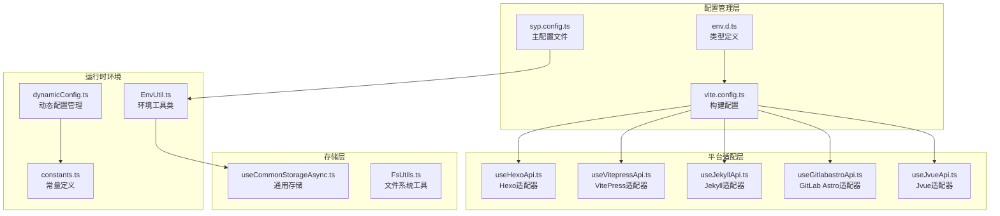
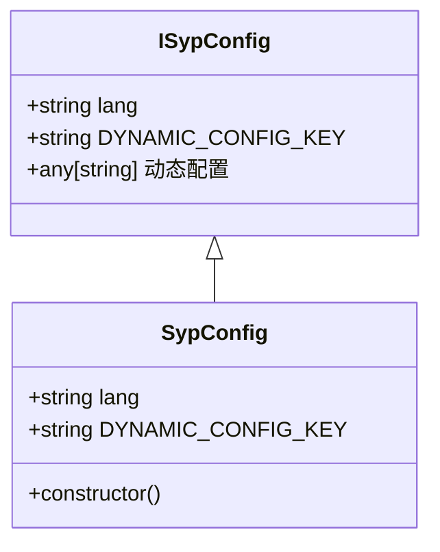
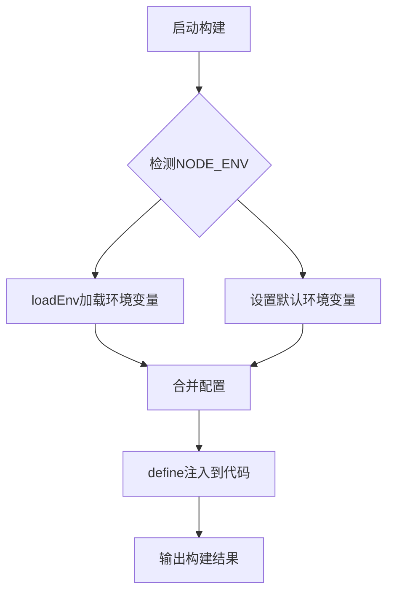
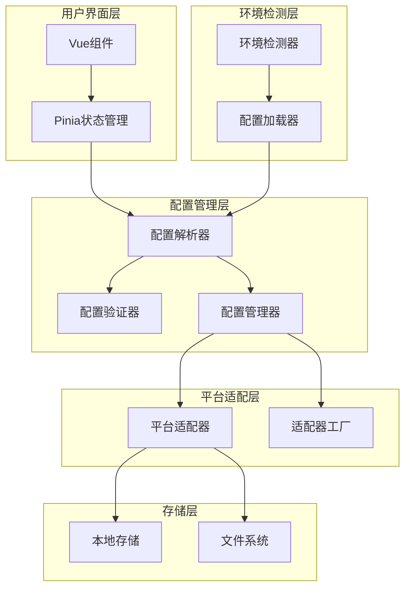
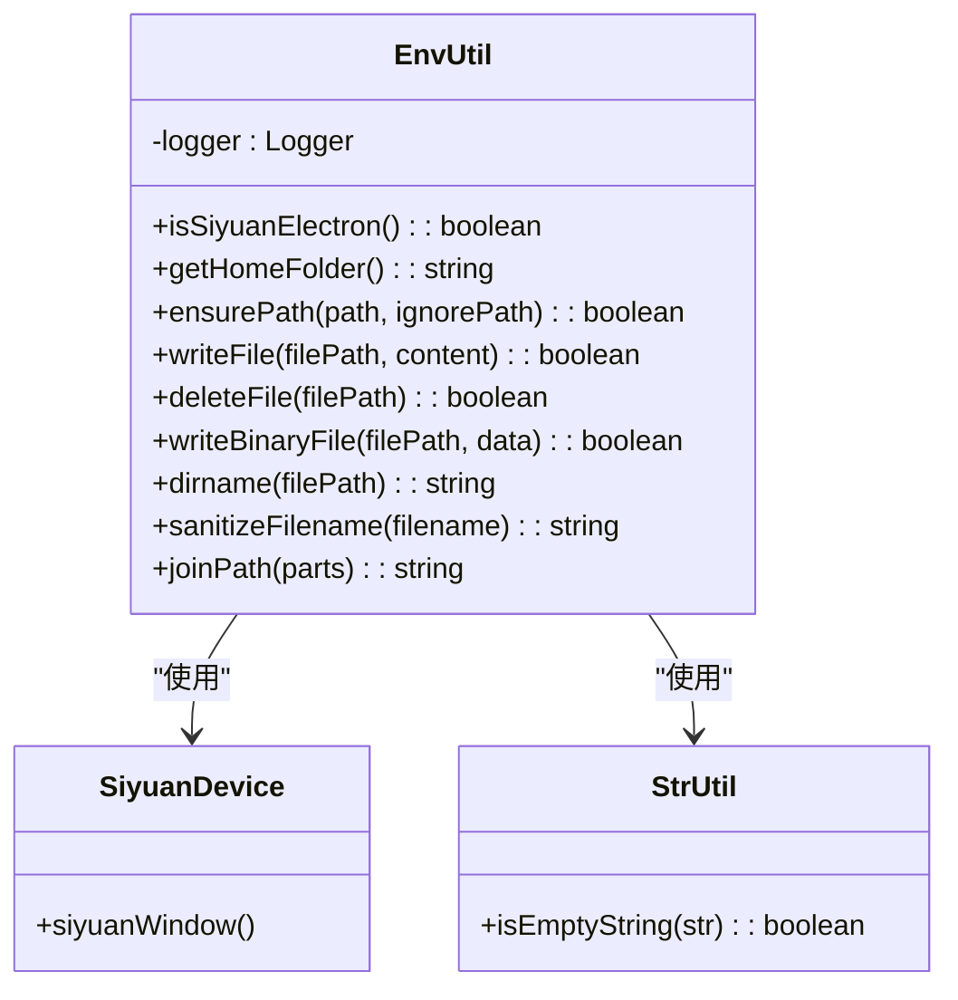
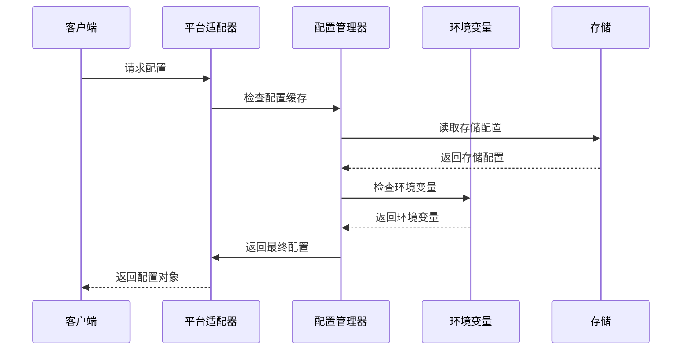
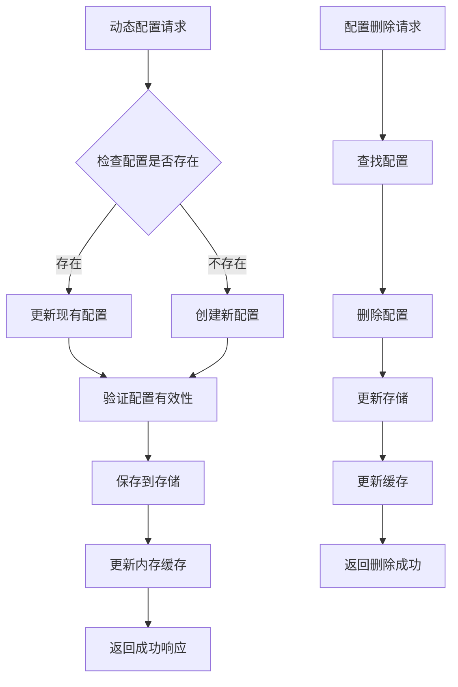
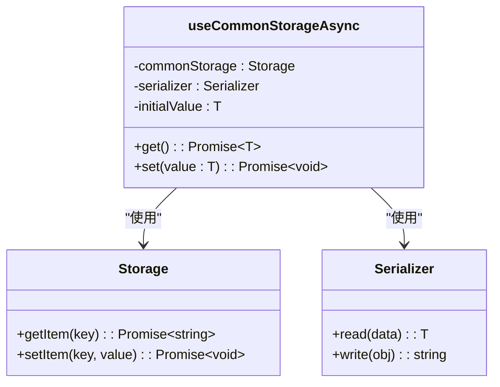
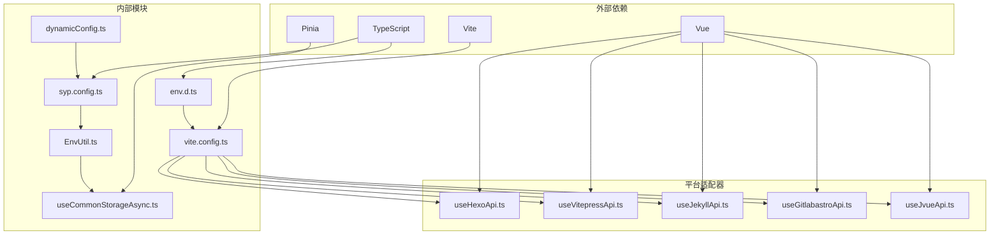

# 环境配置管理

<cite>
**本文档引用的文件**
- [syp.config.ts](file://syp.config.ts)
- [env.d.ts](file://env.d.ts)
- [vite.config.ts](file://vite.config.ts)
- [EnvUtil.ts](file://src/utils/EnvUtil.ts)
- [useHexoApi.ts](file://src/adaptors/api/hexo/useHexoApi.ts)
- [useVitepressApi.ts](file://src/adaptors/api/vitepress/useVitepressApi.ts)
- [useJekyllApi.ts](file://src/adaptors/api/jekyll/useJekyllApi.ts)
- [useGitlabastroApi.ts](file://src/adaptors/api/gitlab-astro/useGitlabastroApi.ts)
- [useJvueApi.ts](file://src/adaptors/api/jvue/useJvueApi.ts)
- [dynamicConfig.ts](file://src/platforms/dynamicConfig.ts)
- [constants.ts](file://src/utils/constants.ts)
- [useCommonStorageAsync.ts](file://src/stores/common/useCommonStorageAsync.ts)
- [FsUtils.ts](file://src/adaptors/fs/LocalSystem/FsUtils.ts)
- [package.json](file://package.json)
</cite>

## 目录
1. [简介](#简介)
2. [项目结构](#项目结构)
3. [核心组件](#核心组件)
4. [架构概览](#架构概览)
5. [详细组件分析](#详细组件分析)
6. [依赖关系分析](#依赖关系分析)
7. [性能考虑](#性能考虑)
8. [故障排除指南](#故障排除指南)
9. [结论](#结论)

## 简介

本项目采用多环境配置管理系统，支持开发、测试、生产等多种运行环境。系统通过Vite的环境变量加载机制、TypeScript类型定义、动态配置管理等方式，实现了灵活的配置管理方案。

系统的核心特点包括：
- 多环境配置分离与切换机制
- 运行时环境检测与自动配置
- 配置注入与优先级管理
- 动态配置更新与持久化存储
- 类型安全的配置访问接口

## 项目结构

项目采用模块化的配置管理架构，主要由以下层次组成：

**图表来源**
- [syp.config.ts:1-52](file://syp.config.ts#L1-L52)
- [vite.config.ts:1-275](file://vite.config.ts#L1-L275)
- [EnvUtil.ts:1-223](file://src/utils/EnvUtil.ts#L1-L223)

**章节来源**
- [syp.config.ts:1-52](file://syp.config.ts#L1-L52)
- [vite.config.ts:1-275](file://vite.config.ts#L1-L275)
- [env.d.ts:1-29](file://env.d.ts#L1-L29)

## 核心组件

### 主配置文件 (syp.config.ts)

主配置文件定义了系统的基础配置结构和默认值：

**图表来源**
- [syp.config.ts:28-49](file://syp.config.ts#L28-L49)

### 环境变量类型定义 (env.d.ts)

通过TypeScript接口定义，确保环境变量的类型安全：

- 定义了ImportMetaEnv接口
- 提供了完整的环境变量类型提示
- 支持Vite的环境变量加载机制

### 构建配置 (vite.config.ts)

Vite配置文件实现了智能的环境变量处理：

**图表来源**
- [vite.config.ts:27-55](file://vite.config.ts#L27-L55)

**章节来源**
- [syp.config.ts:28-49](file://syp.config.ts#L28-L49)
- [env.d.ts:26-28](file://env.d.ts#L26-L28)
- [vite.config.ts:27-55](file://vite.config.ts#L27-L55)

## 架构概览

系统采用分层架构设计，实现了配置管理的解耦和扩展性：

**图表来源**
- [EnvUtil.ts:21-37](file://src/utils/EnvUtil.ts#L21-L37)
- [dynamicConfig.ts:442-486](file://src/platforms/dynamicConfig.ts#L442-L486)

## 详细组件分析

### 环境工具类 (EnvUtil)

EnvUtil提供了完整的环境检测和文件操作功能：

**图表来源**
- [EnvUtil.ts:21-223](file://src/utils/EnvUtil.ts#L21-L223)

#### 环境检测机制

系统通过多种方式检测运行环境：

1. **Electron环境检测**：检查process.versions中的node和electron版本
2. **文件系统可用性检测**：验证fs模块的可用性
3. **路径标准化处理**：统一不同操作系统的路径格式

#### 文件操作功能

EnvUtil提供了完整的文件系统操作能力：

- **路径管理**：确保目录存在、路径标准化、文件删除
- **文件读写**：文本文件和二进制文件的读写操作
- **安全处理**：文件名清理、错误处理和日志记录

**章节来源**
- [EnvUtil.ts:21-223](file://src/utils/EnvUtil.ts#L21-L223)

### 平台适配器配置

各平台适配器实现了统一的配置加载机制：

**图表来源**
- [useHexoApi.ts:42-60](file://src/adaptors/api/hexo/useHexoApi.ts#L42-L60)
- [useVitepressApi.ts:42-77](file://src/adaptors/api/vitepress/useVitepressApi.ts#L42-L77)

#### 配置加载优先级

各平台适配器遵循以下配置加载优先级：

1. **传入参数配置**：最高优先级，直接传入的配置
2. **存储配置**：从本地存储读取的配置
3. **环境变量配置**：从process.env读取的配置
4. **默认配置**：平台特定的默认配置

**章节来源**
- [useHexoApi.ts:42-60](file://src/adaptors/api/hexo/useHexoApi.ts#L42-L60)
- [useVitepressApi.ts:42-77](file://src/adaptors/api/vitepress/useVitepressApi.ts#L42-L77)
- [useJekyllApi.ts:58-77](file://src/adaptors/api/jekyll/useJekyllApi.ts#L58-L77)
- [useGitlabastroApi.ts:29-61](file://src/adaptors/api/gitlab-astro/useGitlabastroApi.ts#L29-L61)
- [useJvueApi.ts:37-67](file://src/adaptors/api/jvue/useJvueApi.ts#L37-L67)

### 动态配置管理

系统支持动态配置的添加、修改和删除：

**图表来源**
- [dynamicConfig.ts:442-486](file://src/platforms/dynamicConfig.ts#L442-L486)

**章节来源**
- [dynamicConfig.ts:442-486](file://src/platforms/dynamicConfig.ts#L442-L486)

### 存储系统

系统实现了通用的异步存储管理：

**图表来源**
- [useCommonStorageAsync.ts:43-84](file://src/stores/common/useCommonStorageAsync.ts#L43-L84)

**章节来源**
- [useCommonStorageAsync.ts:43-84](file://src/stores/common/useCommonStorageAsync.ts#L43-L84)

## 依赖关系分析

系统配置管理的依赖关系如下：

**图表来源**
- [package.json:29-96](file://package.json#L29-L96)
- [vite.config.ts:1-275](file://vite.config.ts#L1-L275)

**章节来源**
- [package.json:29-96](file://package.json#L29-L96)
- [vite.config.ts:1-275](file://vite.config.ts#L1-L275)

## 性能考虑

### 配置加载优化

1. **延迟加载**：配置在首次使用时才进行加载
2. **缓存机制**：内存中缓存已加载的配置
3. **批量处理**：多个配置请求合并处理

### 存储优化

1. **序列化优化**：根据数据类型选择最优的序列化方式
2. **增量更新**：只更新变化的配置项
3. **异步处理**：避免阻塞主线程

### 环境检测优化

1. **缓存检测结果**：避免重复的环境检测
2. **条件加载**：只在需要时加载相关模块
3. **错误恢复**：环境检测失败时使用降级方案

## 故障排除指南

### 常见问题及解决方案

#### 环境变量未生效

**问题描述**：配置中无法读取到环境变量

**可能原因**：
1. 环境变量文件命名错误
2. 环境变量名称拼写错误
3. 构建时未正确注入

**解决方案**：
1. 检查.env文件的命名格式
2. 验证环境变量名称前缀
3. 确认Vite配置中的define设置

#### 配置加载失败

**问题描述**：平台配置无法正确加载

**可能原因**：
1. 存储中的配置格式错误
2. 环境变量值为空
3. 配置验证失败

**解决方案**：
1. 检查存储中的JSON格式
2. 验证环境变量的默认值设置
3. 查看配置验证日志

#### 文件操作异常

**问题描述**：文件读写操作失败

**可能原因**：
1. 权限不足
2. 路径不存在
3. 系统资源限制

**解决方案**：
1. 检查文件权限设置
2. 确保目录存在且可访问
3. 查看系统资源使用情况

**章节来源**
- [EnvUtil.ts:46-72](file://src/utils/EnvUtil.ts#L46-L72)
- [useCommonStorageAsync.ts:43-63](file://src/stores/common/useCommonStorageAsync.ts#L43-L63)

## 结论

本项目的环境配置管理系统具有以下优势：

1. **模块化设计**：清晰的分层架构，便于维护和扩展
2. **类型安全**：完整的TypeScript类型定义，提供编译时检查
3. **灵活配置**：支持多种配置源和优先级机制
4. **运行时检测**：智能的环境检测和自动配置
5. **持久化存储**：可靠的配置持久化和恢复机制

系统通过合理的架构设计和实现细节，为多环境部署提供了稳定可靠的支持。建议在实际使用中：

- 建立完善的配置文档和最佳实践
- 实施配置变更的版本控制
- 建立配置监控和告警机制
- 定期审查和优化配置性能