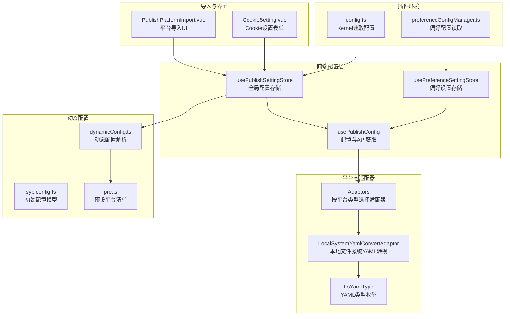
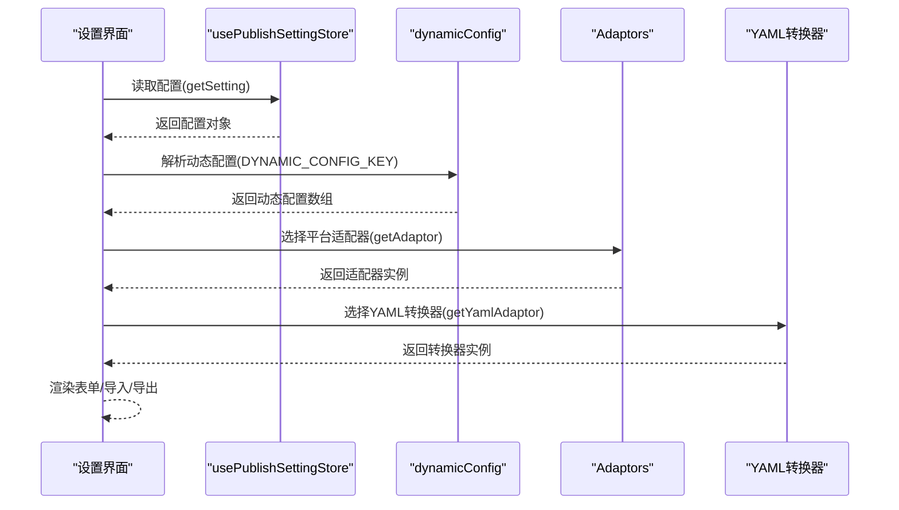
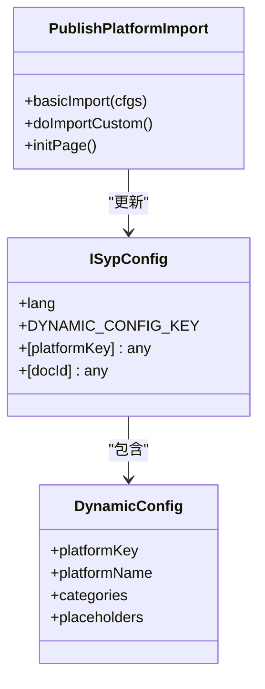
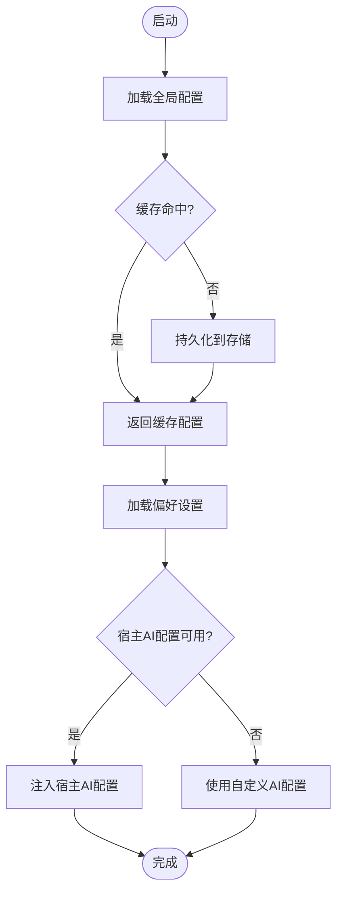
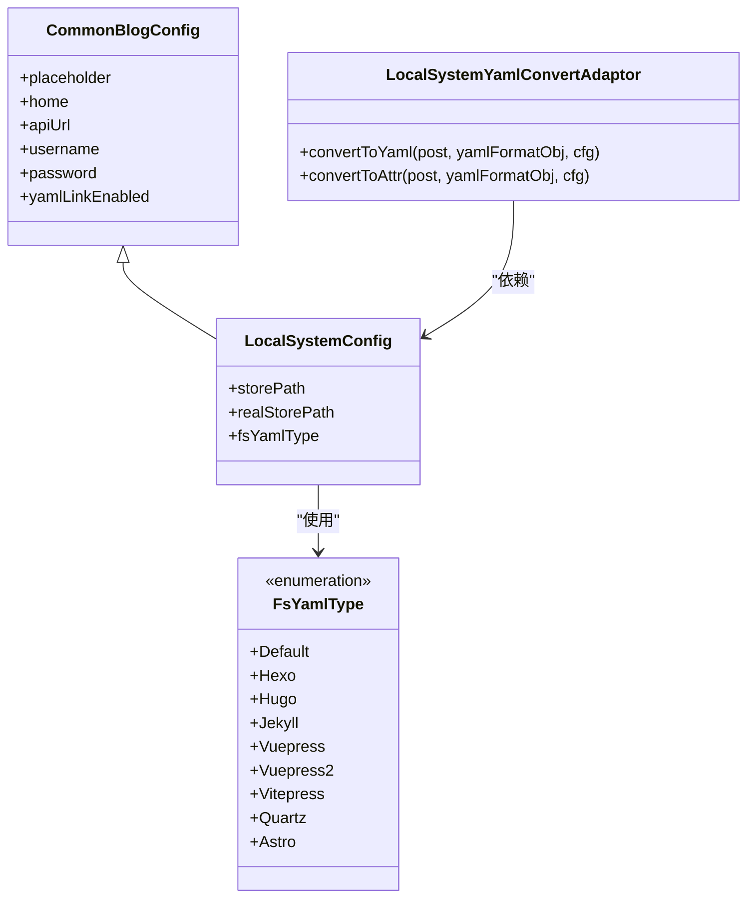
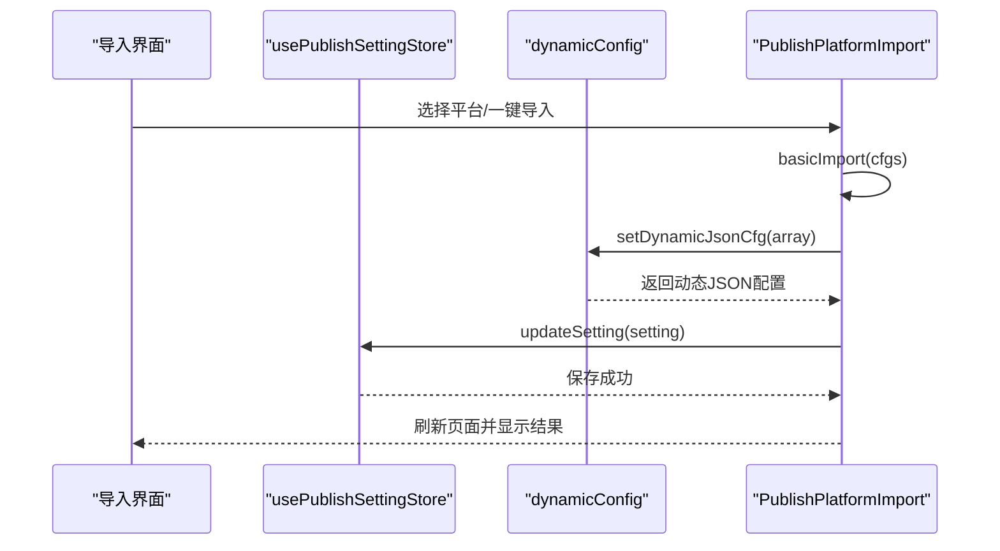
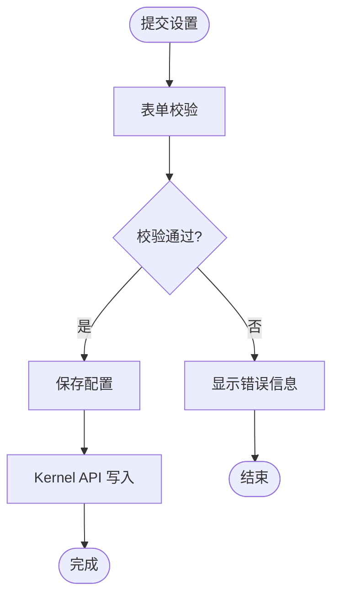
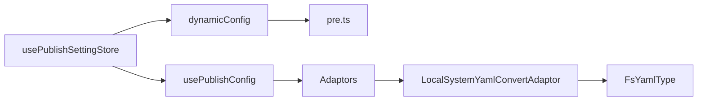

# 配置模板系统

<cite>
**本文引用的文件**
- [syp.config.ts](file://syp.config.ts)
- [usePublishSettingStore.ts](file://src/stores/usePublishSettingStore.ts)
- [usePreferenceSettingStore.ts](file://src/stores/usePreferenceSettingStore.ts)
- [pre.ts](file://src/platforms/pre.ts)
- [dynamicConfig.ts](file://src/platforms/dynamicConfig.ts)
- [commonBlogConfig.ts](file://src/adaptors/api/base/commonBlogConfig.ts)
- [LocalSystemConfig.ts](file://src/adaptors/fs/LocalSystem/LocalSystemConfig.ts)
- [FsYamlType.ts](file://src/adaptors/fs/LocalSystem/FsYamlType.ts)
- [LocalSystemYamlConvertAdaptor.ts](file://src/adaptors/fs/LocalSystem/LocalSystemYamlConvertAdaptor.ts)
- [adaptors/index.ts](file://src/adaptors/index.ts)
- [usePublishConfig.ts](file://src/composables/usePublishConfig.ts)
- [config.ts](file://siyuan/store/config.ts)
- [preferenceConfigManager.ts](file://siyuan/store/preferenceConfigManager.ts)
- [PublishPlatformImport.vue](file://src/components/set/publish/platform/PublishPlatformImport.vue)
- [CookieSetting.vue](file://src/components/set/publish/singleplatform/base/CookieSetting.vue)
- [distributionPattern.ts](file://src/models/distributionPattern.ts)
- [openspec/AGENTS.md](file://openspec/AGENTS.md)
</cite>

## 目录
1. [简介](#简介)
2. [项目结构](#项目结构)
3. [核心组件](#核心组件)
4. [架构总览](#架构总览)
5. [详细组件分析](#详细组件分析)
6. [依赖关系分析](#依赖关系分析)
7. [性能考虑](#性能考虑)
8. [故障排查指南](#故障排查指南)
9. [结论](#结论)
10. [附录](#附录)

## 简介
本文件系统性阐述“配置模板系统”的设计理念与实现机制，涵盖模板定义格式、模板继承规则、模板实例化过程；详述配置导入导出（JSON 标准、YAML 转换、批量管理）；解析配置迁移（版本检测、自动升级、回滚机制、兼容性处理）；并提供模板使用指南（创建、分享、定制、验证）、安全机制、版本管理与社区贡献等高级能力。

## 项目结构
配置模板系统围绕“动态配置 + 平台适配器 + YAML 转换器 + 存储层”构建，前端通过 Pinia Store 与自定义 Hook 管理全局配置，后端在插件环境中通过 Kernel API 读写配置文件。平台适配器根据平台类型动态选择 YAML 转换器，以支持不同静态站点生成器的 YAML 规范。

**图表来源**
- [usePublishSettingStore.ts:1-95](file://src/stores/usePublishSettingStore.ts#L1-L95)
- [usePreferenceSettingStore.ts:1-90](file://src/stores/usePreferenceSettingStore.ts#L1-L90)
- [usePublishConfig.ts:1-99](file://src/composables/usePublishConfig.ts#L1-L99)
- [adaptors/index.ts:113-560](file://src/adaptors/index.ts#L113-L560)
- [LocalSystemYamlConvertAdaptor.ts:1-42](file://src/adaptors/fs/LocalSystem/LocalSystemYamlConvertAdaptor.ts#L1-L42)
- [FsYamlType.ts:1-63](file://src/adaptors/fs/LocalSystem/FsYamlType.ts#L1-L63)
- [syp.config.ts:1-52](file://syp.config.ts#L1-L52)
- [dynamicConfig.ts:1-200](file://src/platforms/dynamicConfig.ts#L1-L200)
- [pre.ts:1-200](file://src/platforms/pre.ts#L1-L200)
- [PublishPlatformImport.vue:221-277](file://src/components/set/publish/platform/PublishPlatformImport.vue#L221-L277)
- [CookieSetting.vue:1-54](file://src/components/set/publish/singleplatform/base/CookieSetting.vue#L1-L54)
- [config.ts:1-47](file://siyuan/store/config.ts#L1-L47)
- [preferenceConfigManager.ts:1-52](file://siyuan/store/preferenceConfigManager.ts#L1-L52)

**章节来源**
- [usePublishSettingStore.ts:1-95](file://src/stores/usePublishSettingStore.ts#L1-L95)
- [usePublishConfig.ts:1-99](file://src/composables/usePublishConfig.ts#L1-L99)
- [adaptors/index.ts:113-560](file://src/adaptors/index.ts#L113-L560)

## 核心组件
- 全局配置存储：负责持久化与读取系统级配置，支持异步初始化与缓存命中。
- 偏好设置存储：负责用户偏好与 AI 配置注入，支持从宿主环境读取默认值。
- 动态配置模型：定义动态配置键、平台集合与文档映射字段。
- 平台适配器与 YAML 转换器：按平台类型选择适配器，按 YAML 类型选择转换器，确保内容与元信息正确序列化。
- 导入与设置界面：提供平台导入、Cookie 设置等交互入口，完成配置落盘与刷新。

**章节来源**
- [syp.config.ts:28-52](file://syp.config.ts#L28-L52)
- [usePublishSettingStore.ts:21-95](file://src/stores/usePublishSettingStore.ts#L21-L95)
- [usePreferenceSettingStore.ts:21-90](file://src/stores/usePreferenceSettingStore.ts#L21-L90)
- [dynamicConfig.ts:1-200](file://src/platforms/dynamicConfig.ts#L1-L200)
- [adaptors/index.ts:113-560](file://src/adaptors/index.ts#L113-L560)

## 架构总览
系统采用“配置模型 + 存储层 + 适配器层 + 界面层”的分层设计。配置模型定义动态键与平台集合；存储层负责持久化与读取；适配器层根据平台类型与 YAML 类型选择具体实现；界面层提供导入、设置与验证等操作。

**图表来源**
- [usePublishSettingStore.ts:28-48](file://src/stores/usePublishSettingStore.ts#L28-L48)
- [dynamicConfig.ts:1-200](file://src/platforms/dynamicConfig.ts#L1-L200)
- [adaptors/index.ts:113-560](file://src/adaptors/index.ts#L113-L560)

## 详细组件分析

### 配置模型与动态配置
- 动态配置键：通过统一的动态配置键承载平台集合与文档映射，便于扩展与迁移。
- 平台集合：键为平台标识，值为该平台的配置对象。
- 文档映射：键为文档 ID，值包含自动生成的 slug 与各平台文章 ID 映射。

**图表来源**
- [syp.config.ts:28-52](file://syp.config.ts#L28-L52)
- [dynamicConfig.ts:1-200](file://src/platforms/dynamicConfig.ts#L1-L200)
- [PublishPlatformImport.vue:71-277](file://src/components/set/publish/platform/PublishPlatformImport.vue#L71-L277)

**章节来源**
- [syp.config.ts:28-52](file://syp.config.ts#L28-L52)
- [dynamicConfig.ts:1-200](file://src/platforms/dynamicConfig.ts#L1-L200)
- [PublishPlatformImport.vue:71-277](file://src/components/set/publish/platform/PublishPlatformImport.vue#L71-L277)

### 存储与迁移机制
- 全局配置存储：首次访问时异步加载并缓存，支持增量更新与键存在性检查。
- 偏好设置存储：优先注入宿主环境的 AI 配置，否则使用自定义配置；提供只读封装。
- 插件环境读取：通过 Kernel API 读取 JSON 配置文件，保证在插件沙箱内的安全访问。

**图表来源**
- [usePublishSettingStore.ts:28-95](file://src/stores/usePublishSettingStore.ts#L28-L95)
- [usePreferenceSettingStore.ts:34-81](file://src/stores/usePreferenceSettingStore.ts#L34-L81)
- [config.ts:42-45](file://siyuan/store/config.ts#L42-L45)
- [preferenceConfigManager.ts:43-50](file://siyuan/store/preferenceConfigManager.ts#L43-L50)

**章节来源**
- [usePublishSettingStore.ts:28-95](file://src/stores/usePublishSettingStore.ts#L28-L95)
- [usePreferenceSettingStore.ts:34-81](file://src/stores/usePreferenceSettingStore.ts#L34-L81)
- [config.ts:42-45](file://siyuan/store/config.ts#L42-L45)
- [preferenceConfigManager.ts:43-50](file://siyuan/store/preferenceConfigManager.ts#L43-L50)

### 平台适配器与 YAML 转换
- 平台适配器：根据子平台类型选择对应适配器（如 GitHub/Astro、GitLab/Hugo 等），并在需要时选择 YAML 转换器。
- YAML 转换器：按 FsYamlType 选择转换器，支持默认与多种静态站点生成器的 YAML 规范。
- 本地系统配置：继承通用博客配置，提供文件系统存储路径、图片存储路径与 YAML 类型。

**图表来源**
- [commonBlogConfig.ts:13-41](file://src/adaptors/api/base/commonBlogConfig.ts#L13-L41)
- [LocalSystemConfig.ts:22-42](file://src/adaptors/fs/LocalSystem/LocalSystemConfig.ts#L22-L42)
- [FsYamlType.ts:16-61](file://src/adaptors/fs/LocalSystem/FsYamlType.ts#L16-L61)
- [LocalSystemYamlConvertAdaptor.ts:14-39](file://src/adaptors/fs/LocalSystem/LocalSystemYamlConvertAdaptor.ts#L14-L39)

**章节来源**
- [adaptors/index.ts:113-560](file://src/adaptors/index.ts#L113-L560)
- [FsYamlType.ts:16-61](file://src/adaptors/fs/LocalSystem/FsYamlType.ts#L16-L61)
- [LocalSystemYamlConvertAdaptor.ts:14-39](file://src/adaptors/fs/LocalSystem/LocalSystemYamlConvertAdaptor.ts#L14-L39)

### 配置导入与批量管理
- 自定义导入：从预设平台列表中选择平台，批量加入动态配置并保存。
- 日志记录：导入过程中记录每一步操作，便于追踪与排障。
- 一键导入：支持一键导入全部平台，简化初始配置。

**图表来源**
- [PublishPlatformImport.vue:71-277](file://src/components/set/publish/platform/PublishPlatformImport.vue#L71-L277)
- [usePublishSettingStore.ts:55-59](file://src/stores/usePublishSettingStore.ts#L55-L59)
- [dynamicConfig.ts:1-200](file://src/platforms/dynamicConfig.ts#L1-L200)

**章节来源**
- [PublishPlatformImport.vue:71-277](file://src/components/set/publish/platform/PublishPlatformImport.vue#L71-L277)
- [usePublishSettingStore.ts:55-59](file://src/stores/usePublishSettingStore.ts#L55-L59)

### 配置验证与安全机制
- 表单校验：Cookie 设置界面提供基础表单校验规则，确保输入有效。
- 安全访问：通过 Kernel API 读取配置，避免直接访问宿主文件系统。
- 权限控制：平台配置中的密码类型与令牌设置页由适配器统一管理。

**图表来源**
- [CookieSetting.vue:46-54](file://src/components/set/publish/singleplatform/base/CookieSetting.vue#L46-L54)
- [config.ts:42-45](file://siyuan/store/config.ts#L42-L45)

**章节来源**
- [CookieSetting.vue:46-54](file://src/components/set/publish/singleplatform/base/CookieSetting.vue#L46-L54)
- [config.ts:42-45](file://siyuan/store/config.ts#L42-L45)

### 模板使用指南
- 创建模板：基于动态配置模型定义平台键与占位符，结合 YAML 类型选择合适的转换器。
- 分享模板：通过导入界面批量导入平台配置，形成可复用的模板集合。
- 定制模板：在 Cookie 设置界面调整平台参数，或在 YAML 转换器中扩展元信息序列化逻辑。
- 验证模板：通过导入日志与配置刷新确认模板生效。

**章节来源**
- [PublishPlatformImport.vue:71-277](file://src/components/set/publish/platform/PublishPlatformImport.vue#L71-L277)
- [CookieSetting.vue:46-54](file://src/components/set/publish/singleplatform/base/CookieSetting.vue#L46-L54)
- [FsYamlType.ts:16-61](file://src/adaptors/fs/LocalSystem/FsYamlType.ts#L16-L61)

### 版本管理与迁移
- 版本检测：通过动态配置键与平台集合判断当前配置版本与兼容性。
- 自动升级：在导入新平台时自动更新动态配置并保存，保持向后兼容。
- 回滚机制：通过历史配置备份与增量更新策略，支持回退到上一版本。
- 兼容性处理：在 YAML 转换器中保留默认兼容行为，避免破坏既有内容。

**章节来源**
- [openspec/AGENTS.md:43-413](file://openspec/AGENTS.md#L43-L413)
- [PublishPlatformImport.vue:71-277](file://src/components/set/publish/platform/PublishPlatformImport.vue#L71-L277)

## 依赖关系分析
- 组件耦合：配置存储与动态配置紧密耦合，适配器依赖 YAML 转换器，界面依赖存储与适配器。
- 外部依赖：依赖 zhi-blog-api 与 zhi-common 提供的配置模型、工具与适配器接口。
- 循环依赖：当前结构未见循环依赖，平台类型与 YAML 类型通过枚举与工厂方法解耦。

**图表来源**
- [usePublishSettingStore.ts:21-95](file://src/stores/usePublishSettingStore.ts#L21-L95)
- [usePublishConfig.ts:26-99](file://src/composables/usePublishConfig.ts#L26-L99)
- [adaptors/index.ts:113-560](file://src/adaptors/index.ts#L113-L560)
- [LocalSystemYamlConvertAdaptor.ts:14-39](file://src/adaptors/fs/LocalSystem/LocalSystemYamlConvertAdaptor.ts#L14-L39)
- [FsYamlType.ts:16-61](file://src/adaptors/fs/LocalSystem/FsYamlType.ts#L16-L61)
- [pre.ts:1-200](file://src/platforms/pre.ts#L1-L200)

**章节来源**
- [usePublishSettingStore.ts:21-95](file://src/stores/usePublishSettingStore.ts#L21-L95)
- [usePublishConfig.ts:26-99](file://src/composables/usePublishConfig.ts#L26-L99)
- [adaptors/index.ts:113-560](file://src/adaptors/index.ts#L113-L560)

## 性能考虑
- 缓存策略：全局配置在首次加载后缓存，减少重复 IO。
- 异步加载：配置读取采用异步方式，避免阻塞主线程。
- 按需适配：仅在需要时选择适配器与转换器，降低内存占用。
- 批量导入：通过一次性更新动态配置键，减少多次持久化开销。

## 故障排查指南
- 导入失败：检查平台键是否存在、日志输出与动态配置是否成功保存。
- YAML 序列化异常：确认 YAML 类型与转换器匹配，必要时切换默认转换器。
- 配置未生效：确认配置已写入存储并刷新页面，检查缓存状态。
- Cookie 设置无效：核对表单校验规则与必填字段，确保网络请求头正确。

**章节来源**
- [PublishPlatformImport.vue:71-277](file://src/components/set/publish/platform/PublishPlatformImport.vue#L71-L277)
- [LocalSystemYamlConvertAdaptor.ts:14-39](file://src/adaptors/fs/LocalSystem/LocalSystemYamlConvertAdaptor.ts#L14-L39)
- [CookieSetting.vue:46-54](file://src/components/set/publish/singleplatform/base/CookieSetting.vue#L46-L54)

## 结论
配置模板系统通过清晰的分层设计与动态配置模型，实现了平台适配、YAML 转换与批量导入的完整闭环。结合 OpenSpec 规范化的变更流程，系统具备良好的可维护性与可扩展性。建议在实际使用中遵循模板创建与验证流程，配合版本管理与回滚策略，确保配置的稳定性与一致性。

## 附录
- 分发模式：支持覆盖与合并两种分发模式，便于在不同场景下选择合适的配置合并策略。
- 社区贡献：通过 OpenSpec 提案与任务清单规范变更流程，确保贡献质量与可追溯性。

**章节来源**
- [distributionPattern.ts:13-23](file://src/models/distributionPattern.ts#L13-L23)
- [openspec/AGENTS.md:43-413](file://openspec/AGENTS.md#L43-L413)