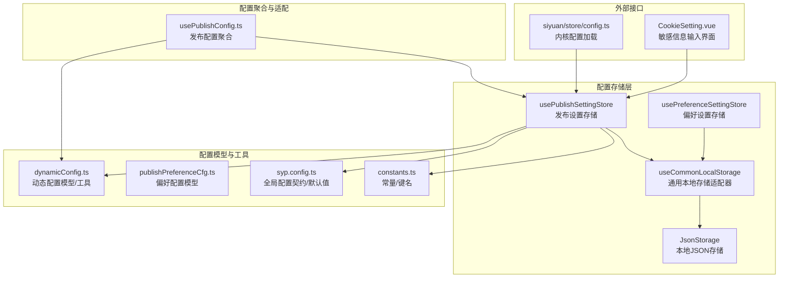
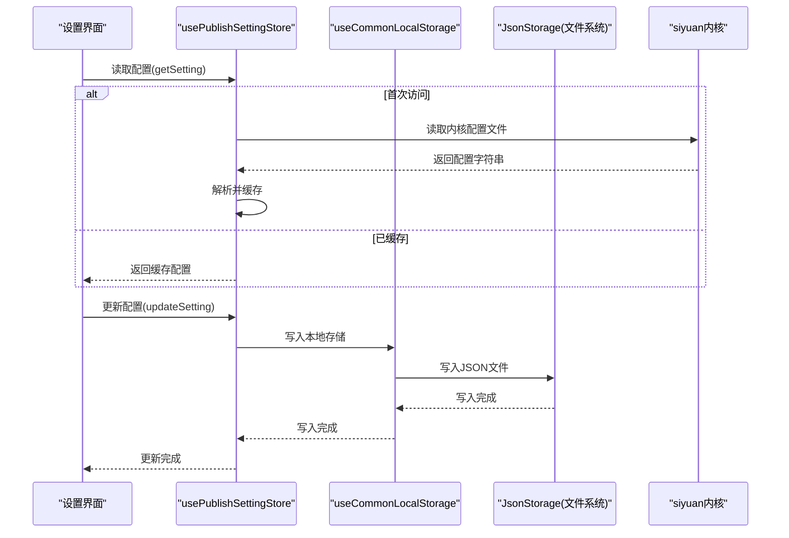
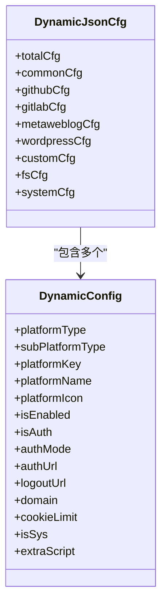
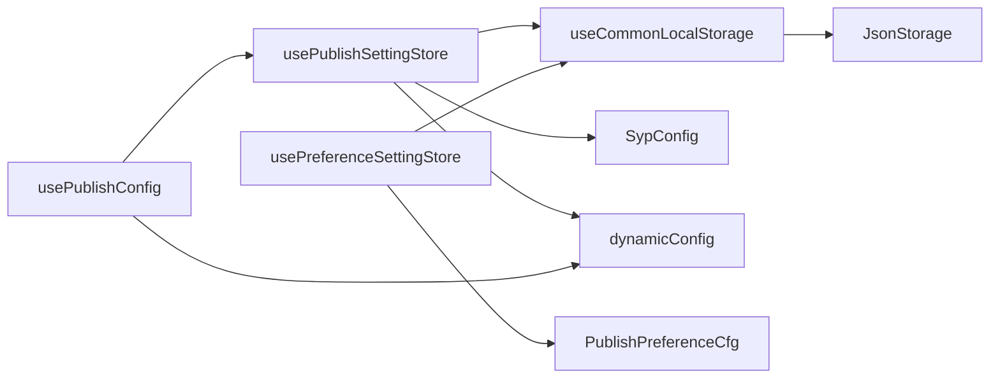

# 配置管理系统

<cite>
**本文引用的文件**
- [config.ts](file://siyuan/store/config.ts)
- [preferenceConfigManager.ts](file://siyuan/store/preferenceConfigManager.ts)
- [dynamicConfig.ts](file://src/platforms/dynamicConfig.ts)
- [usePublishSettingStore.ts](file://src/stores/usePublishSettingStore.ts)
- [usePreferenceSettingStore.ts](file://src/stores/usePreferenceSettingStore.ts)
- [jsonStorage.ts](file://src/stores/common/jsonStorage.ts)
- [useCommonLocalStorage.ts](file://src/stores/common/useCommonLocalStorage.ts)
- [publishPreferenceCfg.ts](file://src/models/publishPreferenceCfg.ts)
- [usePublishConfig.ts](file://src/composables/usePublishConfig.ts)
- [syp.config.ts](file://syp.config.ts)
- [constants.ts](file://src/utils/constants.ts)
- [CookieSetting.vue](file://src/components/set/publish/singleplatform/base/CookieSetting.vue)
</cite>

## 目录
1. [简介](#简介)
2. [项目结构](#项目结构)
3. [核心组件](#核心组件)
4. [架构总览](#架构总览)
5. [详细组件分析](#详细组件分析)
6. [依赖关系分析](#依赖关系分析)
7. [性能考量](#性能考量)
8. [故障排查指南](#故障排查指南)
9. [结论](#结论)
10. [附录](#附录)

## 简介
本文件面向“配置管理系统”的设计与实现，围绕动态配置机制、多环境配置管理、配置存储与同步、配置模板与迁移、安全与审计、以及性能优化等方面进行系统化梳理。通过对仓库中实际代码的逐层解析，帮助开发者与使用者理解配置的加载、验证、缓存与更新策略，掌握在不同运行环境（浏览器/桌面）下的配置持久化方案，并提供配置模板与迁移的最佳实践。

## 项目结构
配置系统主要分布在以下模块：
- 平台动态配置模型与工具：src/platforms/dynamicConfig.ts
- 发布设置存储与读写：src/stores/usePublishSettingStore.ts、src/stores/common/jsonStorage.ts、src/stores/common/useCommonLocalStorage.ts
- 偏好设置存储与读写：src/stores/usePreferenceSettingStore.ts、src/models/publishPreferenceCfg.ts
- 配置聚合与适配：src/composables/usePublishConfig.ts
- 全局配置契约与默认值：syp.config.ts、src/utils/constants.ts
- 思源内核配置加载：siyuan/store/config.ts、siyuan/store/preferenceConfigManager.ts
- 安全与敏感信息界面：src/components/set/publish/singleplatform/base/CookieSetting.vue

图表来源
- [usePublishSettingStore.ts:1-95](file://src/stores/usePublishSettingStore.ts#L1-L95)
- [usePreferenceSettingStore.ts:1-90](file://src/stores/usePreferenceSettingStore.ts#L1-L90)
- [jsonStorage.ts:1-110](file://src/stores/common/jsonStorage.ts#L1-L110)
- [useCommonLocalStorage.ts:1-58](file://src/stores/common/useCommonLocalStorage.ts#L1-L58)
- [dynamicConfig.ts:1-534](file://src/platforms/dynamicConfig.ts#L1-L534)
- [publishPreferenceCfg.ts:1-101](file://src/models/publishPreferenceCfg.ts#L1-L101)
- [syp.config.ts:1-52](file://syp.config.ts#L1-L52)
- [constants.ts:1-54](file://src/utils/constants.ts#L1-L54)
- [usePublishConfig.ts:1-99](file://src/composables/usePublishConfig.ts#L1-L99)
- [config.ts:1-47](file://siyuan/store/config.ts#L1-L47)
- [CookieSetting.vue:1-54](file://src/components/set/publish/singleplatform/base/CookieSetting.vue#L1-L54)

章节来源
- [dynamicConfig.ts:1-534](file://src/platforms/dynamicConfig.ts#L1-L534)
- [usePublishSettingStore.ts:1-95](file://src/stores/usePublishSettingStore.ts#L1-L95)
- [usePreferenceSettingStore.ts:1-90](file://src/stores/usePreferenceSettingStore.ts#L1-L90)
- [jsonStorage.ts:1-110](file://src/stores/common/jsonStorage.ts#L1-L110)
- [useCommonLocalStorage.ts:1-58](file://src/stores/common/useCommonLocalStorage.ts#L1-L58)
- [publishPreferenceCfg.ts:1-101](file://src/models/publishPreferenceCfg.ts#L1-L101)
- [usePublishConfig.ts:1-99](file://src/composables/usePublishConfig.ts#L1-L99)
- [syp.config.ts:1-52](file://syp.config.ts#L1-L52)
- [constants.ts:1-54](file://src/utils/constants.ts#L1-L54)
- [config.ts:1-47](file://siyuan/store/config.ts#L1-L47)
- [CookieSetting.vue:1-54](file://src/components/set/publish/singleplatform/base/CookieSetting.vue#L1-L54)

## 核心组件
- 动态配置模型与工具：提供平台类型、子类型、授权模式、动态配置封装、平台键生成与解析等能力，支撑多平台统一配置管理。
- 发布设置存储：基于 Pinia 的设置存储，负责从内核或本地文件系统加载/保存配置，支持缓存与异步读写。
- 偏好设置存储：封装发布偏好配置，支持从思源笔记窗口读取AI配置并回填到偏好设置。
- 通用本地存储适配器：根据运行环境选择 Electron JSON 文件存储或浏览器 localStorage，保证跨端一致性。
- 配置聚合与适配：在调用发布流程前，聚合设置、动态配置与平台具体配置，输出统一的发布配置对象。
- 全局配置契约与常量：定义动态配置键名、默认语言、全局配置结构与默认值，确保系统级一致性。
- 思源内核配置加载：提供从内核文件系统读取配置的能力，作为配置来源之一。

章节来源
- [dynamicConfig.ts:1-534](file://src/platforms/dynamicConfig.ts#L1-L534)
- [usePublishSettingStore.ts:1-95](file://src/stores/usePublishSettingStore.ts#L1-L95)
- [usePreferenceSettingStore.ts:1-90](file://src/stores/usePreferenceSettingStore.ts#L1-L90)
- [useCommonLocalStorage.ts:1-58](file://src/stores/common/useCommonLocalStorage.ts#L1-L58)
- [jsonStorage.ts:1-110](file://src/stores/common/jsonStorage.ts#L1-L110)
- [usePublishConfig.ts:1-99](file://src/composables/usePublishConfig.ts#L1-L99)
- [syp.config.ts:1-52](file://syp.config.ts#L1-L52)
- [constants.ts:1-54](file://src/utils/constants.ts#L1-L54)
- [config.ts:1-47](file://siyuan/store/config.ts#L1-L47)

## 架构总览
配置系统采用“模型-存储-适配-界面”分层架构：
- 模型层：动态配置模型与偏好配置模型，定义配置的数据结构与行为。
- 存储层：发布设置与偏好设置分别通过统一的本地存储适配器持久化，支持 Electron 与浏览器双端。
- 适配层：发布配置聚合器负责将设置、动态配置与平台配置整合，供业务逻辑使用。
- 界面层：设置表单与敏感信息输入组件负责配置录入与校验。

图表来源
- [usePublishSettingStore.ts:21-95](file://src/stores/usePublishSettingStore.ts#L21-L95)
- [useCommonLocalStorage.ts:27-58](file://src/stores/common/useCommonLocalStorage.ts#L27-L58)
- [jsonStorage.ts:23-110](file://src/stores/common/jsonStorage.ts#L23-L110)
- [config.ts:42-45](file://siyuan/store/config.ts#L42-L45)

## 详细组件分析

### 动态配置模型与工具
- 数据结构：动态配置对象包含平台类型、子类型、授权模式、域名、启用状态、是否内置等字段；提供动态配置封装接口，按类型拆分为多个集合。
- 键规则与解析：提供平台键生成、键解析、文章ID键与YAML键生成等工具函数，确保键的唯一性与可追溯性。
- 类型枚举：定义平台类型与子类型枚举，覆盖常见博客平台、静态站点生成器、文件系统与自定义平台等。

图表来源
- [dynamicConfig.ts:13-113](file://src/platforms/dynamicConfig.ts#L13-L113)
- [dynamicConfig.ts:243-253](file://src/platforms/dynamicConfig.ts#L243-L253)

章节来源
- [dynamicConfig.ts:1-534](file://src/platforms/dynamicConfig.ts#L1-L534)

### 发布设置存储（Pinia + 本地存储）
- 初始化与默认值：以全局配置契约作为初始值，确保首次启动时具备完整结构。
- 缓存策略：在内存中缓存已加载的设置，避免重复读取；更新时同步刷新缓存。
- 异步读写：通过通用存储适配器实现异步读写，Electron 环境写入 JSON 文件，浏览器环境写入 localStorage。
- 迁移提示：注释明确指出配置文件路径变更与旧数据迁移策略。

图表来源
- [usePublishSettingStore.ts:28-48](file://src/stores/usePublishSettingStore.ts#L28-L48)

章节来源
- [usePublishSettingStore.ts:1-95](file://src/stores/usePublishSettingStore.ts#L1-L95)

### 偏好设置存储（偏好配置模型 + 思源笔记集成）
- 偏好配置模型：继承通用偏好配置，扩展 AI 相关开关与参数，以及菜单显示控制等。
- 思源笔记集成：检测思源窗口中的 AI 配置，自动回填到偏好设置，提升用户体验。
- 默认值与校验：对布尔型字段提供默认值兜底，确保配置完整性。

章节来源
- [publishPreferenceCfg.ts:1-101](file://src/models/publishPreferenceCfg.ts#L1-L101)
- [usePreferenceSettingStore.ts:1-90](file://src/stores/usePreferenceSettingStore.ts#L1-L90)

### 通用本地存储适配器（Electron/浏览器）
- 环境检测：通过设备检测判断是否处于思源/新窗口环境，决定使用 JSON 文件存储还是浏览器 localStorage。
- 文件系统保障：在 Electron 环境下，确保目录与文件存在，未存在时自动初始化空 JSON 文件。
- 序列化与反序列化：统一使用 JSON 字符串进行读写，保证跨端一致性。

章节来源
- [useCommonLocalStorage.ts:1-58](file://src/stores/common/useCommonLocalStorage.ts#L1-L58)
- [jsonStorage.ts:1-110](file://src/stores/common/jsonStorage.ts#L1-L110)

### 配置聚合与适配（发布配置）
- 聚合逻辑：从发布设置中读取动态配置与平台配置，结合动态配置工具解析目标平台配置。
- API 初始化：根据平台键与配置初始化适配器，输出统一的发布 API。

章节来源
- [usePublishConfig.ts:1-99](file://src/composables/usePublishConfig.ts#L1-L99)
- [constants.ts:19](file://src/utils/constants.ts#L19)

### 全局配置契约与常量
- 动态配置键名：系统唯一键名，贯穿整个配置生命周期，确保跨模块一致性。
- 默认值与语言：提供默认语言与动态配置默认空值，保证初始化安全。

章节来源
- [syp.config.ts:1-52](file://syp.config.ts#L1-L52)
- [constants.ts:1-54](file://src/utils/constants.ts#L1-L54)

### 思源内核配置加载
- 文件读取：通过内核 API 读取指定路径的配置文件，返回文本后由上层解析。
- 用途：作为配置来源之一，与本地存储形成互补。

章节来源
- [config.ts:1-47](file://siyuan/store/config.ts#L1-L47)
- [preferenceConfigManager.ts:1-52](file://siyuan/store/preferenceConfigManager.ts#L1-L52)

## 依赖关系分析
- 组件耦合
  - usePublishSettingStore 依赖 useCommonStorageAsync 与 SypConfig，默认值来自全局配置契约。
  - usePublishConfig 依赖 usePublishSettingStore、dynamicConfig 工具与 Adaptors，负责配置聚合。
  - usePreferenceSettingStore 依赖 useCommonLocalStorage 与 PublishPreferenceCfg。
  - useCommonLocalStorage 依据运行环境选择 JsonStorage 或浏览器 localStorage。
- 外部依赖
  - 思源设备检测、内核 API、文件系统与路径模块。
  - 第三方库：@vueuse/core、Pinia、Element Plus 等。

图表来源
- [usePublishSettingStore.ts:10-25](file://src/stores/usePublishSettingStore.ts#L10-L25)
- [useCommonLocalStorage.ts:9-34](file://src/stores/common/useCommonLocalStorage.ts#L9-L34)
- [jsonStorage.ts:23-51](file://src/stores/common/jsonStorage.ts#L23-L51)
- [syp.config.ts:46-52](file://syp.config.ts#L46-L52)
- [dynamicConfig.ts:13-113](file://src/platforms/dynamicConfig.ts#L13-L113)
- [usePublishConfig.ts:15-18](file://src/composables/usePublishConfig.ts#L15-L18)
- [publishPreferenceCfg.ts:19-98](file://src/models/publishPreferenceCfg.ts#L19-L98)

## 性能考量
- 缓存策略：发布设置在内存中缓存，避免重复读取，显著降低 IO 压力。
- 异步读写：通过异步存储适配器减少主线程阻塞，提升交互流畅度。
- 文件系统初始化：首次启动时确保目录与文件存在，避免后续频繁的目录创建开销。
- 配置解析：统一使用 JSON 解析，避免重复解析与深拷贝带来的额外成本。

## 故障排查指南
- 配置无法加载
  - 检查内核文件是否存在与可读，确认路径与键名一致。
  - 在 Electron 环境下确认数据目录与文件权限。
- 配置更新无效
  - 确认 updateSetting 是否正确调用并刷新了缓存。
  - 检查运行环境是否切换至 Electron/浏览器，导致存储介质不同。
- 动态配置键异常
  - 使用动态配置工具函数校验键格式，确保平台键唯一且符合规则。
- 敏感信息输入
  - 通过 CookieSetting 等界面组件进行输入，注意密码/Token 的最小暴露原则与及时清理。

章节来源
- [usePublishSettingStore.ts:55-59](file://src/stores/usePublishSettingStore.ts#L55-L59)
- [dynamicConfig.ts:397-418](file://src/platforms/dynamicConfig.ts#L397-L418)
- [CookieSetting.vue:1-54](file://src/components/set/publish/singleplatform/base/CookieSetting.vue#L1-L54)

## 结论
该配置管理系统以“模型-存储-适配-界面”为核心架构，通过动态配置模型统一多平台配置，借助通用本地存储适配器实现跨端一致性，配合发布配置聚合器为业务提供标准化入口。系统在缓存、异步读写、文件系统初始化等方面具备良好性能表现，并通过常量与全局配置契约确保一致性与可维护性。建议在生产环境中结合安全与审计策略，进一步强化敏感信息保护与配置变更追踪。

## 附录
- 多环境配置管理
  - 开发/测试/生产环境可通过环境变量注入默认配置（如平台 API 地址、认证令牌等），并在设置界面覆盖。
  - 建议在 CI/CD 中为不同环境准备独立的配置文件与密钥管理策略。
- 配置模板与迁移
  - 使用动态配置封装接口将配置按类型拆分，便于模板化导入导出。
  - 迁移时遵循系统唯一键名，避免键冲突；必要时提供版本化配置与兼容层。
- 安全与审计
  - 敏感信息（密码、Token、Cookie）通过专用界面组件输入与最小暴露策略处理。
  - 建议引入配置变更审计日志与权限控制，确保合规与可追溯。