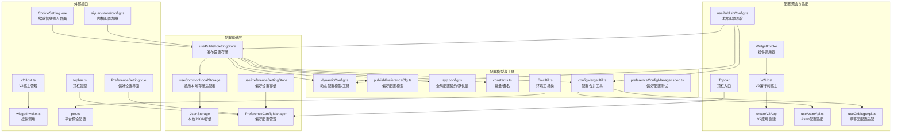
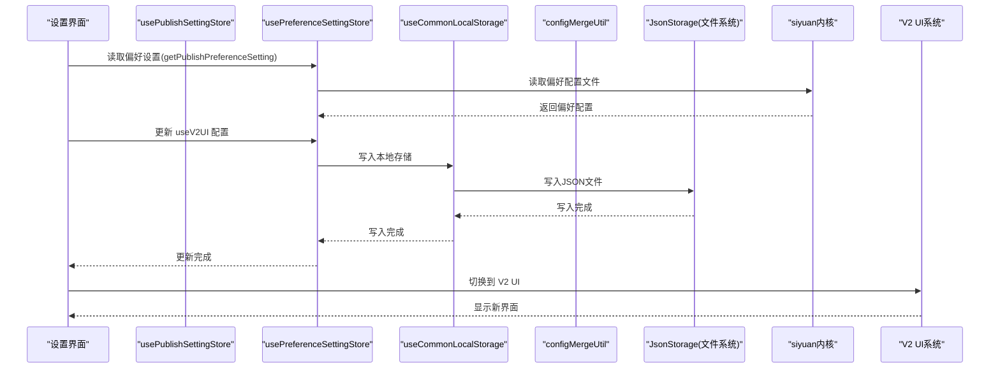
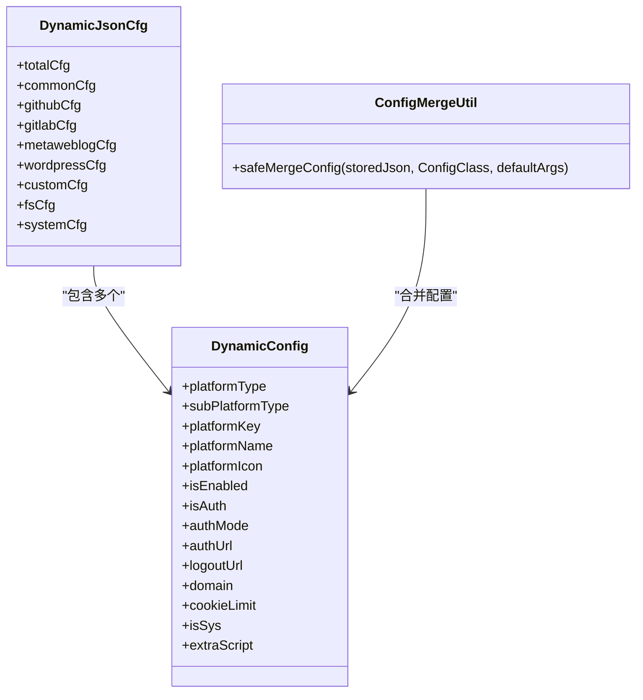
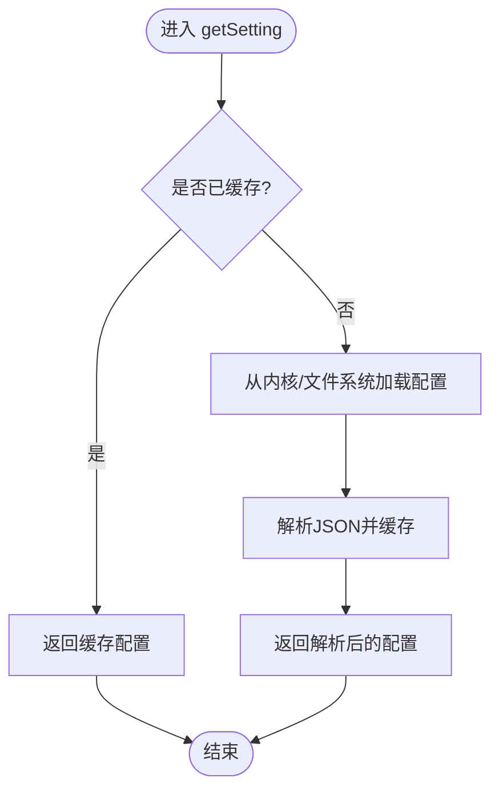
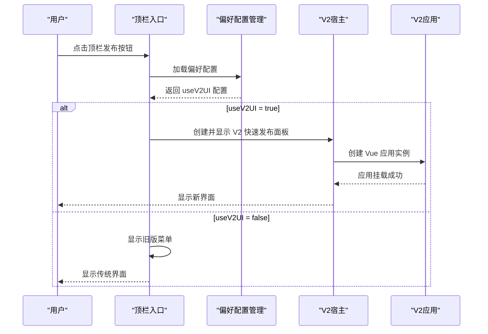
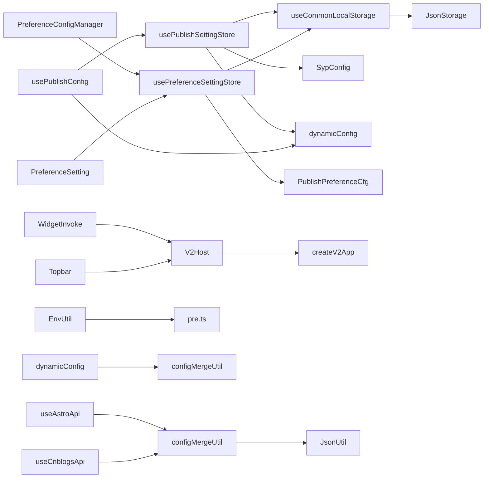

# 配置管理系统

<cite>
**本文引用的文件**
- [config.ts](file://siyuan/store/config.ts)
- [preferenceConfigManager.ts](file://siyuan/store/preferenceConfigManager.ts)
- [dynamicConfig.ts](file://src/platforms/dynamicConfig.ts)
- [usePublishSettingStore.ts](file://src/stores/usePublishSettingStore.ts)
- [usePreferenceSettingStore.ts](file://src/stores/usePreferenceSettingStore.ts)
- [jsonStorage.ts](file://src/stores/common/jsonStorage.ts)
- [useCommonLocalStorage.ts](file://src/stores/common/useCommonLocalStorage.ts)
- [publishPreferenceCfg.ts](file://src/models/publishPreferenceCfg.ts)
- [usePublishConfig.ts](file://src/composables/usePublishConfig.ts)
- [syp.config.ts](file://syp.config.ts)
- [constants.ts](file://src/utils/constants.ts)
- [configMergeUtil.ts](file://src/adaptors/api/base/configMergeUtil.ts)
- [useAstroApi.ts](file://src/adaptors/api/astro/useAstroApi.ts)
- [useCnblogsApi.ts](file://src/adaptors/api/cnblogs/useCnblogsApi.ts)
- [EnvUtil.ts](file://src/utils/EnvUtil.ts)
- [CookieSetting.vue](file://src/components/set/publish/singleplatform/base/CookieSetting.vue)
- [PreferenceSetting.vue](file://src/components/set/preference/PreferenceSetting.vue)
- [topbar.ts](file://siyuan/topbar.ts)
- [widgetInvoke.ts](file://siyuan/invoke/widgetInvoke.ts)
- [v2Host.ts](file://siyuan/v2/v2Host.ts)
- [createV2App.ts](file://src/v2/createV2App.ts)
- [preferenceConfigManager.spec.ts](file://src/stores/preferenceConfigManager.spec.ts)
</cite>

## 更新摘要
**变更内容**
- 新增配置合并工具（configMergeUtil）增强平台特定配置的持久化能力
- 改进配置管理机制，解决构造函数默认值丢失问题
- 增强环境兼容性检查能力，支持多环境配置管理
- 扩展动态配置工具函数，提供更完善的配置操作能力

## 目录
1. [简介](#简介)
2. [项目结构](#项目结构)
3. [核心组件](#核心组件)
4. [架构总览](#架构总览)
5. [详细组件分析](#详细组件分析)
6. [依赖关系分析](#依赖关系分析)
7. [性能考量](#性能考量)
8. [故障排查指南](#故障排查指南)
9. [结论](#结论)
10. [附录](#附录)

## 简介
本文件面向"配置管理系统"的设计与实现，围绕动态配置机制、多环境配置管理、配置存储与同步、配置模板与迁移、安全与审计、以及性能优化等方面进行系统化梳理。通过对仓库中实际代码的逐层解析，帮助开发者与使用者理解配置的加载、验证、缓存与更新策略，掌握在不同运行环境（浏览器/桌面）下的配置持久化方案，并提供配置模板与迁移的最佳实践。

**新增功能**：系统现已集成配置合并工具（configMergeUtil），有效解决平台特定配置在存储过程中构造函数默认值丢失的问题，增强了配置的完整性和可靠性。同时，系统具备更强的环境兼容性检查能力，支持在不同运行环境下自动调整配置行为。

## 项目结构
配置系统主要分布在以下模块：
- 平台动态配置模型与工具：src/platforms/dynamicConfig.ts
- 配置合并工具：src/adaptors/api/base/configMergeUtil.ts
- 发布设置存储与读写：src/stores/usePublishSettingStore.ts、src/stores/common/jsonStorage.ts、src/stores/common/useCommonLocalStorage.ts
- 偏好设置存储与读写：src/stores/usePreferenceSettingStore.ts、src/models/publishPreferenceCfg.ts
- 配置聚合与适配：src/composables/usePublishConfig.ts
- 全局配置契约与默认值：syp.config.ts、src/utils/constants.ts
- 思源内核配置加载：siyuan/store/config.ts、siyuan/store/preferenceConfigManager.ts
- 环境工具类：src/utils/EnvUtil.ts
- 安全与敏感信息界面：src/components/set/publish/singleplatform/base/CookieSetting.vue
- **新增** V2 UI 系统：siyuan/v2/v2Host.ts、src/v2/createV2App.ts、siyuan/invoke/widgetInvoke.ts
- **新增** 偏好设置界面：src/components/set/preference/PreferenceSetting.vue

**图表来源**
- [usePublishSettingStore.ts:1-95](file://src/stores/usePublishSettingStore.ts#L1-L95)
- [usePreferenceSettingStore.ts:1-90](file://src/stores/usePreferenceSettingStore.ts#L1-L90)
- [jsonStorage.ts:1-110](file://src/stores/common/jsonStorage.ts#L1-L110)
- [useCommonLocalStorage.ts:1-58](file://src/stores/common/useCommonLocalStorage.ts#L1-L58)
- [dynamicConfig.ts:1-540](file://src/platforms/dynamicConfig.ts#L1-L540)
- [publishPreferenceCfg.ts:1-106](file://src/models/publishPreferenceCfg.ts#L1-L106)
- [syp.config.ts:1-52](file://syp.config.ts#L1-L52)
- [constants.ts:1-54](file://src/utils/constants.ts#L1-L54)
- [configMergeUtil.ts:1-34](file://src/adaptors/api/base/configMergeUtil.ts#L1-L34)
- [EnvUtil.ts:1-37](file://src/utils/EnvUtil.ts#L1-L37)
- [usePublishConfig.ts:1-99](file://src/composables/usePublishConfig.ts#L1-L99)
- [config.ts:1-47](file://siyuan/store/config.ts#L1-L47)
- [CookieSetting.vue:1-54](file://src/components/set/publish/singleplatform/base/CookieSetting.vue#L1-L54)
- [PreferenceSetting.vue:1-123](file://src/components/set/preference/PreferenceSetting.vue#L1-L123)
- [topbar.ts:1-287](file://siyuan/topbar.ts#L1-L287)
- [widgetInvoke.ts:1-183](file://siyuan/invoke/widgetInvoke.ts#L1-L183)
- [v2Host.ts:1-97](file://siyuan/v2/v2Host.ts#L1-L97)
- [createV2App.ts:1-37](file://src/v2/createV2App.ts#L1-L37)
- [preferenceConfigManager.spec.ts:1-35](file://src/stores/preferenceConfigManager.spec.ts#L1-L35)
- [useAstroApi.ts:35-97](file://src/adaptors/api/astro/useAstroApi.ts#L35-L97)
- [useCnblogsApi.ts:40-94](file://src/adaptors/api/cnblogs/useCnblogsApi.ts#L40-L94)
- [pre.ts:1-16](file://src/platforms/pre.ts#L1-L16)

**章节来源**
- [dynamicConfig.ts:1-540](file://src/platforms/dynamicConfig.ts#L1-L540)
- [configMergeUtil.ts:1-34](file://src/adaptors/api/base/configMergeUtil.ts#L1-L34)
- [usePublishSettingStore.ts:1-95](file://src/stores/usePublishSettingStore.ts#L1-L95)
- [usePreferenceSettingStore.ts:1-90](file://src/stores/usePreferenceSettingStore.ts#L1-L90)
- [jsonStorage.ts:1-110](file://src/stores/common/jsonStorage.ts#L1-L110)
- [useCommonLocalStorage.ts:1-58](file://src/stores/common/useCommonLocalStorage.ts#L1-L58)
- [publishPreferenceCfg.ts:1-106](file://src/models/publishPreferenceCfg.ts#L1-L106)
- [usePublishConfig.ts:1-99](file://src/composables/usePublishConfig.ts#L1-L99)
- [syp.config.ts:1-52](file://syp.config.ts#L1-L52)
- [constants.ts:1-54](file://src/utils/constants.ts#L1-L54)
- [config.ts:1-47](file://siyuan/store/config.ts#L1-L47)
- [CookieSetting.vue:1-54](file://src/components/set/publish/singleplatform/base/CookieSetting.vue#L1-L54)
- [PreferenceSetting.vue:1-123](file://src/components/set/preference/PreferenceSetting.vue#L1-L123)
- [topbar.ts:1-287](file://siyuan/topbar.ts#L1-L287)
- [widgetInvoke.ts:1-183](file://siyuan/invoke/widgetInvoke.ts#L1-L183)
- [v2Host.ts:1-97](file://siyuan/v2/v2Host.ts#L1-L97)
- [createV2App.ts:1-37](file://src/v2/createV2App.ts#L1-L37)
- [preferenceConfigManager.spec.ts:1-35](file://src/stores/preferenceConfigManager.spec.ts#L1-L35)
- [EnvUtil.ts:1-37](file://src/utils/EnvUtil.ts#L1-L37)
- [useAstroApi.ts:35-97](file://src/adaptors/api/astro/useAstroApi.ts#L35-L97)
- [useCnblogsApi.ts:40-94](file://src/adaptors/api/cnblogs/useCnblogsApi.ts#L40-L94)
- [pre.ts:1-16](file://src/platforms/pre.ts#L1-L16)

## 核心组件
- 动态配置模型与工具：提供平台类型、子类型、授权模式、动态配置封装、平台键生成与解析等能力，支撑多平台统一配置管理。
- **新增** 配置合并工具：通过构造函数创建带默认值的配置实例，再用存储的JSON覆盖，确保构造函数初始化的平台特定配置（如knowledgeSpaceTitle、placeholder等）在存储数据中缺失时仍能作为fallback存在。
- 发布设置存储：基于 Pinia 的设置存储，负责从内核或本地文件系统加载/保存配置，支持缓存与异步读写。
- 偏好设置存储：封装发布偏好配置，支持从思源笔记窗口读取AI配置并回填到偏好设置，**新增 useV2UI 配置标志**。
- 通用本地存储适配器：根据运行环境选择 Electron JSON 文件存储或浏览器 localStorage，保证跨端一致性。
- 配置聚合与适配：在调用发布流程前，聚合设置、动态配置与平台具体配置，输出统一的发布配置对象。
- 全局配置契约与常量：定义动态配置键名、默认语言、全局配置结构与默认值，确保系统级一致性。
- **新增** 环境工具类：提供统一的环境检测功能，支持isSiyuanElectron()等环境判断方法。
- 思源内核配置加载：提供从内核文件系统读取配置的能力，作为配置来源之一。
- **新增** V2 UI 系统：提供实验性的新版本界面，支持快速发布面板和设置页面的 DOM 主机渲染。
- **新增** 偏好设置界面：提供完整的偏好设置表单，包括 UI 切换、菜单显示控制等选项。

**章节来源**
- [dynamicConfig.ts:1-540](file://src/platforms/dynamicConfig.ts#L1-L540)
- [configMergeUtil.ts:12-34](file://src/adaptors/api/base/configMergeUtil.ts#L12-L34)
- [usePublishSettingStore.ts:1-95](file://src/stores/usePublishSettingStore.ts#L1-L95)
- [usePreferenceSettingStore.ts:1-90](file://src/stores/usePreferenceSettingStore.ts#L1-L90)
- [useCommonLocalStorage.ts:1-58](file://src/stores/common/useCommonLocalStorage.ts#L1-L58)
- [jsonStorage.ts:1-110](file://src/stores/common/jsonStorage.ts#L1-L110)
- [usePublishConfig.ts:1-99](file://src/composables/usePublishConfig.ts#L1-L99)
- [syp.config.ts:1-52](file://syp.config.ts#L1-L52)
- [constants.ts:1-54](file://src/utils/constants.ts#L1-L54)
- [EnvUtil.ts:21-37](file://src/utils/EnvUtil.ts#L21-L37)
- [config.ts:1-47](file://siyuan/store/config.ts#L1-L47)
- [publishPreferenceCfg.ts:81-82](file://src/models/publishPreferenceCfg.ts#L81-L82)
- [PreferenceSetting.vue:108-113](file://src/components/set/preference/PreferenceSetting.vue#L108-L113)
- [topbar.ts:67-76](file://siyuan/topbar.ts#L67-L76)
- [widgetInvoke.ts:110-117](file://siyuan/invoke/widgetInvoke.ts#L110-L117)

## 架构总览
配置系统采用"模型-存储-适配-界面"分层架构：
- 模型层：动态配置模型与偏好配置模型，定义配置的数据结构与行为。
- **新增** 工具层：配置合并工具解决构造函数默认值丢失问题，环境工具类提供统一的环境检测能力。
- 存储层：发布设置与偏好设置分别通过统一的本地存储适配器持久化，支持 Electron 与浏览器双端。
- 适配层：发布配置聚合器负责将设置、动态配置与平台配置整合，供业务逻辑使用。
- 界面层：设置表单与敏感信息输入组件负责配置录入与校验，**新增 V2 UI 切换界面**。

**图表来源**
- [usePublishSettingStore.ts:21-95](file://src/stores/usePublishSettingStore.ts#L21-L95)
- [useCommonLocalStorage.ts:27-58](file://src/stores/common/useCommonLocalStorage.ts#L27-L58)
- [jsonStorage.ts:23-110](file://src/stores/common/jsonStorage.ts#L23-L110)
- [config.ts:42-45](file://siyuan/store/config.ts#L42-L45)
- [PreferenceSetting.vue:108-113](file://src/components/set/preference/PreferenceSetting.vue#L108-L113)
- [topbar.ts:67-76](file://siyuan/topbar.ts#L67-L76)
- [widgetInvoke.ts:110-117](file://siyuan/invoke/widgetInvoke.ts#L110-L117)

## 详细组件分析

### 动态配置模型与工具
- 数据结构：动态配置对象包含平台类型、子类型、授权模式、域名、启用状态、是否内置等字段；提供动态配置封装接口，按类型拆分为多个集合。
- 键规则与解析：提供平台键生成、键解析、文章ID键与YAML键生成等工具函数，确保键的唯一性与可追溯性。
- 类型枚举：定义平台类型与子类型枚举，覆盖常见博客平台、静态站点生成器、文件系统与自定义平台等。
- **新增** 配置操作工具：提供动态键重复检测、按键查询平台、根据键替换平台配置等实用工具函数。

**图表来源**
- [dynamicConfig.ts:13-113](file://src/platforms/dynamicConfig.ts#L13-L113)
- [dynamicConfig.ts:243-253](file://src/platforms/dynamicConfig.ts#L243-L253)
- [configMergeUtil.ts:25-33](file://src/adaptors/api/base/configMergeUtil.ts#L25-L33)

**章节来源**
- [dynamicConfig.ts:1-540](file://src/platforms/dynamicConfig.ts#L1-L540)

### 配置合并工具（新增）
- **核心功能**：解决 JsonUtil.safeParse 跳过构造函数导致平台特定配置丢失的问题。
- **工作原理**：先通过构造函数创建带默认值的实例，再用存储的 JSON 覆盖，确保构造函数初始化的平台特定配置（如 knowledgeSpaceTitle、placeholder 等）在存储数据中缺失时仍能作为 fallback 存在。
- **应用场景**：广泛应用于各平台API适配器中，如 Astro、博客园等配置的加载与初始化。
- **类型安全**：使用泛型约束确保返回配置实例的类型安全。

**章节来源**
- [configMergeUtil.ts:12-34](file://src/adaptors/api/base/configMergeUtil.ts#L12-L34)

### 发布设置存储（Pinia + 本地存储）
- 初始化与默认值：以全局配置契约作为初始值，确保首次启动时具备完整结构。
- 缓存策略：在内存中缓存已加载的设置，避免重复读取；更新时同步刷新缓存。
- 异步读写：通过通用存储适配器实现异步读写，Electron 环境写入 JSON 文件，浏览器环境写入 localStorage。
- 迁移提示：注释明确指出配置文件路径变更与旧数据迁移策略。

**图表来源**
- [usePublishSettingStore.ts:28-48](file://src/stores/usePublishSettingStore.ts#L28-L48)

**章节来源**
- [usePublishSettingStore.ts:1-95](file://src/stores/usePublishSettingStore.ts#L1-L95)

### 偏好设置存储（偏好配置模型 + 思源笔记集成 + V2 UI 支持）
- 偏好配置模型：继承通用偏好配置，扩展 AI 相关开关与参数，以及菜单显示控制等。
- **新增** useV2UI 配置标志：提供实验性的 V2 UI 开关，默认关闭，重启后生效。
- **新增** V2 UI 切换逻辑：在顶栏入口和设置页面中根据配置标志切换不同的 UI 实现。
- **新增** 回退机制：当 V2 UI 初始化失败时自动回退到旧版菜单。
- 思源笔记集成：检测思源窗口中的 AI 配置，自动回填到偏好设置，提升用户体验。
- 默认值与校验：对布尔型字段提供默认值兜底，确保配置完整性。

**章节来源**
- [publishPreferenceCfg.ts:1-106](file://src/models/publishPreferenceCfg.ts#L1-L106)
- [usePreferenceSettingStore.ts:1-90](file://src/stores/usePreferenceSettingStore.ts#L1-L90)
- [preferenceConfigManager.ts:48-63](file://siyuan/store/preferenceConfigManager.ts#L48-L63)

### 通用本地存储适配器（Electron/浏览器）
- 环境检测：通过设备检测判断是否处于思源/新窗口环境，决定使用 JSON 文件存储还是浏览器 localStorage。
- 文件系统保障：在 Electron 环境下，确保目录与文件存在，未存在时自动初始化空 JSON 文件。
- 序列化与反序列化：统一使用 JSON 字符串进行读写，保证跨端一致性。

**章节来源**
- [useCommonLocalStorage.ts:1-58](file://src/stores/common/useCommonLocalStorage.ts#L1-L58)
- [jsonStorage.ts:1-110](file://src/stores/common/jsonStorage.ts#L1-L110)

### 配置聚合与适配（发布配置）
- 聚合逻辑：从发布设置中读取动态配置与平台配置，结合动态配置工具解析目标平台配置。
- API 初始化：根据平台键与配置初始化适配器，输出统一的发布 API。
- **新增** 配置合并：在适配器初始化时使用配置合并工具确保平台特定配置的完整性。

**章节来源**
- [usePublishConfig.ts:1-99](file://src/composables/usePublishConfig.ts#L1-L99)
- [constants.ts:19](file://src/utils/constants.ts#L19)

### 全局配置契约与常量
- 动态配置键名：系统唯一键名，贯穿整个配置生命周期，确保跨模块一致性。
- 默认值与语言：提供默认语言与动态配置默认空值，保证初始化安全。

**章节来源**
- [syp.config.ts:1-52](file://syp.config.ts#L1-L52)
- [constants.ts:1-54](file://src/utils/constants.ts#L1-L54)

### **新增** 环境工具类
- **统一环境检测**：提供 isSiyuanElectron() 方法统一判断思源Electron环境。
- **环境适配**：支持在不同运行环境下自动调整配置行为，确保跨平台兼容性。
- **平台预设**：与平台预设配置结合，动态过滤平台列表，支持环境特定的功能展示。

**章节来源**
- [EnvUtil.ts:21-37](file://src/utils/EnvUtil.ts#L21-L37)
- [pre.ts:10-16](file://src/platforms/pre.ts#L10-L16)

### 思源内核配置加载
- 文件读取：通过内核 API 读取指定路径的配置文件，返回文本后由上层解析。
- 用途：作为配置来源之一，与本地存储形成互补。

**章节来源**
- [config.ts:1-47](file://siyuan/store/config.ts#L1-L47)
- [preferenceConfigManager.ts:1-102](file://siyuan/store/preferenceConfigManager.ts#L1-L102)

### **新增** V2 UI 系统
- **V2Host 宿主管理**：基于思源原生 Menu 挂载真实 DOM，提供 V2 版本界面的容器。
- **createV2App 应用创建**：创建 Vue 应用实例，支持国际化和状态管理。
- **快速发布面板**：提供最小化的发布界面，支持锚点定位和响应式布局。
- **设置页面集成**：在启用 V2 UI 时，设置页面通过 DOM 主机渲染而非 iframe。
- **回退机制**：当 V2 UI 初始化失败时，自动回退到旧版菜单并显示错误提示。

**图表来源**
- [topbar.ts:64-80](file://siyuan/topbar.ts#L64-L80)
- [widgetInvoke.ts:110-117](file://siyuan/invoke/widgetInvoke.ts#L110-L117)
- [v2Host.ts:26-59](file://siyuan/v2/v2Host.ts#L26-L59)
- [createV2App.ts:15-36](file://src/v2/createV2App.ts#L15-L36)

**章节来源**
- [topbar.ts:67-76](file://siyuan/topbar.ts#L67-L76)
- [widgetInvoke.ts:110-117](file://siyuan/invoke/widgetInvoke.ts#L110-L117)
- [v2Host.ts:1-97](file://siyuan/v2/v2Host.ts#L1-L97)
- [createV2App.ts:1-37](file://src/v2/createV2App.ts#L1-L37)

### **新增** 偏好设置界面
- **完整的设置表单**：提供所有偏好设置选项的可视化界面。
- **useV2UI 开关**：实验性功能开关，开启后重启生效。
- **菜单显示控制**：控制各种菜单项的显示与隐藏。
- **确认对话框**：对重要设置变更提供确认提示。
- **响应式设计**：适配不同设备和窗口大小。

**章节来源**
- [PreferenceSetting.vue:1-123](file://src/components/set/preference/PreferenceSetting.vue#L1-L123)
- [preferenceConfigManager.spec.ts:1-35](file://src/stores/preferenceConfigManager.spec.ts#L1-L35)

## 依赖关系分析
- 组件耦合
  - usePublishSettingStore 依赖 useCommonStorageAsync 与 SypConfig，默认值来自全局配置契约。
  - usePublishConfig 依赖 usePublishSettingStore、dynamicConfig 工具与 Adaptors，负责配置聚合。
  - usePreferenceSettingStore 依赖 useCommonLocalStorage 与 PublishPreferenceCfg。
  - useCommonLocalStorage 依据运行环境选择 JsonStorage 或浏览器 localStorage。
  - **新增** PreferenceConfigManager 负责偏好配置的加载、保存和删除。
  - **新增** V2Host 依赖 createV2App 和思源原生 Menu API。
  - **新增** WidgetInvoke 在启用 V2 UI 时使用 V2Host 替代传统 iframe。
  - **新增** configMergeUtil 依赖 JsonUtil，被各平台API适配器广泛使用。
  - **新增** EnvUtil 提供统一的环境检测功能，影响平台注册与过滤。
- 外部依赖
  - 思源设备检测、内核 API、文件系统与路径模块。
  - 第三方库：@vueuse/core、Pinia、Element Plus、Vue 3 等。

**图表来源**
- [usePublishSettingStore.ts:10-25](file://src/stores/usePublishSettingStore.ts#L10-L25)
- [useCommonLocalStorage.ts:9-34](file://src/stores/common/useCommonLocalStorage.ts#L9-L34)
- [jsonStorage.ts:23-51](file://src/stores/common/jsonStorage.ts#L23-L51)
- [syp.config.ts:46-52](file://syp.config.ts#L46-L52)
- [dynamicConfig.ts:13-113](file://src/platforms/dynamicConfig.ts#L13-L113)
- [usePublishConfig.ts:15-18](file://src/composables/usePublishConfig.ts#L15-L18)
- [publishPreferenceCfg.ts:19-98](file://src/models/publishPreferenceCfg.ts#L19-L98)
- [PreferenceSetting.vue:18](file://src/components/set/preference/PreferenceSetting.vue#L18)
- [topbar.ts:47-53](file://siyuan/topbar.ts#L47-L53)
- [widgetInvoke.ts:44-48](file://siyuan/invoke/widgetInvoke.ts#L44-L48)
- [v2Host.ts:15-24](file://siyuan/v2/v2Host.ts#L15-L24)
- [configMergeUtil.ts:10](file://src/adaptors/api/base/configMergeUtil.ts#L10)
- [useAstroApi.ts:13](file://src/adaptors/api/astro/useAstroApi.ts#L13)
- [useCnblogsApi.ts:11](file://src/adaptors/api/cnblogs/useCnblogsApi.ts#L11)
- [EnvUtil.ts:10](file://src/utils/EnvUtil.ts#L10)
- [pre.ts:12](file://src/platforms/pre.ts#L12)

## 性能考量
- 缓存策略：发布设置在内存中缓存，避免重复读取，显著降低 IO 压力。
- 异步读写：通过异步存储适配器减少主线程阻塞，提升交互流畅度。
- 文件系统初始化：首次启动时确保目录与文件存在，避免后续频繁的目录创建开销。
- 配置解析：统一使用 JSON 解析，避免重复解析与深拷贝带来的额外成本。
- **新增** 配置合并优化：通过构造函数默认值合并，减少配置初始化的重复工作。
- **新增** 环境检测缓存：EnvUtil 提供高效的环境检测，避免重复的DOM查询。
- **新增** V2 UI 按需加载：只有在启用 useV2UI 时才加载 V2 相关资源，减少不必要的内存占用。
- **新增** 回退机制：V2 UI 初始化失败时自动回退，确保系统稳定性。

## 故障排查指南
- 配置无法加载
  - 检查内核文件是否存在与可读，确认路径与键名一致。
  - 在 Electron 环境下确认数据目录与文件权限。
- 配置更新无效
  - 确认 updateSetting 是否正确调用并刷新了缓存。
  - 检查运行环境是否切换至 Electron/浏览器，导致存储介质不同。
- 动态配置键异常
  - 使用动态配置工具函数校验键格式，确保平台键唯一且符合规则。
- **新增** 配置合并问题
  - 检查 configMergeUtil 的使用是否正确，确保构造函数参数传递无误。
  - 确认平台配置类的构造函数是否包含必要的默认值设置。
- **新增** 环境兼容性问题
  - 使用 EnvUtil.isSiyuanElectron() 检查当前运行环境。
  - 确认平台注册时的环境过滤逻辑是否正确。
- 敏感信息输入
  - 通过 CookieSetting 等界面组件进行输入，注意密码/Token 的最小暴露原则与及时清理。
- **新增** V2 UI 问题
  - 检查 useV2UI 配置是否正确保存，重启后生效。
  - 查看控制台错误信息，确认 V2 UI 初始化是否成功。
  - 如果 V2 UI 启动失败，系统会自动回退到旧版菜单。

**章节来源**
- [usePublishSettingStore.ts:55-59](file://src/stores/usePublishSettingStore.ts#L55-L59)
- [dynamicConfig.ts:397-418](file://src/platforms/dynamicConfig.ts#L397-L418)
- [configMergeUtil.ts:25-33](file://src/adaptors/api/base/configMergeUtil.ts#L25-L33)
- [EnvUtil.ts:27-32](file://src/utils/EnvUtil.ts#L27-L32)
- [CookieSetting.vue:1-54](file://src/components/set/publish/singleplatform/base/CookieSetting.vue#L1-L54)
- [topbar.ts:72-76](file://siyuan/topbar.ts#L72-L76)
- [preferenceConfigManager.spec.ts:26-33](file://src/stores/preferenceConfigManager.spec.ts#L26-L33)

## 结论
该配置管理系统以"模型-存储-适配-界面"为核心架构，通过动态配置模型统一多平台配置，借助通用本地存储适配器实现跨端一致性，配合发布配置聚合器为业务提供标准化入口。系统在缓存、异步读写、文件系统初始化等方面具备良好性能表现，并通过常量与全局配置契约确保一致性与可维护性。

**新增功能**：系统现已集成配置合并工具（configMergeUtil），有效解决了平台特定配置在存储过程中构造函数默认值丢失的问题，显著增强了配置的完整性和可靠性。同时，系统具备更强的环境兼容性检查能力，通过 EnvUtil 提供统一的环境检测功能，支持在不同运行环境下自动调整配置行为。V2 UI 功能现已支持 useV2UI 配置标志，允许用户在新旧两种 UI 界面之间进行切换。V2 UI 提供实验性的全新界面体验，支持快速发布面板和设置页面的 DOM 主机渲染。系统包含完善的回退机制，确保在 V2 UI 初始化失败时能够自动回退到稳定的传统界面。

建议在生产环境中结合安全与审计策略，进一步强化敏感信息保护与配置变更追踪。对于 V2 UI 功能，建议在测试环境中充分验证后再推广使用。配置合并工具的应用为平台特定配置的持久化提供了可靠保障，建议在所有平台配置的加载场景中统一使用该工具。

## 附录
- 多环境配置管理
  - 开发/测试/生产环境可通过环境变量注入默认配置（如平台 API 地址、认证令牌等），并在设置界面覆盖。
  - 建议在 CI/CD 中为不同环境准备独立的配置文件与密钥管理策略。
  - **新增** V2 UI 可以单独配置，不影响其他环境的配置。
  - **新增** 环境工具类提供统一的环境检测，支持在不同环境下自动调整配置行为。
- 配置模板与迁移
  - 使用动态配置封装接口将配置按类型拆分，便于模板化导入导出。
  - 迁移时遵循系统唯一键名，避免键冲突；必要时提供版本化配置与兼容层。
  - **新增** useV2UI 配置标志会自动应用默认值，无需手动迁移。
  - **新增** 配置合并工具确保迁移过程中的配置完整性。
- 安全与审计
  - 敏感信息（密码、Token、Cookie）通过专用界面组件输入与最小暴露策略处理。
  - 建议引入配置变更审计日志与权限控制，确保合规与可追溯。
  - **新增** V2 UI 的切换记录可以作为配置变更的一部分进行审计。
  - **新增** 环境兼容性检查记录可用于审计不同环境下的配置差异。
- **新增** 配置合并工具使用指南
  - 在平台配置加载时使用 safeMergeConfig 函数确保默认值完整。
  - 构造函数参数应包含所有必要的默认值，确保配置的完整性。
  - 配置合并工具适用于所有平台特定配置的加载场景。
- **新增** V2 UI 使用指南
  - 在偏好设置中找到"使用新版 UI（实验性）"开关。
  - 开启后需要重启插件或刷新环境才能生效。
  - 如遇问题，系统会自动回退到旧版菜单。
  - V2 UI 提供更简洁的快速发布面板和改进的设置页面体验。
- **新增** 环境兼容性检查指南
  - 使用 EnvUtil.isSiyuanElectron() 进行环境检测，避免直接访问环境特定的API。
  - 在平台注册和过滤时统一使用环境守卫函数，确保功能的正确性。
  - 非 Electron 环境下应提供优雅降级，避免抛出未捕获异常。