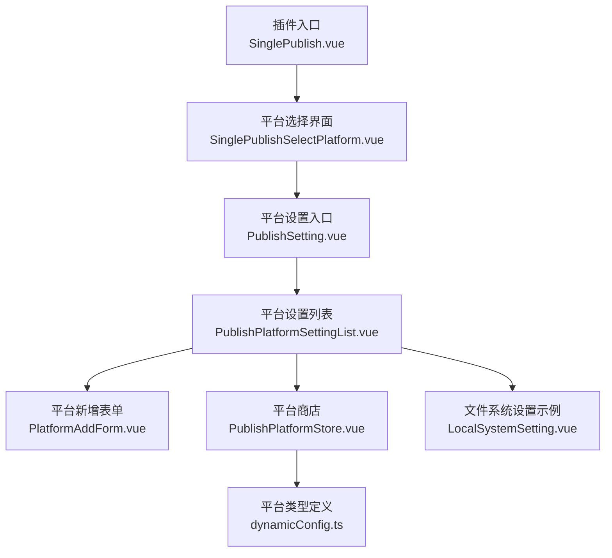
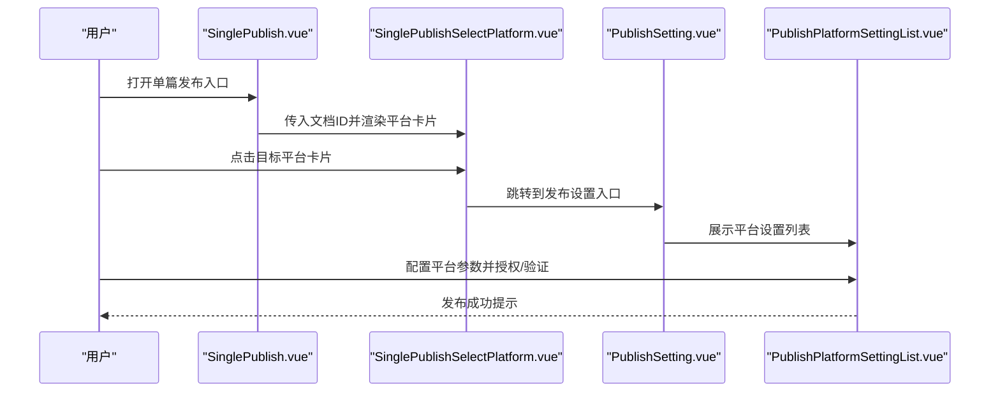
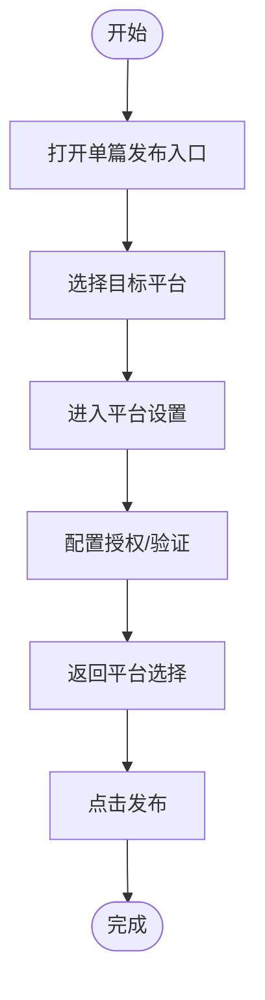
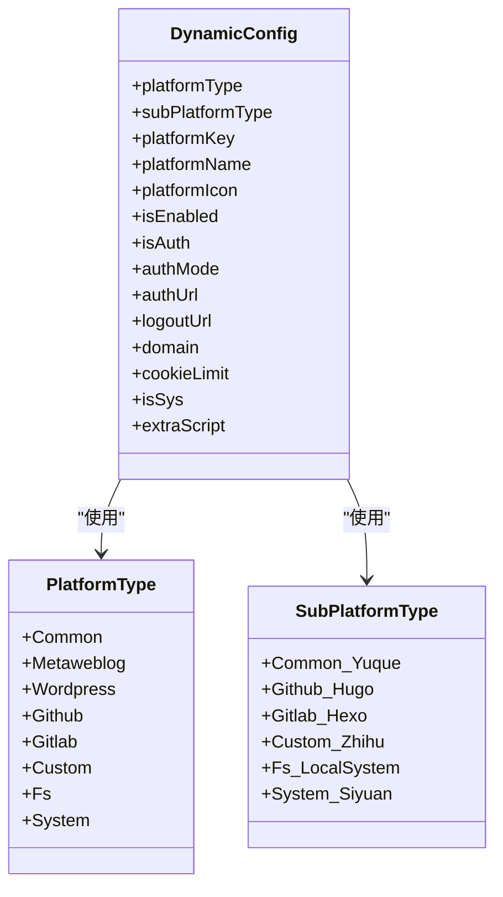
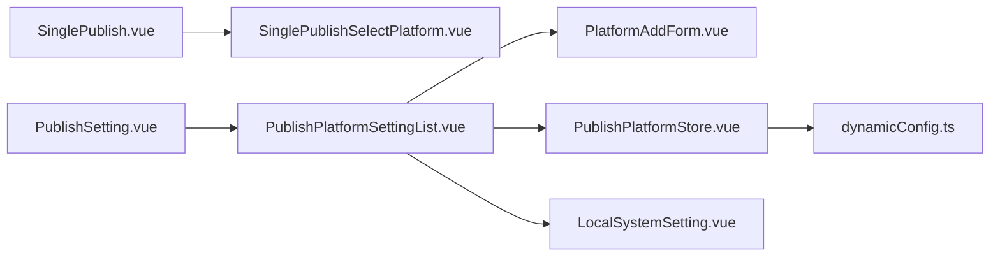

# 快速开始指南

<cite>
**本文引用的文件**   
- [README_zh_CN.md](file://README_zh_CN.md)
- [plugin.json](file://plugin.json)
- [SinglePublish.vue](file://src/pages/SinglePublish.vue)
- [SinglePublishSelectPlatform.vue](file://src/components/publish/SinglePublishSelectPlatform.vue)
- [PublishSetting.vue](file://src/components/set/PublishSetting.vue)
- [PublishPlatformSettingList.vue](file://src/components/set/publish/platform/PublishPlatformSettingList.vue)
- [PlatformAddForm.vue](file://src/components/set/publish/form/PlatformAddForm.vue)
- [PublishPlatformStore.vue](file://src/components/set/publish/platform/PublishPlatformStore.vue)
- [LocalSystemSetting.vue](file://src/components/set/publish/singleplatform/fs/LocalSystemSetting.vue)
- [dynamicConfig.ts](file://src/platforms/dynamicConfig.ts)
</cite>

## 目录
1. [简介](#简介)
2. [项目结构](#项目结构)
3. [核心组件](#核心组件)
4. [架构总览](#架构总览)
5. [详细组件分析](#详细组件分析)
6. [依赖关系分析](#依赖关系分析)
7. [性能考虑](#性能考虑)
8. [故障排除指南](#故障排除指南)
9. [结论](#结论)
10. [附录](#附录)

## 简介
本指南面向首次使用“发布工具”插件的思源笔记用户，目标是在5分钟内完成从安装到第一次成功发布的全流程。内容涵盖：
- 如何在插件市场搜索并安装“发布工具”
- 启用插件后的基本操作流程
- 如何配置第一个发布平台（以“文件系统”为例）
- 简单的发布测试步骤
- 关键操作节点与注意事项
- 常见问题快速解决方案

## 项目结构
发布工具插件采用前端单页应用架构，核心页面与组件如下：
- 页面层：单篇发布入口、设置入口
- 组件层：平台选择卡片、平台设置列表、平台新增表单、平台商店
- 平台适配层：按平台类型（通用、GitHub、GitLab、自定义、文件系统等）组织的适配器
- 配置层：动态平台配置模型与持久化

图表来源
- [SinglePublish.vue:19-21](file://src/pages/SinglePublish.vue#L19-L21)
- [SinglePublishSelectPlatform.vue:183-202](file://src/components/publish/SinglePublishSelectPlatform.vue#L183-L202)
- [PublishSetting.vue:25-61](file://src/components/set/PublishSetting.vue#L25-L61)
- [PublishPlatformSettingList.vue:491-619](file://src/components/set/publish/platform/PublishPlatformSettingList.vue#L491-L619)
- [PlatformAddForm.vue:202-269](file://src/components/set/publish/form/PlatformAddForm.vue#L202-L269)
- [PublishPlatformStore.vue:59-91](file://src/components/set/publish/platform/PublishPlatformStore.vue#L59-L91)
- [LocalSystemSetting.vue:32-91](file://src/components/set/publish/singleplatform/fs/LocalSystemSetting.vue#L32-L91)
- [dynamicConfig.ts:126-238](file://src/platforms/dynamicConfig.ts#L126-L238)

章节来源
- [README_zh_CN.md:15-21](file://README_zh_CN.md#L15-L21)
- [plugin.json:22-29](file://plugin.json#L22-L29)

## 核心组件
- 单篇发布入口：负责接收文档ID并跳转至平台选择界面
- 平台选择界面：展示已启用且已授权的平台卡片，支持一键预览
- 平台设置入口：提供“发布设置”“导入”“商店”三个标签页
- 平台设置列表：集中管理平台的启用/禁用、授权、验证、删除等操作
- 平台新增表单：用于新增自定义平台或导入预设平台模板
- 平台商店：按平台类型筛选并快速新增平台
- 文件系统设置示例：演示如何配置本地文件系统输出
- 平台类型定义：统一管理平台类型、子类型与授权模式

章节来源
- [SinglePublish.vue:10-21](file://src/pages/SinglePublish.vue#L10-L21)
- [SinglePublishSelectPlatform.vue:10-149](file://src/components/publish/SinglePublishSelectPlatform.vue#L10-L149)
- [PublishSetting.vue:10-62](file://src/components/set/PublishSetting.vue#L10-L62)
- [PublishPlatformSettingList.vue:10-489](file://src/components/set/publish/platform/PublishPlatformSettingList.vue#L10-L489)
- [PlatformAddForm.vue:10-199](file://src/components/set/publish/form/PlatformAddForm.vue#L10-L199)
- [PublishPlatformStore.vue:10-56](file://src/components/set/publish/platform/PublishPlatformStore.vue#L10-L56)
- [LocalSystemSetting.vue:10-30](file://src/components/set/publish/singleplatform/fs/LocalSystemSetting.vue#L10-L30)
- [dynamicConfig.ts:13-113](file://src/platforms/dynamicConfig.ts#L13-L113)

## 架构总览
发布流程从“单篇发布入口”开始，进入“平台选择界面”，随后根据平台类型进入相应“平台设置”页面完成配置与发布。

图表来源
- [SinglePublish.vue:15-21](file://src/pages/SinglePublish.vue#L15-L21)
- [SinglePublishSelectPlatform.vue:62-77](file://src/components/publish/SinglePublishSelectPlatform.vue#L62-L77)
- [PublishSetting.vue:25-61](file://src/components/set/PublishSetting.vue#L25-L61)
- [PublishPlatformSettingList.vue:78-85](file://src/components/set/publish/platform/PublishPlatformSettingList.vue#L78-L85)

## 详细组件分析

### 安装与启用
- 在插件市场搜索“发布工具”，安装后重启或刷新思源笔记
- 启用插件后，在思源笔记窗口左上角工具栏可见“发布工具”按钮
- 参考：[README_zh_CN.md:17-20](file://README_zh_CN.md#L17-L20)

章节来源
- [README_zh_CN.md:17-20](file://README_zh_CN.md#L17-L20)

### 第一次发布流程
- 打开任意一篇文档，点击“发布工具”按钮，进入单篇发布入口
- 在平台选择界面，点击目标平台卡片进入对应平台设置
- 在平台设置中完成授权/验证，返回平台选择界面后点击“发布”

图表来源
- [SinglePublish.vue:15-21](file://src/pages/SinglePublish.vue#L15-L21)
- [SinglePublishSelectPlatform.vue:62-77](file://src/components/publish/SinglePublishSelectPlatform.vue#L62-L77)
- [PublishPlatformSettingList.vue:78-85](file://src/components/set/publish/platform/PublishPlatformSettingList.vue#L78-L85)

章节来源
- [SinglePublish.vue:10-21](file://src/pages/SinglePublish.vue#L10-L21)
- [SinglePublishSelectPlatform.vue:10-149](file://src/components/publish/SinglePublishSelectPlatform.vue#L10-L149)
- [PublishPlatformSettingList.vue:10-489](file://src/components/set/publish/platform/PublishPlatformSettingList.vue#L10-L489)

### 配置第一个发布平台：文件系统
- 进入“发布设置” -> “发布设置”标签页
- 在平台设置列表中，点击“新增平台”或通过“商店”选择“文件系统”
- 选择子类型“本地系统”，填写存储路径与媒体路径
- 选择YAML类型（如Hexo、Hugo、Jekyll等）
- 保存并返回平台选择界面进行发布测试

图表来源
- [dynamicConfig.ts:13-113](file://src/platforms/dynamicConfig.ts#L13-L113)
- [dynamicConfig.ts:126-238](file://src/platforms/dynamicConfig.ts#L126-L238)

章节来源
- [PublishSetting.vue:25-61](file://src/components/set/PublishSetting.vue#L25-L61)
- [PublishPlatformSettingList.vue:491-619](file://src/components/set/publish/platform/PublishPlatformSettingList.vue#L491-L619)
- [PlatformAddForm.vue:10-199](file://src/components/set/publish/form/PlatformAddForm.vue#L10-L199)
- [PublishPlatformStore.vue:59-91](file://src/components/set/publish/platform/PublishPlatformStore.vue#L59-L91)
- [LocalSystemSetting.vue:32-91](file://src/components/set/publish/singleplatform/fs/LocalSystemSetting.vue#L32-L91)

### 发布测试步骤
- 在平台设置中完成授权/验证
- 回到平台选择界面，点击“一键预览”检查是否可打开各平台预览页
- 选择目标平台，点击“发布”，等待发布完成提示
- 若发布失败，检查平台授权状态与配置项

章节来源
- [SinglePublishSelectPlatform.vue:103-122](file://src/components/publish/SinglePublishSelectPlatform.vue#L103-L122)
- [PublishPlatformSettingList.vue:283-427](file://src/components/set/publish/platform/PublishPlatformSettingList.vue#L283-L427)

## 依赖关系分析
- 页面与组件：单篇发布入口依赖平台选择组件；平台设置入口依赖设置列表组件
- 平台类型：dynamicConfig.ts统一定义平台类型与子类型，被新增表单与设置列表引用
- 平台适配：不同平台通过适配器实现，文件系统通过LocalSystemSetting.vue示例展示

图表来源
- [SinglePublish.vue:10-21](file://src/pages/SinglePublish.vue#L10-L21)
- [SinglePublishSelectPlatform.vue:10-149](file://src/components/publish/SinglePublishSelectPlatform.vue#L10-L149)
- [PublishSetting.vue:10-62](file://src/components/set/PublishSetting.vue#L10-L62)
- [PublishPlatformSettingList.vue:10-489](file://src/components/set/publish/platform/PublishPlatformSettingList.vue#L10-L489)
- [PlatformAddForm.vue:10-199](file://src/components/set/publish/form/PlatformAddForm.vue#L10-L199)
- [PublishPlatformStore.vue:10-56](file://src/components/set/publish/platform/PublishPlatformStore.vue#L10-L56)
- [LocalSystemSetting.vue:10-30](file://src/components/set/publish/singleplatform/fs/LocalSystemSetting.vue#L10-L30)
- [dynamicConfig.ts:13-113](file://src/platforms/dynamicConfig.ts#L13-L113)

## 性能考虑
- 首次加载时，平台列表与配置解析可能产生一定延迟，页面提供骨架屏与计时器提示
- 预览与发布操作建议在网络稳定环境下进行
- 文件系统输出建议使用本地高速存储路径，避免跨盘符写入导致的性能损耗

章节来源
- [SinglePublishSelectPlatform.vue:154-149](file://src/components/publish/SinglePublishSelectPlatform.vue#L154-L149)

## 故障排除指南
- 无法找到“发布工具”按钮
  - 确认已在插件市场正确安装并启用插件
  - 参考：[README_zh_CN.md:17-20](file://README_zh_CN.md#L17-L20)
- 平台列表为空
  - 需先在“发布设置”中新增并启用至少一个平台
  - 参考：[PublishPlatformSettingList.vue:493-495](file://src/components/set/publish/platform/PublishPlatformSettingList.vue#L493-L495)
- 授权失败或验证失败
  - 确认平台授权模式（API/网页）与配置项正确
  - 对于网页授权，需在新窗口完成登录并点击“验证”
  - 参考：[PublishPlatformSettingList.vue:123-135](file://src/components/set/publish/platform/PublishPlatformSettingList.vue#L123-L135)、[PublishPlatformSettingList.vue:283-295](file://src/components/set/publish/platform/PublishPlatformSettingList.vue#L283-L295)
- 发布后无法预览
  - 确认文章已发布到该平台，点击“一键预览”或平台卡片上的“预览”
  - 参考：[SinglePublishSelectPlatform.vue:86-101](file://src/components/publish/SinglePublishSelectPlatform.vue#L86-L101)
- 文件系统发布路径错误
  - 检查“存储路径”与“媒体存储路径”是否有效
  - 参考：[LocalSystemSetting.vue:40-52](file://src/components/set/publish/singleplatform/fs/LocalSystemSetting.vue#L40-L52)

章节来源
- [README_zh_CN.md:17-20](file://README_zh_CN.md#L17-L20)
- [PublishPlatformSettingList.vue:493-495](file://src/components/set/publish/platform/PublishPlatformSettingList.vue#L493-L495)
- [PublishPlatformSettingList.vue:123-135](file://src/components/set/publish/platform/PublishPlatformSettingList.vue#L123-L135)
- [PublishPlatformSettingList.vue:283-295](file://src/components/set/publish/platform/PublishPlatformSettingList.vue#L283-L295)
- [SinglePublishSelectPlatform.vue:86-101](file://src/components/publish/SinglePublishSelectPlatform.vue#L86-L101)
- [LocalSystemSetting.vue:40-52](file://src/components/set/publish/singleplatform/fs/LocalSystemSetting.vue#L40-L52)

## 结论
通过本指南，你可以在5分钟内完成“发布工具”插件的安装、启用与首次发布。建议优先配置“文件系统”平台进行本地验证，再逐步接入其他平台。若遇问题，可依据故障排除指南逐项排查。

## 附录
- 插件入口与显示名称：参考 [plugin.json:22-29](file://plugin.json#L22-L29)
- 平台类型与子类型清单：参考 [dynamicConfig.ts:126-238](file://src/platforms/dynamicConfig.ts#L126-L238)