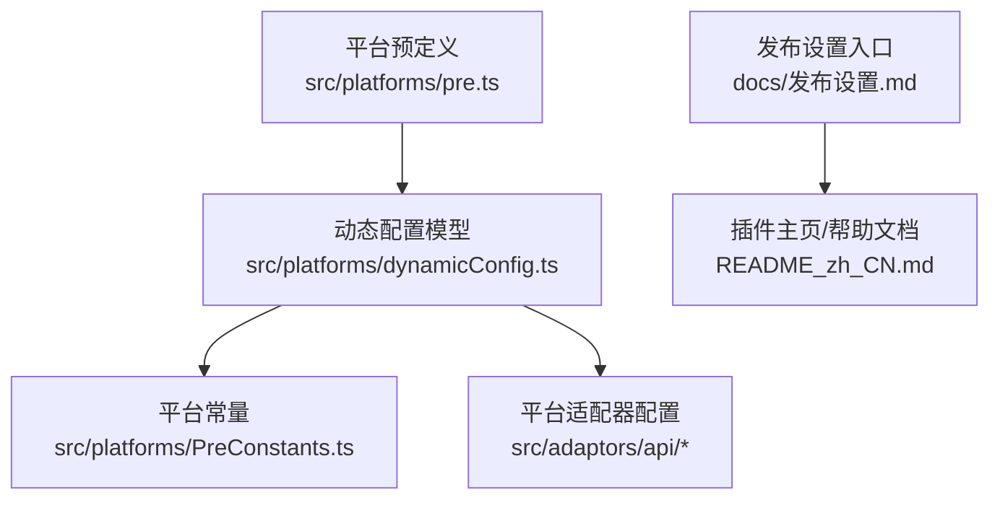
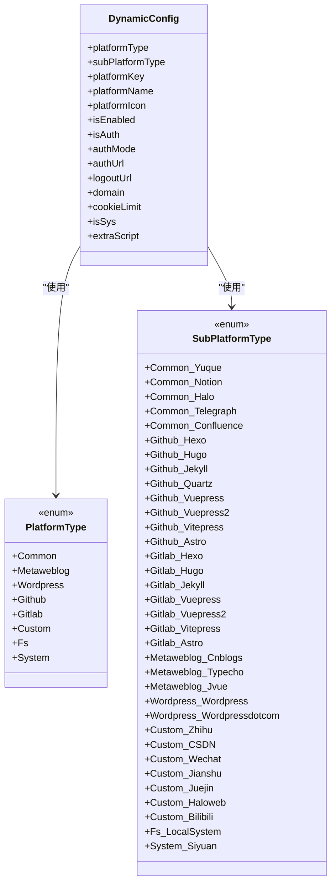
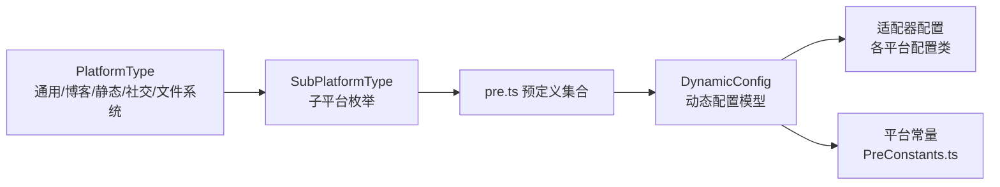

# 支持的平台列表

<cite>
**本文引用的文件**
- [src/platforms/pre.ts](file://src/platforms/pre.ts)
- [src/platforms/dynamicConfig.ts](file://src/platforms/dynamicConfig.ts)
- [src/platforms/PreConstants.ts](file://src/platforms/PreConstants.ts)
- [src/adaptors/api/yuque/yuqueConfig.ts](file://src/adaptors/api/yuque/yuqueConfig.ts)
- [src/adaptors/api/notion/notionConfig.ts](file://src/adaptors/api/notion/notionConfig.ts)
- [src/adaptors/api/confluence/confluenceConfig.ts](file://src/adaptors/api/confluence/confluenceConfig.ts)
- [src/adaptors/api/wordpress/wordpressConfig.ts](file://src/adaptors/api/wordpress/wordpressConfig.ts)
- [src/adaptors/api/cnblogs/cnblogsConfig.ts](file://src/adaptors/api/cnblogs/cnblogsConfig.ts)
- [README_zh_CN.md](file://README_zh_CN.md)
- [docs/发布设置.md](file://docs/发布设置.md)
</cite>

## 目录
1. [简介](#简介)
2. [项目结构](#项目结构)
3. [核心组件](#核心组件)
4. [架构总览](#架构总览)
5. [详细组件分析](#详细组件分析)
6. [依赖关系分析](#依赖关系分析)
7. [性能考量](#性能考量)
8. [故障排查指南](#故障排查指南)
9. [结论](#结论)
10. [附录](#附录)

## 简介
本文件面向“思源笔记发布器插件”的使用者与维护者，系统性梳理并分类说明插件当前支持的平台清单，覆盖博客平台、内容平台、静态站点、社交媒体与文件系统五大类别。每类平台均给出平台名称、图标来源、功能特性、适用场景与配置要点，并提供相关文档与入口指引，帮助用户快速了解可用选项并选择合适的发布平台。

## 项目结构
平台能力由“平台类型 + 子平台类型”双层定义，配合动态配置与适配器实现统一接入。核心位置如下：
- 平台预定义与动态配置：src/platforms/pre.ts、src/platforms/dynamicConfig.ts
- 平台常量：src/platforms/PreConstants.ts
- 平台适配器配置：各平台在 src/adaptors/api 下的对应配置文件
- 使用入口与发布设置：docs/发布设置.md；插件 README 中提供帮助文档入口

图表来源
- [src/platforms/pre.ts:101-462](file://src/platforms/pre.ts#L101-L462)
- [src/platforms/dynamicConfig.ts:13-166](file://src/platforms/dynamicConfig.ts#L13-L166)
- [src/platforms/PreConstants.ts:10-19](file://src/platforms/PreConstants.ts#L10-L19)
- [docs/发布设置.md:5](file://docs/发布设置.md#L5)
- [README_zh_CN.md:9](file://README_zh_CN.md#L9)

章节来源
- [src/platforms/pre.ts:101-462](file://src/platforms/pre.ts#L101-L462)
- [src/platforms/dynamicConfig.ts:13-166](file://src/platforms/dynamicConfig.ts#L13-L166)
- [docs/发布设置.md:5](file://docs/发布设置.md#L5)
- [README_zh_CN.md:9](file://README_zh_CN.md#L9)

## 核心组件
- 平台类型与子类型
  - 平台类型：通用平台(Common)、Metaweblog、WordPress、GitHub、Gitlab、自定义(Custom)、文件系统(Fs)、系统(System)
  - 子类型覆盖博客园、Typecho、Jvue、WordPress、WordPress.com、语雀、Notion、Halo、Telegraph、Confluence、以及各类静态站点与社交平台
- 动态配置模型
  - DynamicConfig 定义平台Key、名称、图标、启用状态、授权模式、域名、是否系统内置等字段
  - 支持按类型拆分为 totalCfg、commonCfg、githubCfg、gitlabCfg、metaweblogCfg、wordpressCfg、customCfg、fsCfg、systemCfg
- 预定义平台集合
  - 通过 pre.ts 的 pre 对象集中声明各子平台的平台Key、名称、图标、授权模式、域名等
  - 通过 mainPre 提供通用平台的概览信息

章节来源
- [src/platforms/dynamicConfig.ts:13-166](file://src/platforms/dynamicConfig.ts#L13-L166)
- [src/platforms/dynamicConfig.ts:258-329](file://src/platforms/dynamicConfig.ts#L258-L329)
- [src/platforms/pre.ts:101-462](file://src/platforms/pre.ts#L101-L462)
- [src/platforms/PreConstants.ts:10-19](file://src/platforms/PreConstants.ts#L10-L19)

## 架构总览
平台能力的组织方式如下：
- 类型维度：PlatformType（通用/Common、Metaweblog、WordPress、GitHub、Gitlab、自定义/Custon、文件系统/Fs、系统/System）
- 子类型维度：SubPlatformType（如 Common_Yuque、Github_Hugo、Gitlab_Jekyll、Metaweblog_Cnblogs、Wordpress_Wordpress、Custom_Zhihu 等）
- 预定义与动态配置：pre.ts 中的 pre 对象与 mainPre 提供平台概览；dynamicConfig.ts 提供类型与动态配置的统一模型
- 适配器配置：各平台在 src/adaptors/api 下提供具体配置类，决定页面类型、标签/分类/知识库支持、预览URL等

图表来源
- [src/platforms/dynamicConfig.ts:13-166](file://src/platforms/dynamicConfig.ts#L13-L166)
- [src/platforms/dynamicConfig.ts:174-238](file://src/platforms/dynamicConfig.ts#L174-L238)

章节来源
- [src/platforms/dynamicConfig.ts:13-166](file://src/platforms/dynamicConfig.ts#L13-L166)
- [src/platforms/dynamicConfig.ts:174-238](file://src/platforms/dynamicConfig.ts#L174-L238)

## 详细组件分析

### 博客平台（Metaweblog、WordPress）
- 博客园（Cnblogs）
  - 平台类型：Metaweblog
  - 特点：支持多分类、标签、可修改预览URL；用户名+Token认证
  - 适用场景：个人博客、技术博客
  - 配置要点：需配置Token设置页、用户名与Token；支持Markdown页面类型
  - 参考配置：[cnblogsConfig.ts:19-46](file://src/adaptors/api/cnblogs/cnblogsConfig.ts#L19-L46)
- Typecho
  - 平台类型：Metaweblog
  - 特点：基于Metaweblog协议，适合轻量博客
  - 适用场景：轻博客、个人站点
  - 配置要点：遵循Metaweblog通用配置
- Jvue
  - 平台类型：Metaweblog
  - 特点：基于Metaweblog协议
  - 适用场景：特定博客系统
  - 配置要点：遵循Metaweblog通用配置
- WordPress
  - 平台类型：WordPress
  - 特点：支持多分类、标签、可修改预览URL；Html页面类型
  - 适用场景：企业/个人博客、CMS站点
  - 配置要点：解析首页与API地址；支持Token或用户名密码
  - 参考配置：[wordpressConfig.ts:20-48](file://src/adaptors/api/wordpress/wordpressConfig.ts#L20-L48)
- WordPress.com
  - 平台类型：WordPress
  - 特点：云端托管版本
  - 适用场景：无需自建服务器的博客
  - 配置要点：遵循WordPress通用配置

平台图标与入口
- 图标来源：svgIcons（在预定义中以 platformIcon 字段引用）
- 入口：发布设置页面（/#/manage）

章节来源
- [src/platforms/pre.ts:288-336](file://src/platforms/pre.ts#L288-L336)
- [src/adaptors/api/cnblogs/cnblogsConfig.ts:19-46](file://src/adaptors/api/cnblogs/cnblogsConfig.ts#L19-L46)
- [src/adaptors/api/wordpress/wordpressConfig.ts:20-48](file://src/adaptors/api/wordpress/wordpressConfig.ts#L20-L48)
- [docs/发布设置.md:5](file://docs/发布设置.md#L5)

### 内容平台（语雀、Notion、Confluence、Halo、Telegraph）
- 语雀（Yuque）
  - 平台类型：Common
  - 特点：知识库维度、Token认证、Markdown页面类型
  - 适用场景：团队知识库、文档沉淀
  - 配置要点：启用知识库支持、不可编辑知识库时的提示
  - 参考配置：[yuqueConfig.ts:16-37](file://src/adaptors/api/yuque/yuqueConfig.ts#L16-L37)
- Notion
  - 平台类型：Common
  - 特点：集成令牌、Markdown页面类型、支持分类检索
  - 适用场景：个人/团队知识管理
  - 配置要点：启用知识空间、根页面概念
  - 参考配置：[notionConfig.ts:16-37](file://src/adaptors/api/notion/notionConfig.ts#L16-L37)
- Confluence
  - 平台类型：Common
  - 特点：Token认证、Html页面类型、支持图床与打包图床
  - 适用场景：企业文档协作
  - 配置要点：启用知识空间、允许修改父页面
  - 参考配置：[confluenceConfig.ts:17-42](file://src/adaptors/api/confluence/confluenceConfig.ts#L17-L42)
- Halo
  - 平台类型：Common
  - 特点：API认证
  - 适用场景：自建博客/内容管理
  - 配置要点：API认证方式
- Telegraph
  - 平台类型：Common
  - 特点：API认证
  - 适用场景：快速发布短文
  - 配置要点：API认证方式

平台图标与入口
- 图标来源：svgIcons（在预定义中以 platformIcon 字段引用）
- 入口：发布设置页面（/#/manage）

章节来源
- [src/platforms/pre.ts:102-148](file://src/platforms/pre.ts#L102-L148)
- [src/adaptors/api/yuque/yuqueConfig.ts:16-37](file://src/adaptors/api/yuque/yuqueConfig.ts#L16-L37)
- [src/adaptors/api/notion/notionConfig.ts:16-37](file://src/adaptors/api/notion/notionConfig.ts#L16-L37)
- [src/adaptors/api/confluence/confluenceConfig.ts:17-42](file://src/adaptors/api/confluence/confluenceConfig.ts#L17-L42)
- [docs/发布设置.md:5](file://docs/发布设置.md#L5)

### 静态站点（GitHub Pages、GitLab Pages、本地系统）
- GitHub Pages（Hexo、Hugo、Jekyll、Quartz、Vuepress、Vuepress2、Vitepress、Astro）
  - 平台类型：GitHub
  - 特点：通过GitHub API发布到静态站点
  - 适用场景：个人/开源站点、文档网站
  - 配置要点：API认证、平台图标一致
- GitLab Pages（同上，Gitlab_Hexo/Hugo/Jekyll/Vuepress/Vuepress2/Vitepress/Astro）
  - 平台类型：Gitlab
  - 特点：通过GitLab API发布到静态站点
  - 适用场景：企业/私有仓库静态站点
  - 配置要点：API认证、平台图标一致
- 本地系统（Fs_LocalSystem）
  - 平台类型：Fs
  - 特点：本地文件系统写入（仅在桌面环境可用）
  - 适用场景：离线/本地部署
  - 配置要点：仅在Electron环境下启用

平台图标与入口
- 图标来源：svgIcons（在预定义中以 platformIcon 字段引用）
- 入口：发布设置页面（/#/manage）

章节来源
- [src/platforms/pre.ts:149-287](file://src/platforms/pre.ts#L149-L287)
- [src/platforms/pre.ts:439-449](file://src/platforms/pre.ts#L439-L449)
- [src/platforms/dynamicConfig.ts:174-238](file://src/platforms/dynamicConfig.ts#L174-L238)
- [docs/发布设置.md:5](file://docs/发布设置.md#L5)

### 社交媒体（知乎、CSDN、微信公众号、简书、掘金、B站、Halo网页版）
- 知乎（Zhihu）
  - 平台类型：Custom
  - 特点：网页授权（WEBSITE），域名 zhihu.com
  - 适用场景：技术问答/专栏
  - 配置要点：登录URL、域名、授权模式
- CSDN
  - 平台类型：Custom
  - 特点：网页授权（WEBSITE），域名 csdn.net
  - 适用场景：IT技术社区
  - 配置要点：登录URL、域名、授权模式
- 微信公众号（Wechat）
  - 平台类型：Custom
  - 特点：网页授权（WEBSITE），域名 qq.com
  - 适用场景：企业/个人公众号
  - 配置要点：登录URL、域名、授权模式
- 简书（Jianshu）
  - 平台类型：Custom
  - 特点：网页授权（WEBSITE），域名 jianshu.com
  - 适用场景：写作社区
  - 配置要点：登录URL、域名、授权模式
- 掘金（Juejin）
  - 平台类型：Custom
  - 特点：网页授权（WEBSITE），域名 juejin.cn
  - 适用场景：开发者社区
  - 配置要点：登录URL、域名、授权模式
- 哔哩哔哩（Bilibili）
  - 平台类型：Custom
  - 特点：网页授权（WEBSITE），域名 bilibili.com
  - 适用场景：视频/图文内容
  - 配置要点：登录URL、域名、授权模式
- Halo网页版（Haloweb）
  - 平台类型：Custom
  - 特点：网页授权（WEBSITE），相对路径登录
  - 适用场景：Halo博客
  - 配置要点：登录URL、域名、授权模式

平台图标与入口
- 图标来源：svgIcons（在预定义中以 platformIcon 字段引用）
- 入口：发布设置页面（/#/manage）

章节来源
- [src/platforms/pre.ts:337-438](file://src/platforms/pre.ts#L337-L438)
- [src/platforms/PreConstants.ts:10-19](file://src/platforms/PreConstants.ts#L10-L19)
- [docs/发布设置.md:5](file://docs/发布设置.md#L5)

### 文件系统（本地文件系统）
- 本地系统（Fs_LocalSystem）
  - 平台类型：Fs
  - 特点：本地文件系统写入（仅在桌面环境可用）
  - 适用场景：离线/本地部署
  - 配置要点：仅在Electron环境下启用

平台图标与入口
- 图标来源：svgIcons（在预定义中以 platformIcon 字段引用）
- 入口：发布设置页面（/#/manage）

章节来源
- [src/platforms/pre.ts:439-449](file://src/platforms/pre.ts#L439-L449)
- [docs/发布设置.md:5](file://docs/发布设置.md#L5)

## 依赖关系分析
- 平台类型与子类型的映射关系由 dynamicConfig.ts 的枚举与 getSubtypeList 决定
- 预定义平台集合 pre.ts 将各子平台的平台Key、名称、图标、授权模式、域名等集中管理
- 平台常量 PreConstants.ts 提供部分固定Key（如本地系统、B站、小红书等）
- 适配器配置文件（如 yuqueConfig.ts、notionConfig.ts、confluenceConfig.ts、wordpressConfig.ts、cnblogsConfig.ts）定义各平台的页面类型、标签/分类/知识库支持、预览URL等

图表来源
- [src/platforms/dynamicConfig.ts:174-238](file://src/platforms/dynamicConfig.ts#L174-L238)
- [src/platforms/pre.ts:101-462](file://src/platforms/pre.ts#L101-L462)
- [src/platforms/PreConstants.ts:10-19](file://src/platforms/PreConstants.ts#L10-L19)
- [src/adaptors/api/yuque/yuqueConfig.ts:16-37](file://src/adaptors/api/yuque/yuqueConfig.ts#L16-L37)
- [src/adaptors/api/notion/notionConfig.ts:16-37](file://src/adaptors/api/notion/notionConfig.ts#L16-L37)
- [src/adaptors/api/confluence/confluenceConfig.ts:17-42](file://src/adaptors/api/confluence/confluenceConfig.ts#L17-L42)
- [src/adaptors/api/wordpress/wordpressConfig.ts:20-48](file://src/adaptors/api/wordpress/wordpressConfig.ts#L20-L48)
- [src/adaptors/api/cnblogs/cnblogsConfig.ts:19-46](file://src/adaptors/api/cnblogs/cnblogsConfig.ts#L19-L46)

章节来源
- [src/platforms/dynamicConfig.ts:258-329](file://src/platforms/dynamicConfig.ts#L258-L329)
- [src/platforms/pre.ts:101-462](file://src/platforms/pre.ts#L101-L462)
- [src/platforms/PreConstants.ts:10-19](file://src/platforms/PreConstants.ts#L10-L19)

## 性能考量
- 平台选择对性能的影响主要体现在发布流程与网络请求次数。静态站点（GitHub/GitLab Pages）通常具备较好的缓存与CDN支持；内容平台（语雀、Notion、Confluence）依赖API调用频率；社交媒体（知乎、CSDN、微信公众号等）可能受限于网页授权与反爬策略。
- 建议优先选择API认证平台以减少交互成本；对于网页授权平台，注意登录状态与Cookie有效期。

## 故障排查指南
- 发布设置入口
  - 发布设置入口地址为：/#/manage
  - 偏好设置入口地址为：/#/manage
- 帮助文档
  - 插件主页提供帮助文档入口，可查阅最新帮助文档
- 常见问题定位
  - 若平台未显示或不可用：检查平台启用状态与授权模式；确认是否满足平台要求（如Electron环境）
  - 若发布失败：核对平台配置（Token/用户名/密码/域名/预览URL）；查看平台适配器配置中的页面类型与功能开关

章节来源
- [docs/发布设置.md:5](file://docs/发布设置.md#L5)
- [README_zh_CN.md:9](file://README_zh_CN.md#L9)

## 结论
本插件通过统一的动态配置模型与平台预定义，实现了对20+平台的标准化接入。用户可根据自身需求选择合适平台：博客平台适合个人/企业博客；内容平台适合知识库与协作；静态站点适合文档/个人站点；社交媒体适合内容分发；文件系统适合本地部署。建议结合平台特性与自身使用场景，合理选择并完成相应配置。

## 附录
- 发布设置入口：/#/manage
- 帮助文档入口：README_zh_CN.md 中提供的帮助文档链接