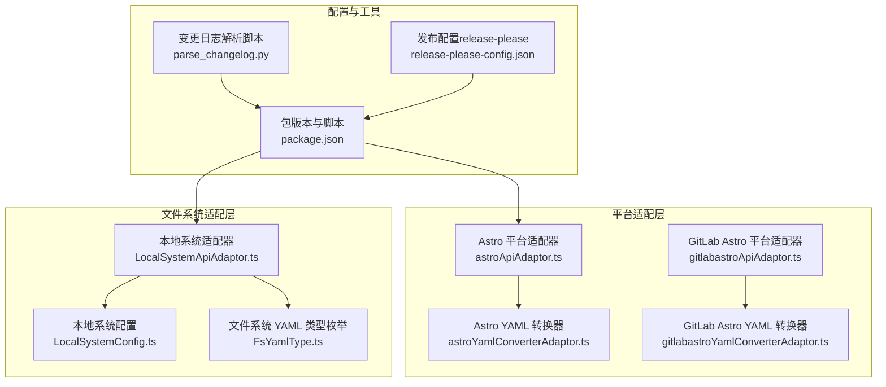
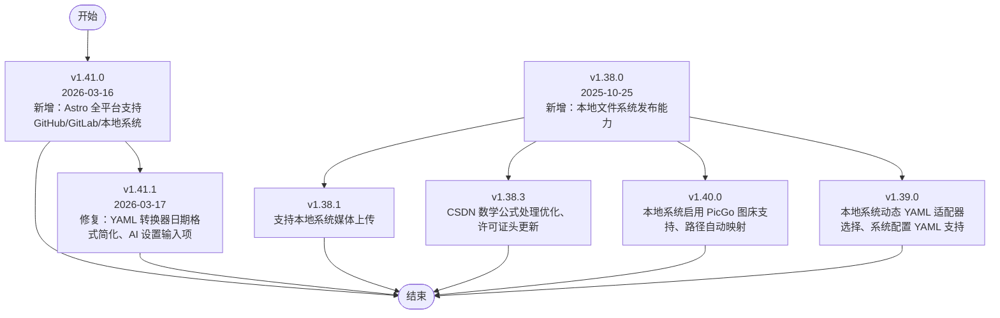
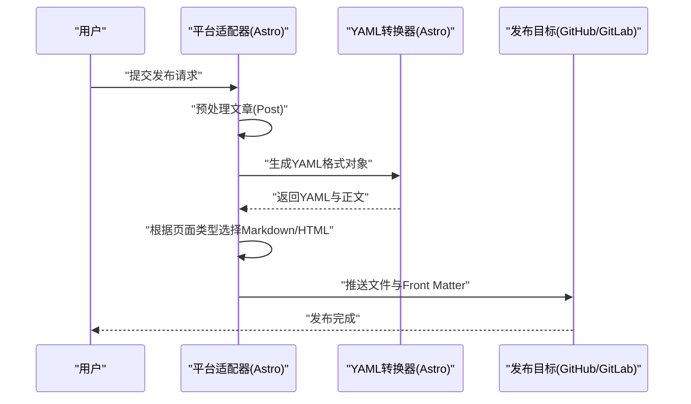
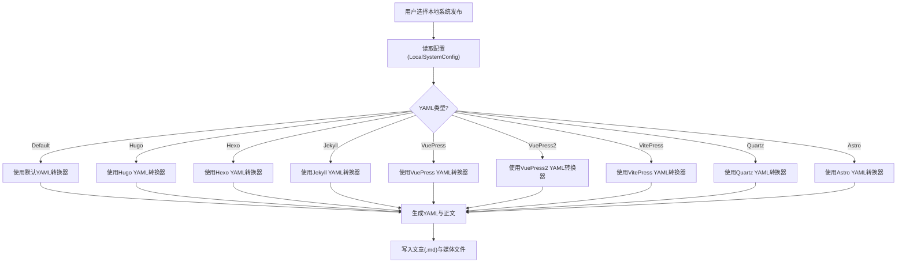
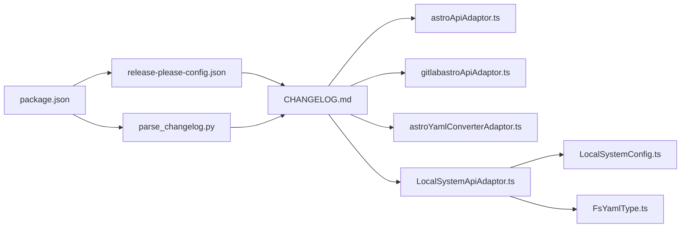

# 更新历史

<cite>
**本文档引用的文件**
- [README_zh_CN.md](file://README_zh_CN.md)
- [CHANGELOG.md](file://CHANGELOG.md)
- [package.json](file://package.json)
- [release-please-config.json](file://release-please-config.json)
- [parse_changelog.py](file://scripts/parse_changelog.py)
- [LocalSystemApiAdaptor.ts](file://src/adaptors/fs/LocalSystem/LocalSystemApiAdaptor.ts)
- [LocalSystemConfig.ts](file://src/adaptors/fs/LocalSystem/LocalSystemConfig.ts)
- [FsYamlType.ts](file://src/adaptors/fs/LocalSystem/FsYamlType.ts)
- [astroApiAdaptor.ts](file://src/adaptors/api/astro/astroApiAdaptor.ts)
- [astroYamlConverterAdaptor.ts](file://src/adaptors/api/astro/astroYamlConverterAdaptor.ts)
- [gitlabastroApiAdaptor.ts](file://src/adaptors/api/gitlab-astro/gitlabastroApiAdaptor.ts)
- [gitlabastroYamlConverterAdaptor.ts](file://src/adaptors/api/gitlab-astro/gitlabastroYamlConverterAdaptor.ts)
</cite>

## 目录
1. [简介](#简介)
2. [项目结构](#项目结构)
3. [核心组件](#核心组件)
4. [架构总览](#架构总览)
5. [详细组件分析](#详细组件分析)
6. [依赖关系分析](#依赖关系分析)
7. [性能考量](#性能考量)
8. [故障排除指南](#故障排除指南)
9. [结论](#结论)
10. [附录](#附录)

## 简介
本文件基于仓库内的更新日志与源码实现，系统梳理思源笔记发布器插件的版本演进与重大功能里程碑，重点聚焦 v1.41.0 与 v1.38.0 的关键更新：Astro 全平台支持（含 GitHub/GitLab 与本地文件系统）与本地文件系统发布能力。文档提供版本发布时间、功能亮点、改进详情、兼容性信息、升级注意事项与已知问题说明，并给出版本选择建议与功能对比参考，帮助用户快速把握项目发展脉络。

## 项目结构
围绕“版本发布”与“平台适配”的主线，项目采用“适配器模式 + 平台/文件系统解耦”的架构设计：
- 平台适配层：针对不同静态站点生成器（如 Hexo、Hugo、Jekyll、VuePress、VitePress、Quartz、Astro）与博客平台（如 GitHub、GitLab、WordPress、Notion 等）提供独立适配器与 YAML 转换器。
- 文件系统适配层：抽象本地文件系统发布能力，支持多种 YAML 类型（Default、Hexo、Hugo、Jekyll、VuePress、VuePress2、VitePress、Quartz、Astro）的动态选择与转换。
- 配置与运行时：通过配置对象注入平台参数、存储路径、图片服务等，运行时按需选择适配器与转换器。

**图表来源**
- [astroApiAdaptor.ts:16-62](file://src/adaptors/api/astro/astroApiAdaptor.ts#L16-L62)
- [gitlabastroApiAdaptor.ts:16-62](file://src/adaptors/api/gitlab-astro/gitlabastroApiAdaptor.ts#L16-L62)
- [astroYamlConverterAdaptor.ts:15-135](file://src/adaptors/api/astro/astroYamlConverterAdaptor.ts#L15-L135)
- [gitlabastroYamlConverterAdaptor.ts:12-21](file://src/adaptors/api/gitlab-astro/gitlabastroYamlConverterAdaptor.ts#L12-L21)
- [LocalSystemApiAdaptor.ts:36-273](file://src/adaptors/fs/LocalSystem/LocalSystemApiAdaptor.ts#L36-L273)
- [LocalSystemConfig.ts:16-45](file://src/adaptors/fs/LocalSystem/LocalSystemConfig.ts#L16-L45)
- [FsYamlType.ts:10-63](file://src/adaptors/fs/LocalSystem/FsYamlType.ts#L10-L63)
- [package.json:1-99](file://package.json#L1-L99)
- [parse_changelog.py:28-110](file://scripts/parse_changelog.py#L28-L110)
- [release-please-config.json:1-38](file://release-please-config.json#L1-L38)

**章节来源**
- [README_zh_CN.md:23-34](file://README_zh_CN.md#L23-L34)
- [CHANGELOG.md:1-60](file://CHANGELOG.md#L1-L60)
- [package.json:1-99](file://package.json#L1-L99)

## 核心组件
- 版本与发布工具
  - 当前版本：1.41.1（见包元数据）
  - 发布流程：通过 release-please 配置与变更日志解析脚本自动化生成发布说明
- 平台适配器
  - Astro 平台适配器：支持 GitHub/GitLab 两种托管平台，统一 YAML 处理与正文格式（Markdown/HTML）
  - GitLab Astro 适配器：复用 Astro YAML 转换器，面向 GitLab 场景
- 文件系统适配器
  - 本地系统适配器：支持将文章与媒体文件写入本地磁盘，按配置动态选择 YAML 类型（Default/Hugo/Hexo/Jekyll/VuePress/VuePress2/VitePress/Quartz/Astro）
  - 配置对象：包含存储路径、真实存储路径、图片存储路径、YAML 类型等
  - YAML 类型枚举：集中管理支持的静态站点生成器类型

**章节来源**
- [package.json:1-99](file://package.json#L1-L99)
- [release-please-config.json:1-38](file://release-please-config.json#L1-L38)
- [parse_changelog.py:28-110](file://scripts/parse_changelog.py#L28-L110)
- [astroApiAdaptor.ts:16-62](file://src/adaptors/api/astro/astroApiAdaptor.ts#L16-L62)
- [gitlabastroApiAdaptor.ts:16-62](file://src/adaptors/api/gitlab-astro/gitlabastroApiAdaptor.ts#L16-L62)
- [astroYamlConverterAdaptor.ts:15-135](file://src/adaptors/api/astro/astroYamlConverterAdaptor.ts#L15-L135)
- [gitlabastroYamlConverterAdaptor.ts:12-21](file://src/adaptors/api/gitlab-astro/gitlabastroYamlConverterAdaptor.ts#L12-L21)
- [LocalSystemApiAdaptor.ts:36-273](file://src/adaptors/fs/LocalSystem/LocalSystemApiAdaptor.ts#L36-L273)
- [LocalSystemConfig.ts:16-45](file://src/adaptors/fs/LocalSystem/LocalSystemConfig.ts#L16-L45)
- [FsYamlType.ts:10-63](file://src/adaptors/fs/LocalSystem/FsYamlType.ts#L10-L63)

## 架构总览
下图展示了 v1.41.0 与 v1.38.0 两个关键版本的发布路径与核心改动：

**图表来源**
- [CHANGELOG.md:1-120](file://CHANGELOG.md#L1-L120)
- [README_zh_CN.md:27-31](file://README_zh_CN.md#L27-L31)

**章节来源**
- [CHANGELOG.md:1-120](file://CHANGELOG.md#L1-L120)
- [README_zh_CN.md:27-31](file://README_zh_CN.md#L27-L31)

## 详细组件分析

### v1.41.0：Astro 全平台支持
- 发布时间：2026-03-16
- 核心功能
  - 新增 Astro 平台适配器，支持 GitHub 与 GitLab 两种托管平台
  - 统一 YAML 解析与正文格式（Markdown/HTML），确保 Front Matter 与正文正确拼接
  - 适配器内部通过 YAML 转换器生成标准 YAML 结构，再根据页面类型决定输出格式
- 关键实现要点
  - 平台适配器在预处理阶段提取并保留 Markdown 中的 Front Matter，再根据页面类型选择输出 Markdown 或 HTML
  - YAML 转换器负责将文章元数据（标题、摘要、发布时间、标签、分类、SEO 关键词等）序列化为 YAML，并拼接到 Markdown 内容前
- 兼容性与升级注意
  - 新增平台适配器不影响既有平台；若使用 GitHub/GitLab 部署的 Astro 站点，可直接启用对应适配器
  - 若已有自定义 YAML 配置，建议检查是否与 Astro YAML 字段对齐
- 已知问题
  - 无公开已知问题（以当前日志为准）

**图表来源**
- [astroApiAdaptor.ts:28-59](file://src/adaptors/api/astro/astroApiAdaptor.ts#L28-L59)
- [astroYamlConverterAdaptor.ts:25-99](file://src/adaptors/api/astro/astroYamlConverterAdaptor.ts#L25-L99)

**章节来源**
- [CHANGELOG.md:1-60](file://CHANGELOG.md#L1-L60)
- [astroApiAdaptor.ts:16-62](file://src/adaptors/api/astro/astroApiAdaptor.ts#L16-L62)
- [astroYamlConverterAdaptor.ts:15-135](file://src/adaptors/api/astro/astroYamlConverterAdaptor.ts#L15-L135)

### v1.38.0：本地文件系统发布能力
- 发布时间：2025-10-25
- 核心功能
  - 首次引入本地文件系统发布能力，支持将文章与媒体文件直接写入本地磁盘
  - 支持多种静态站点生成器的 YAML 类型动态选择（Default/Hugo/Hexo/Jekyll/VuePress/VuePress2/VitePress/Quartz/Astro）
  - 配置对象包含存储路径、真实存储路径、图片存储路径与 YAML 类型字段
- 关键实现要点
  - 本地系统适配器在预处理阶段根据 YAML 类型选择对应的转换器，并按需调用各平台适配器进行前置处理
  - 写入文件时对文件名进行清理并追加 .md 扩展名；媒体文件写入指定图片目录
  - 支持媒体上传返回附件信息，便于后续引用
- 兼容性与升级注意
  - 本地系统发布不会影响线上平台；如需与现有静态站点集成，需确保 YAML 类型与目标站点一致
  - 初次使用建议先在测试目录验证路径与权限
- 已知问题
  - 无公开已知问题（以当前日志为准）

**图表来源**
- [LocalSystemApiAdaptor.ts:67-104](file://src/adaptors/fs/LocalSystem/LocalSystemApiAdaptor.ts#L67-L104)
- [LocalSystemConfig.ts:16-45](file://src/adaptors/fs/LocalSystem/LocalSystemConfig.ts#L16-L45)
- [FsYamlType.ts:10-63](file://src/adaptors/fs/LocalSystem/FsYamlType.ts#L10-L63)

**章节来源**
- [CHANGELOG.md:1-120](file://CHANGELOG.md#L1-L120)
- [LocalSystemApiAdaptor.ts:36-273](file://src/adaptors/fs/LocalSystem/LocalSystemApiAdaptor.ts#L36-L273)
- [LocalSystemConfig.ts:16-45](file://src/adaptors/fs/LocalSystem/LocalSystemConfig.ts#L16-L45)
- [FsYamlType.ts:10-63](file://src/adaptors/fs/LocalSystem/FsYamlType.ts#L10-L63)

### v1.41.1：修复与改进
- 发布时间：2026-03-17
- 主要改进
  - 简化 Astro YAML 转换器中的发布时间格式（精简为日期）
  - 增强实验性 AI 设置输入项
- 兼容性与升级注意
  - 修复为纯功能修复，不影响既有发布流程
  - 如使用 Astro YAML 转换器，建议确认发布时间字段显示是否符合预期

**章节来源**
- [CHANGELOG.md:1-40](file://CHANGELOG.md#L1-L40)
- [astroYamlConverterAdaptor.ts:40-52](file://src/adaptors/api/astro/astroYamlConverterAdaptor.ts#L40-L52)

### v1.38.x：本地系统能力迭代
- v1.38.1：支持本地系统媒体上传
- v1.38.3：CSDN 数学公式处理优化、许可证头更新
- v1.40.0：本地系统启用 PicGo 图床支持、路径自动映射
- v1.39.0：本地系统动态 YAML 适配器选择、系统配置 YAML 支持

**章节来源**
- [CHANGELOG.md:1-200](file://CHANGELOG.md#L1-L200)

## 依赖关系分析
- 版本与发布
  - 包版本与脚本：package.json 定义当前版本与构建脚本
  - 自动化发布：release-please-config.json 配置变更日志分区与 PR 标题
  - 日志解析：parse_changelog.py 去重与规范化变更日志
- 平台与文件系统适配器
  - 平台适配器依赖 YAML 转换器；本地系统适配器根据 YAML 类型枚举动态选择转换器
  - 配置对象贯穿适配器生命周期，决定存储路径与 YAML 行为

**图表来源**
- [package.json:1-99](file://package.json#L1-L99)
- [release-please-config.json:1-38](file://release-please-config.json#L1-L38)
- [parse_changelog.py:28-110](file://scripts/parse_changelog.py#L28-L110)
- [CHANGELOG.md:1-120](file://CHANGELOG.md#L1-L120)
- [astroApiAdaptor.ts:16-62](file://src/adaptors/api/astro/astroApiAdaptor.ts#L16-L62)
- [gitlabastroApiAdaptor.ts:16-62](file://src/adaptors/api/gitlab-astro/gitlabastroApiAdaptor.ts#L16-L62)
- [astroYamlConverterAdaptor.ts:15-135](file://src/adaptors/api/astro/astroYamlConverterAdaptor.ts#L15-L135)
- [LocalSystemApiAdaptor.ts:36-273](file://src/adaptors/fs/LocalSystem/LocalSystemApiAdaptor.ts#L36-L273)
- [LocalSystemConfig.ts:16-45](file://src/adaptors/fs/LocalSystem/LocalSystemConfig.ts#L16-L45)
- [FsYamlType.ts:10-63](file://src/adaptors/fs/LocalSystem/FsYamlType.ts#L10-L63)

**章节来源**
- [package.json:1-99](file://package.json#L1-L99)
- [release-please-config.json:1-38](file://release-please-config.json#L1-L38)
- [parse_changelog.py:28-110](file://scripts/parse_changelog.py#L28-L110)
- [CHANGELOG.md:1-120](file://CHANGELOG.md#L1-L120)

## 性能考量
- YAML 转换与正文拼接：Astro 适配器在预处理阶段提取并保留 Front Matter，避免重复解析，减少字符串拼接成本
- 本地系统写入：文件名清理与路径拼接采用统一工具函数，减少 IO 操作次数；媒体文件写入独立目录，便于后续索引
- 依赖更新：随版本更新的依赖（如 Vue、TypeScript、Vite 等）通常带来性能与稳定性提升，建议保持最新

[本节为通用指导，无需特定文件引用]

## 故障排除指南
- 本地系统发布失败
  - 检查存储路径是否存在且具备写权限；必要时使用路径自动映射功能
  - 确认 YAML 类型与目标静态站点一致，避免生成不兼容的 YAML
- 媒体上传失败
  - 确认图片存储目录存在；若启用 PicGo 图床，请检查图床服务可用性
- Astro YAML 时间格式异常
  - v1.41.1 已简化发布时间格式为日期；如仍异常，检查自定义 YAML 配置是否覆盖了时间字段
- GitHub/GitLab 平台发布异常
  - 确认平台适配器与 YAML 转换器版本一致；检查 Front Matter 字段是否与目标站点要求一致

**章节来源**
- [LocalSystemApiAdaptor.ts:166-203](file://src/adaptors/fs/LocalSystem/LocalSystemApiAdaptor.ts#L166-L203)
- [LocalSystemApiAdaptor.ts:214-265](file://src/adaptors/fs/LocalSystem/LocalSystemApiAdaptor.ts#L214-L265)
- [astroYamlConverterAdaptor.ts:40-52](file://src/adaptors/api/astro/astroYamlConverterAdaptor.ts#L40-L52)

## 结论
- v1.41.0 将 Astro 平台适配能力扩展至 GitHub/GitLab 与本地文件系统，显著提升了静态站点生态的覆盖范围
- v1.38.0 引入本地文件系统发布能力，配合动态 YAML 适配器选择，满足多样化静态站点生成器的需求
- 建议用户优先选择与目标站点匹配的 YAML 类型；如需本地预览，可结合本地系统适配器进行验证
- 版本迭代持续优化 YAML 转换、媒体上传与平台兼容性，整体发布体验稳步提升

[本节为总结性内容，无需特定文件引用]

## 附录

### 版本选择建议与功能对比
- 选择 GitHub/GitLab 部署的 Astro 站点
  - 推荐使用 v1.41.0+ 的 Astro 平台适配器，支持统一 YAML 与正文格式
- 选择其他静态站点生成器（Hugo/VuePress/VitePress/Quartz 等）
  - 推荐使用 v1.38.0+ 的本地系统适配器，并在配置中选择对应 YAML 类型
- 需要本地预览与离线发布
  - 推荐使用 v1.38.0+ 的本地系统适配器，结合动态 YAML 适配器选择与媒体上传能力

**章节来源**
- [CHANGELOG.md:1-200](file://CHANGELOG.md#L1-L200)
- [LocalSystemApiAdaptor.ts:67-104](file://src/adaptors/fs/LocalSystem/LocalSystemApiAdaptor.ts#L67-L104)
- [astroApiAdaptor.ts:28-59](file://src/adaptors/api/astro/astroApiAdaptor.ts#L28-L59)