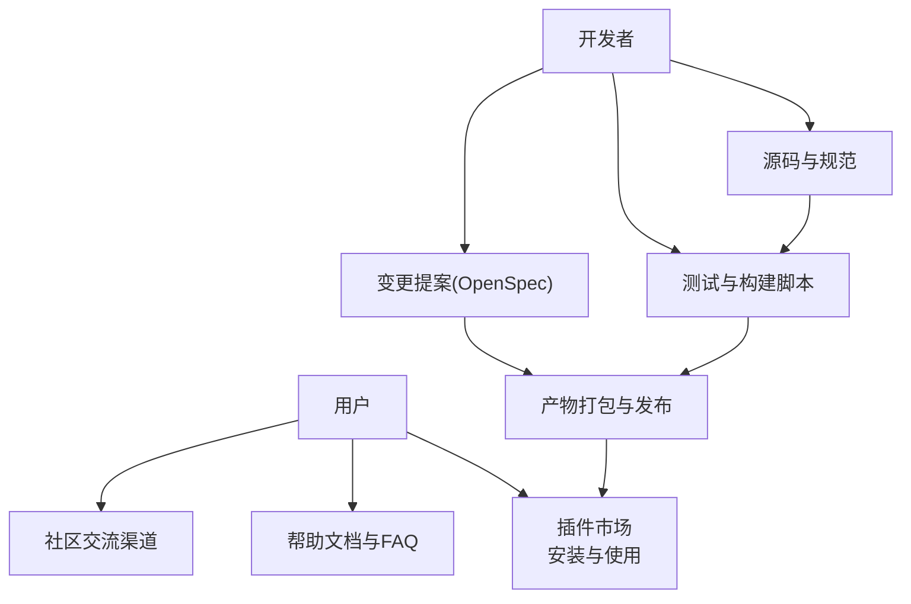
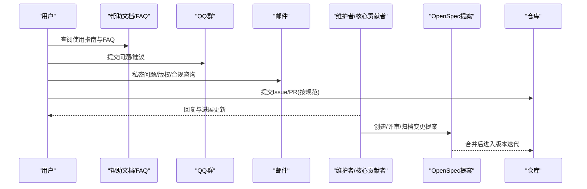
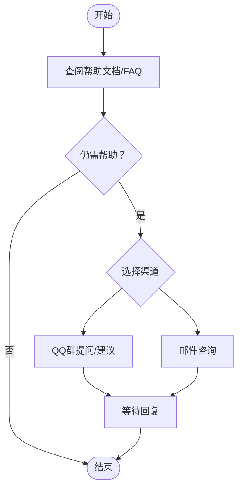
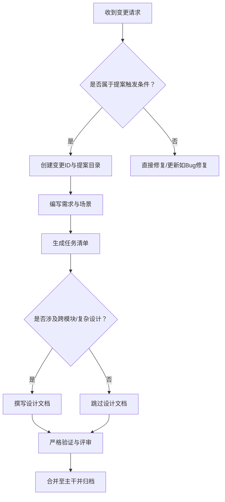
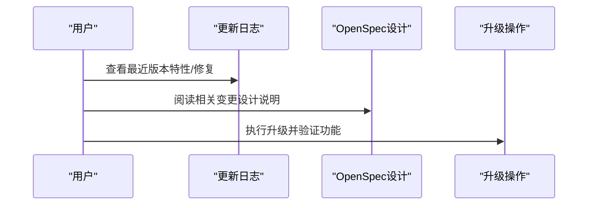
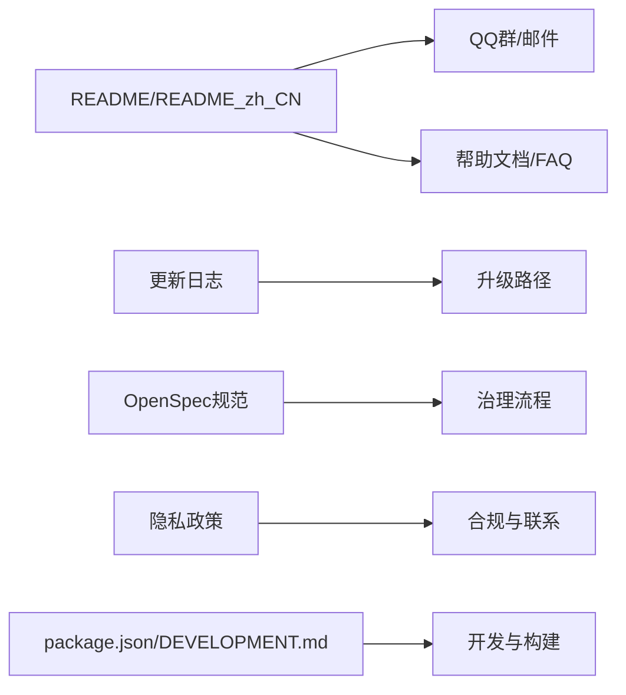

# 社区支持

<cite>
**本文引用的文件**
- [README_zh_CN.md](file://README_zh_CN.md)
- [README.md](file://README.md)
- [CHANGELOG.md](file://CHANGELOG.md)
- [plugin.json](file://plugin.json)
- [package.json](file://package.json)
- [policy.md](file://policy.md)
- [openspec/AGENTS.md](file://openspec/AGENTS.md)
- [.claude/commands/openspec/proposal.md](file://.claude/commands/openspec/proposal.md)
- [.claude/commands/openspec/archive.md](file://.claude/commands/openspec/archive.md)
- [DEVELOPMENT.md](file://DEVELOPMENT.md)
</cite>

## 目录
1. [简介](#简介)
2. [项目结构](#项目结构)
3. [核心组件](#核心组件)
4. [架构总览](#架构总览)
5. [详细组件分析](#详细组件分析)
6. [依赖分析](#依赖分析)
7. [性能考虑](#性能考虑)
8. [故障排查指南](#故障排查指南)
9. [结论](#结论)
10. [附录](#附录)

## 简介
本指南面向思源笔记发布器插件的用户与贡献者，提供社区支持与贡献路径、治理模式、行为准则、参与方式、捐赠与支持渠道、维护团队与核心贡献者信息，以及常见问题自助解决方案与升级路径指引。目标是帮助用户快速获得帮助、理解项目发展方向、规范参与贡献，并建立健康有序的社区互动氛围。

## 项目结构
- 仓库以“插件 + 多端产物 + 开源规范 + 文档”的方式组织，便于用户使用与开发者协作。
- 用户侧主要通过插件市场安装与使用；开发者侧提供多端构建脚本与规范化的变更提案流程。
- 社区沟通与治理通过 README、CHANGELOG、openspec 规范与政策文档协同支撑。

**章节来源**
- [README_zh_CN.md:1-100](file://README_zh_CN.md#L1-L100)
- [plugin.json:1-43](file://plugin.json#L1-L43)
- [package.json:1-99](file://package.json#L1-L99)

## 核心组件
- 社区支持与沟通
  - QQ 群：用于讨论与交流，提供问题反馈与功能建议提交渠道。
  - 邮件：隐私政策中提供的联系邮箱，适合敏感或私密问题。
- 变更治理与贡献流程
  - OpenSpec 规范：用于新功能、破坏性变更、架构调整的规范化提案与归档。
  - 变更提案与归档命令：通过标准化流程确保质量与可追溯性。
- 文档与版本记录
  - 帮助文档与 FAQ：指导用户使用与自助排查。
  - 更新日志：记录版本迭代与问题修复，便于升级与回溯。
- 资助与支持
  - 微信、支付宝、爱发电等捐赠渠道，支持项目持续发展。
- 隐私与合规
  - 隐私政策明确信息收集、使用与披露原则，保障用户权益。

**章节来源**
- [README_zh_CN.md:11-13](file://README_zh_CN.md#L11-L13)
- [README.md:12-14](file://README.md#L12-L14)
- [policy.md:1-63](file://policy.md#L1-L63)
- [openspec/AGENTS.md:1-18](file://openspec/AGENTS.md#L1-L18)
- [.claude/commands/openspec/proposal.md:1-28](file://.claude/commands/openspec/proposal.md#L1-L28)
- [.claude/commands/openspec/archive.md:1-28](file://.claude/commands/openspec/archive.md#L1-L28)
- [CHANGELOG.md:1-200](file://CHANGELOG.md#L1-L200)

## 架构总览
社区支持与贡献的总体流程如下：

**图表来源**
- [README_zh_CN.md:9-13](file://README_zh_CN.md#L9-L13)
- [README.md:9-14](file://README.md#L9-L14)
- [policy.md:60-63](file://policy.md#L60-L63)
- [openspec/AGENTS.md:15-65](file://openspec/AGENTS.md#L15-L65)

**章节来源**
- [README_zh_CN.md:9-13](file://README_zh_CN.md#L9-L13)
- [README.md:9-14](file://README.md#L9-L14)
- [policy.md:60-63](file://policy.md#L60-L63)
- [openspec/AGENTS.md:15-65](file://openspec/AGENTS.md#L15-L65)

## 详细组件分析

### 社区沟通与支持渠道
- QQ 群
  - 用于讨论、问题反馈与功能建议提交。
  - README 中明确“1群已满，请加QQ2群讨论”，确保沟通高效。
- 邮件
  - 隐私政策提供联系邮箱，适合涉及隐私或需要书面记录的问题。
- 帮助文档与FAQ
  - README 提供“最新帮助文档链接”，FAQ 第12条说明如何启用文档菜单，便于用户自助使用。

**章节来源**
- [README_zh_CN.md:9-21](file://README_zh_CN.md#L9-L21)
- [README.md:9-21](file://README.md#L9-L21)
- [policy.md:60-63](file://policy.md#L60-L63)

### 变更治理与贡献流程（OpenSpec）
- OpenSpec 指南
  - 明确何时创建提案（新增功能、破坏性变更、架构调整、性能/安全优化）。
  - 规范化流程：创建提案 → 编写需求与场景 → 实施任务清单 → 设计文档（必要时）→ 验证与归档。
- 提案与归档命令
  - 提供 openspec 列表、显示、验证、归档等命令，确保变更可追踪、可审计。
- 适用范围
  - 适用于重大功能、平台扩展、适配器新增、配置系统演进等。

**章节来源**
- [openspec/AGENTS.md:15-65](file://openspec/AGENTS.md#L15-L65)
- [.claude/commands/openspec/proposal.md:14-27](file://.claude/commands/openspec/proposal.md#L14-L27)
- [.claude/commands/openspec/archive.md:13-27](file://.claude/commands/openspec/archive.md#L13-L27)

### 版本记录与升级路径
- 更新日志
  - 记录每个版本的特性、修复与重构，标注日期与链接，便于用户核对。
- 升级建议
  - 建议用户优先查看最近版本的“Features/Code Refactoring/Bug Fixes”部分，确认影响范围后再升级。
  - 对涉及破坏性变更或架构调整的版本，结合 OpenSpec 规范中的设计说明进行评估。

**章节来源**
- [CHANGELOG.md:1-200](file://CHANGELOG.md#L1-L200)
- [openspec/AGENTS.md:207-235](file://openspec/AGENTS.md#L207-L235)

### 隐私与合规
- 隐私政策
  - 明确信息收集目的、第三方服务链接、日志数据、Cookie 使用、服务商披露、安全性、儿童隐私、政策变更与联系方式。
- 联系方式
  - 提供隐私政策联系邮箱，便于用户咨询与申诉。

**章节来源**
- [policy.md:1-63](file://policy.md#L1-L63)

### 贡献者与维护团队
- 维护者
  - 项目元信息与插件描述中显示作者信息，表明项目由维护者主导推进。
- 核心贡献者
  - 仓库未公开列出核心贡献者名单，建议通过社区交流渠道与维护者沟通，或关注更新日志中贡献者署名与致谢。

**章节来源**
- [plugin.json:1-43](file://plugin.json#L1-L43)
- [README_zh_CN.md:75-100](file://README_zh_CN.md#L75-L100)

### 开发与构建支持
- 开发环境准备
  - 提供 Node.js 与 pnpm 安装与权限配置步骤，确保开发环境一致性。
- 多端开发与构建
  - 支持插件、挂件、浏览器扩展、Nginx 等多端产物，提供统一的构建与打包脚本。
- 同步与发布
  - 提供同步到旧版挂件仓库的脚本，便于兼容与迁移。

**章节来源**
- [DEVELOPMENT.md:1-115](file://DEVELOPMENT.md#L1-L115)
- [package.json:9-28](file://package.json#L9-L28)

## 依赖分析
- 社区支持与治理依赖
  - README 作为用户入口，提供 QQ 群与帮助文档链接。
  - CHANGELOG 作为用户升级依据，体现版本演进。
  - OpenSpec 规范作为贡献治理依据，保证变更质量与可追溯性。
- 隐私与合规依赖
  - policy.md 作为隐私与合规依据，指导用户与维护者行为。
- 开发与构建依赖
  - package.json 与 DEVELOPMENT.md 提供开发与构建工具链，支撑贡献流程。

**章节来源**
- [README_zh_CN.md:9-21](file://README_zh_CN.md#L9-L21)
- [README.md:9-21](file://README.md#L9-L21)
- [CHANGELOG.md:1-200](file://CHANGELOG.md#L1-L200)
- [openspec/AGENTS.md:1-18](file://openspec/AGENTS.md#L1-L18)
- [policy.md:1-63](file://policy.md#L1-L63)
- [package.json:9-28](file://package.json#L9-L28)
- [DEVELOPMENT.md:1-115](file://DEVELOPMENT.md#L1-L115)

## 性能考虑
- 社区响应效率
  - 通过 QQ 群集中讨论，减少重复问题，提升响应效率。
- 变更质量控制
  - OpenSpec 流程要求严格验证与评审，避免引入低质量变更。
- 文档与日志
  - 完整的帮助文档与更新日志有助于用户自助解决问题，降低维护成本。

## 故障排查指南
- 常见问题自助
  - 查阅帮助文档与 FAQ，确认是否为已知问题与解决方案。
  - 参考更新日志，确认当前版本是否存在相关修复。
- 提交问题与建议
  - 在 QQ 群中描述问题背景、复现步骤与期望结果。
  - 涉及隐私或敏感信息时，使用邮件联系维护者。
- 变更影响评估
  - 对涉及破坏性变更或架构调整的版本，结合 OpenSpec 设计说明评估影响范围。

**章节来源**
- [README_zh_CN.md:9-21](file://README_zh_CN.md#L9-L21)
- [README.md:9-21](file://README.md#L9-L21)
- [CHANGELOG.md:1-200](file://CHANGELOG.md#L1-L200)
- [openspec/AGENTS.md:207-235](file://openspec/AGENTS.md#L207-L235)

## 结论
本指南提供了思源笔记发布器插件的社区支持与贡献路径：通过 QQ 群与邮件建立沟通渠道，借助帮助文档与更新日志实现自助排查，采用 OpenSpec 规范确保变更质量与可追溯性，并通过捐赠与支持渠道促进项目可持续发展。建议用户与贡献者遵循规范流程，共同维护健康有序的社区生态。

## 附录
- 联系方式与捐赠
  - QQ 群：用于讨论与反馈。
  - 邮件：隐私政策提供的联系邮箱。
  - 捐赠：微信、支付宝、爱发电等渠道。
- 参考文件
  - README 与 README_zh_CN：项目入口与帮助文档链接。
  - CHANGELOG：版本记录与升级依据。
  - OpenSpec 指南与命令：变更治理与归档流程。
  - 隐私政策：合规与联系信息。
  - 开发与构建脚本：多端产物支持与打包流程。

**章节来源**
- [README_zh_CN.md:11-13](file://README_zh_CN.md#L11-L13)
- [README.md:12-14](file://README.md#L12-L14)
- [policy.md:60-63](file://policy.md#L60-L63)
- [openspec/AGENTS.md:1-18](file://openspec/AGENTS.md#L1-L18)
- [.claude/commands/openspec/proposal.md:1-28](file://.claude/commands/openspec/proposal.md#L1-L28)
- [.claude/commands/openspec/archive.md:1-28](file://.claude/commands/openspec/archive.md#L1-L28)
- [CHANGELOG.md:1-200](file://CHANGELOG.md#L1-L200)
- [plugin.json:38-42](file://plugin.json#L38-L42)
- [package.json:9-28](file://package.json#L9-L28)
- [DEVELOPMENT.md:1-115](file://DEVELOPMENT.md#L1-L115)