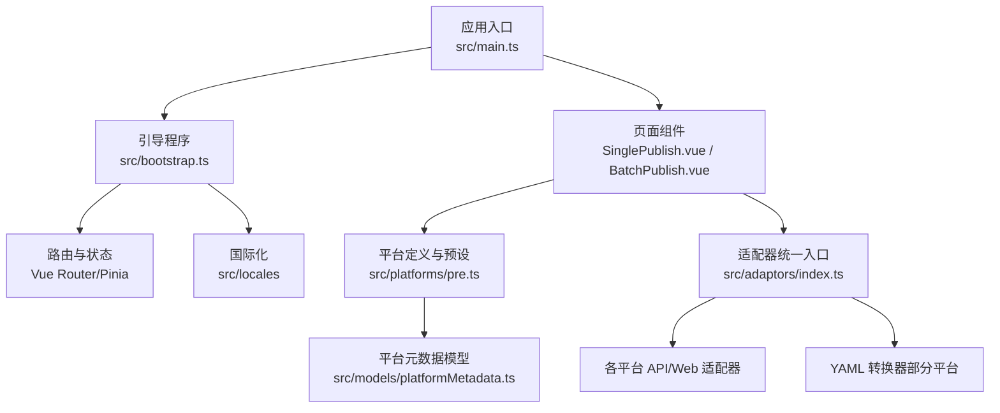
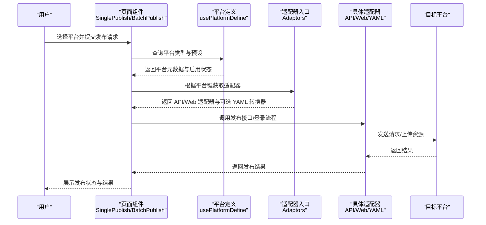
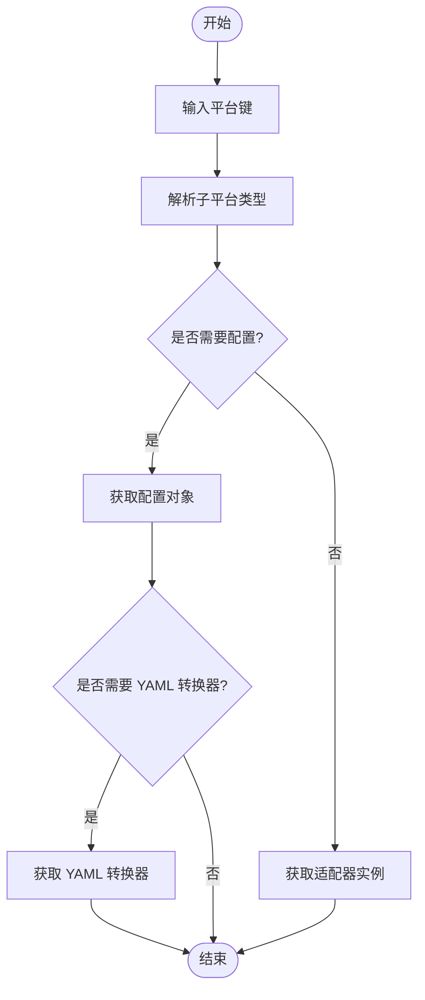
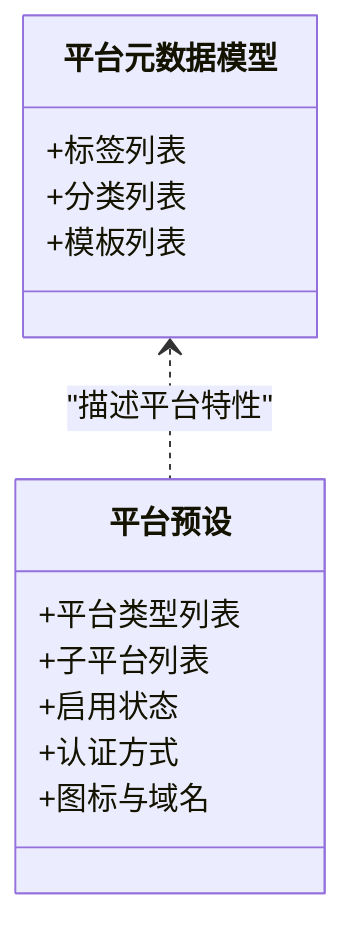
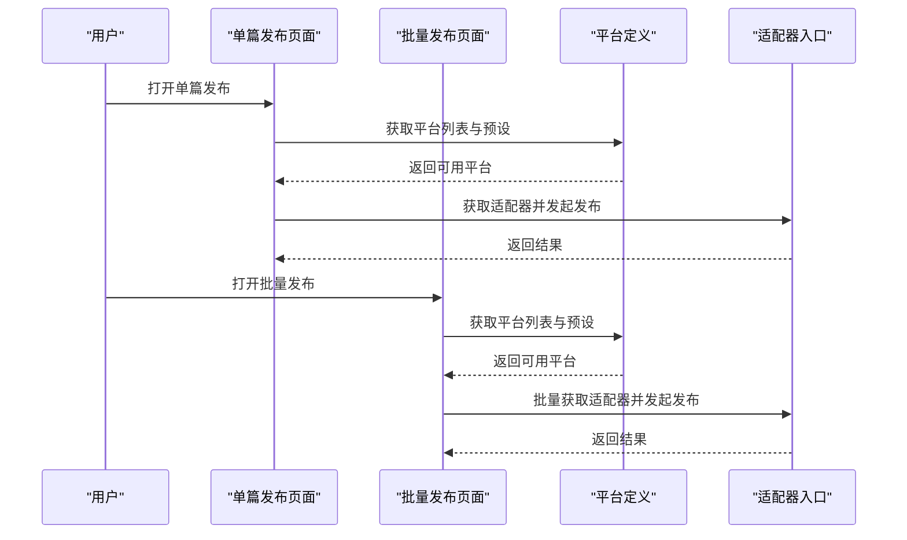
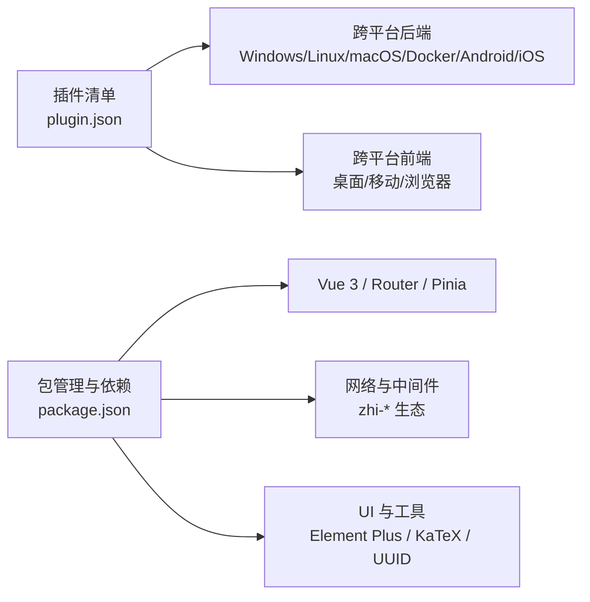

# 项目介绍

<cite>
**本文引用的文件**
- [README_zh_CN.md](file://README_zh_CN.md)
- [README.md](file://README.md)
- [plugin.json](file://plugin.json)
- [package.json](file://package.json)
- [src/main.ts](file://src/main.ts)
- [src/bootstrap.ts](file://src/bootstrap.ts)
- [src/adaptors/index.ts](file://src/adaptors/index.ts)
- [src/platforms/pre.ts](file://src/platforms/pre.ts)
- [src/models/platformMetadata.ts](file://src/models/platformMetadata.ts)
- [src/composables/usePlatformDefine.ts](file://src/composables/usePlatformDefine.ts)
- [src/pages/SinglePublish.vue](file://src/pages/SinglePublish.vue)
- [src/pages/BatchPublish.vue](file://src/pages/BatchPublish.vue)
- [policy.md](file://policy.md)
</cite>

## 目录
1. [引言](#引言)
2. [项目结构](#项目结构)
3. [核心组件](#核心组件)
4. [架构总览](#架构总览)
5. [详细组件分析](#详细组件分析)
6. [依赖分析](#依赖分析)
7. [性能考量](#性能考量)
8. [故障排查指南](#故障排查指南)
9. [结论](#结论)
10. [附录](#附录)

## 引言
“发布工具”是专为思源笔记设计的一站式文章发布插件，目标是让创作者能够将笔记内容一键发布到20+个平台，包括语雀、Notion、WordPress、Typecho、Halo、Confluence、各类静态站点生成器（如 Hexo、Hugo、Jekyll、VitePress、VuePress、Astro 等）以及多个国内主流自媒体/社区平台（如知乎、CSDN、微信公众号、简书、掘金、哔哩哔哩、Halo 网页版等）。项目坚持开源免费，覆盖桌面端（Windows/Linux/macOS/Docker/Android/iOS）与多前端形态（桌面端、移动端、浏览器端），并提供批量分发、模板与分类标签管理、AI 辅助等功能，帮助用户高效地在不同渠道分发内容。

本插件在思源笔记生态中扮演“内容出口”的角色：既可作为桌面插件使用，也可通过浏览器插件或自托管方式运行；既能连接云端服务，也能直接写入本地文件系统，满足从个人写作到团队协作的多样化场景。

## 项目结构
项目采用“前端单页应用 + 平台适配器”的分层架构：
- 应用入口与运行时：Vue 应用通过入口脚本挂载，配合路由、状态管理与国际化模块。
- 平台适配层：统一的适配器入口根据平台键动态加载对应 API/Web 适配器与 YAML 转换器。
- 平台预设与元数据：集中定义平台类型、子平台、启用状态、认证方式与图标等。
- 页面与组件：单篇发布、批量发布、设置页等页面组件驱动交互流程。
- 配置与兼容：插件清单声明跨平台兼容性，包管理与构建脚本支撑开发与发布。

图表来源
- [src/main.ts:1-22](file://src/main.ts#L1-L22)
- [src/bootstrap.ts:1-53](file://src/bootstrap.ts#L1-L53)
- [src/pages/SinglePublish.vue:1-22](file://src/pages/SinglePublish.vue#L1-L22)
- [src/pages/BatchPublish.vue:1-22](file://src/pages/BatchPublish.vue#L1-L22)
- [src/platforms/pre.ts:1-463](file://src/platforms/pre.ts#L1-L463)
- [src/models/platformMetadata.ts:1-50](file://src/models/platformMetadata.ts#L1-L50)
- [src/adaptors/index.ts:1-573](file://src/adaptors/index.ts#L1-L573)

章节来源
- [src/main.ts:1-22](file://src/main.ts#L1-L22)
- [src/bootstrap.ts:1-53](file://src/bootstrap.ts#L1-L53)
- [src/platforms/pre.ts:1-463](file://src/platforms/pre.ts#L1-L463)
- [src/adaptors/index.ts:1-573](file://src/adaptors/index.ts#L1-L573)

## 核心组件
- 应用入口与引导
  - 应用入口负责创建并挂载 Vue 应用，初始化国际化、状态管理与路由。
  - 引导程序负责注册指令、插件与全局配置，确保运行时环境就绪。
- 平台适配器
  - 适配器统一入口根据平台键解析子平台类型，动态加载对应的 API/Web 适配器与 YAML 转换器，屏蔽平台差异。
- 平台预设与元数据
  - 预设文件集中定义平台类型（通用、GitHub、GitLab、Metaweblog、WordPress、自定义、文件系统、系统）与具体子平台，含启用状态、认证方式、图标与域名等。
  - 平台元数据模型用于描述标签、分类与模板等平台特性，便于 UI 展示与业务逻辑使用。
- 页面与交互
  - 单篇发布与批量发布页面分别承载“选择平台—填写参数—执行发布”的流程，结合设置页实现平台配置与偏好管理。

章节来源
- [src/main.ts:1-22](file://src/main.ts#L1-L22)
- [src/bootstrap.ts:1-53](file://src/bootstrap.ts#L1-L53)
- [src/adaptors/index.ts:1-573](file://src/adaptors/index.ts#L1-L573)
- [src/platforms/pre.ts:1-463](file://src/platforms/pre.ts#L1-L463)
- [src/models/platformMetadata.ts:1-50](file://src/models/platformMetadata.ts#L1-L50)
- [src/pages/SinglePublish.vue:1-22](file://src/pages/SinglePublish.vue#L1-L22)
- [src/pages/BatchPublish.vue:1-22](file://src/pages/BatchPublish.vue#L1-L22)

## 架构总览
下图展示了“发布工具”的核心交互：用户在页面选择平台，系统通过适配器入口定位具体适配器，再调用相应 API 或 Web 登录流程完成发布；同时支持本地文件系统输出与静态站点生成器的 YAML 转换。

图表来源
- [src/pages/SinglePublish.vue:1-22](file://src/pages/SinglePublish.vue#L1-L22)
- [src/pages/BatchPublish.vue:1-22](file://src/pages/BatchPublish.vue#L1-L22)
- [src/composables/usePlatformDefine.ts:1-83](file://src/composables/usePlatformDefine.ts#L1-L83)
- [src/adaptors/index.ts:1-573](file://src/adaptors/index.ts#L1-L573)

## 详细组件分析

### 平台适配器与统一入口
- 设计要点
  - 通过平台键映射到子平台类型，再分支加载对应适配器，保证扩展性与可维护性。
  - 对部分静态站点平台提供 YAML 转换器，便于生成符合平台要求的元数据文件。
- 关键流程
  - 获取配置：根据平台键返回对应配置对象，供 UI 渲染与发布参数校验。
  - 获取适配器：返回可直接调用的 API/Web 适配器实例。
  - 获取 YAML 适配器：返回 YAML 转换器，用于生成或转换站点配置文件。
- 复杂度与性能
  - 适配器加载为惰性与异步，避免一次性加载全部平台导致的体积与启动开销。
  - 日志记录有助于定位平台适配问题。

图表来源
- [src/adaptors/index.ts:65-263](file://src/adaptors/index.ts#L65-L263)
- [src/adaptors/index.ts:271-467](file://src/adaptors/index.ts#L271-L467)
- [src/adaptors/index.ts:475-569](file://src/adaptors/index.ts#L475-L569)

章节来源
- [src/adaptors/index.ts:1-573](file://src/adaptors/index.ts#L1-L573)

### 平台预设与元数据模型
- 平台类型与子平台
  - 定义通用、GitHub、GitLab、Metaweblog、WordPress、自定义、文件系统、系统等类型，并为每类列出具体平台与启用状态。
  - 认证方式涵盖 API 密钥与网站登录两种模式，域名与授权地址用于登录流程与 Cookie/UA 策略。
- 平台元数据
  - 元数据模型包含标签、分类与模板列表，用于平台特性展示与业务使用。

图表来源
- [src/models/platformMetadata.ts:16-47](file://src/models/platformMetadata.ts#L16-L47)
- [src/platforms/pre.ts:50-96](file://src/platforms/pre.ts#L50-L96)
- [src/platforms/pre.ts:101-462](file://src/platforms/pre.ts#L101-L462)

章节来源
- [src/platforms/pre.ts:1-463](file://src/platforms/pre.ts#L1-L463)
- [src/models/platformMetadata.ts:1-50](file://src/models/platformMetadata.ts#L1-L50)

### 页面与交互流程
- 单篇发布
  - 页面接收文档 ID，渲染“选择平台—填写参数—执行发布”的流程，支持 AI 辅助与模板选择。
- 批量发布
  - 页面支持批量选择文档并分发到多个平台，提升效率。
- 设置页
  - 提供平台添加、更新、导入导出、通用偏好与 AI 设置等，便于个性化配置。

图表来源
- [src/pages/SinglePublish.vue:10-21](file://src/pages/SinglePublish.vue#L10-L21)
- [src/pages/BatchPublish.vue:10-21](file://src/pages/BatchPublish.vue#L10-L21)
- [src/composables/usePlatformDefine.ts:18-82](file://src/composables/usePlatformDefine.ts#L18-L82)
- [src/adaptors/index.ts:65-263](file://src/adaptors/index.ts#L65-L263)

章节来源
- [src/pages/SinglePublish.vue:1-22](file://src/pages/SinglePublish.vue#L1-L22)
- [src/pages/BatchPublish.vue:1-22](file://src/pages/BatchPublish.vue#L1-L22)
- [src/composables/usePlatformDefine.ts:1-83](file://src/composables/usePlatformDefine.ts#L1-L83)

## 依赖分析
- 插件清单与跨平台兼容
  - 插件清单声明支持 Windows、Linux、macOS、Docker、Android、iOS 等后端，以及桌面端、移动端、浏览器端等前端形态，体现跨平台兼容性。
- 依赖与版本
  - 依赖包括 Vue 3、Element Plus、Pinia、Vue Router、siyuan API 封装库、zhi-* 生态中间件与适配器、fetch、CryptoJS、KaTeX、UUID 等，覆盖 UI、网络、存储与富文本处理等需求。
- 开发与构建
  - 包脚本涵盖开发、测试、构建、打包与多端产物生成，便于快速迭代与发布。

图表来源
- [plugin.json:1-43](file://plugin.json#L1-L43)
- [package.json:1-99](file://package.json#L1-L99)

章节来源
- [plugin.json:1-43](file://plugin.json#L1-L43)
- [package.json:1-99](file://package.json#L1-L99)

## 性能考量
- 按需加载与懒适配
  - 适配器按需加载，减少初始包体与启动时间，适合多平台扩展。
- 路由与状态管理
  - 使用轻量级路由与状态管理，避免不必要的重渲染。
- 图标与资源
  - 通过 SVG 图标与外部资源库，平衡功能完整性与体积。
- 建议
  - 对频繁使用的平台可考虑缓存配置与适配器实例，进一步降低重复初始化成本。
  - 对大文档发布，建议分块处理与进度反馈，提升用户体验。

## 故障排查指南
- 常见问题定位
  - 平台不可用：检查平台启用状态与认证方式，确认配置正确。
  - 登录受限：部分自定义平台存在 Cookie/UA 限制，需按预设白名单策略处理。
  - 本地发布失败：确认 Electron 环境与目标目录权限。
- 隐私与合规
  - 项目提供隐私政策，明确信息收集与使用范围，保障用户知情权。
- 参考路径
  - 平台预设与限制策略：[src/platforms/pre.ts:20-45](file://src/platforms/pre.ts#L20-L45)
  - 平台启用与认证方式：[src/platforms/pre.ts:101-462](file://src/platforms/pre.ts#L101-L462)
  - 隐私政策：[policy.md:1-19](file://policy.md#L1-L19)

章节来源
- [src/platforms/pre.ts:20-45](file://src/platforms/pre.ts#L20-L45)
- [src/platforms/pre.ts:101-462](file://src/platforms/pre.ts#L101-L462)
- [policy.md:1-19](file://policy.md#L1-L19)

## 结论
“发布工具”以“开源免费、一站发布、跨平台兼容”为核心价值，通过统一的适配器架构与丰富的平台预设，将思源笔记的内容高效分发至20+平台，覆盖个人写作、知识库建设与团队协作等多种场景。其模块化设计便于持续扩展，配合批量分发与 AI 辅助，显著提升内容生产与发布的效率与质量。对于普通用户，它简化了多平台发布流程；对于开发者，它提供了清晰的扩展点与稳定的运行环境。

## 附录
- 快速开始
  - 在插件市场搜索“发布工具”，安装并启用后，点击工具栏“飞机”按钮即可使用。
- 更新历史与功能亮点
  - v1.41.0：新增 Astro 平台（支持 GitHub、GitLab 以及本地系统）。
  - v1.38.0：支持发布到文件系统（本地文件），后续将逐步支持 FTP、SFTP、云盘等。
- 技术栈与依赖
  - Vue 3、Vite、TypeScript、Element Plus、Pinia、Vue Router、siyuan API 封装库、zhi-* 生态中间件等。

章节来源
- [README_zh_CN.md:15-33](file://README_zh_CN.md#L15-L33)
- [README.md:16-33](file://README.md#L16-L33)
- [package.json:29-96](file://package.json#L29-L96)