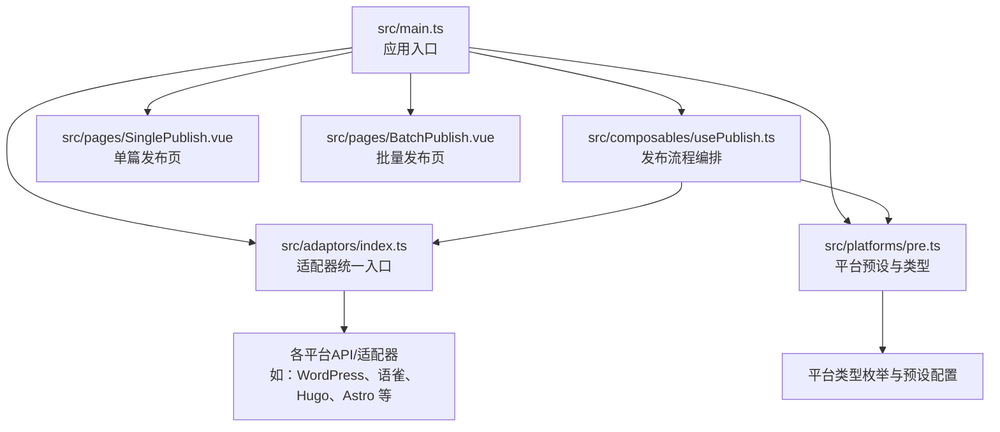
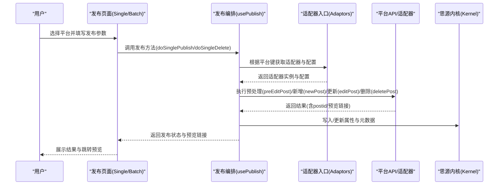
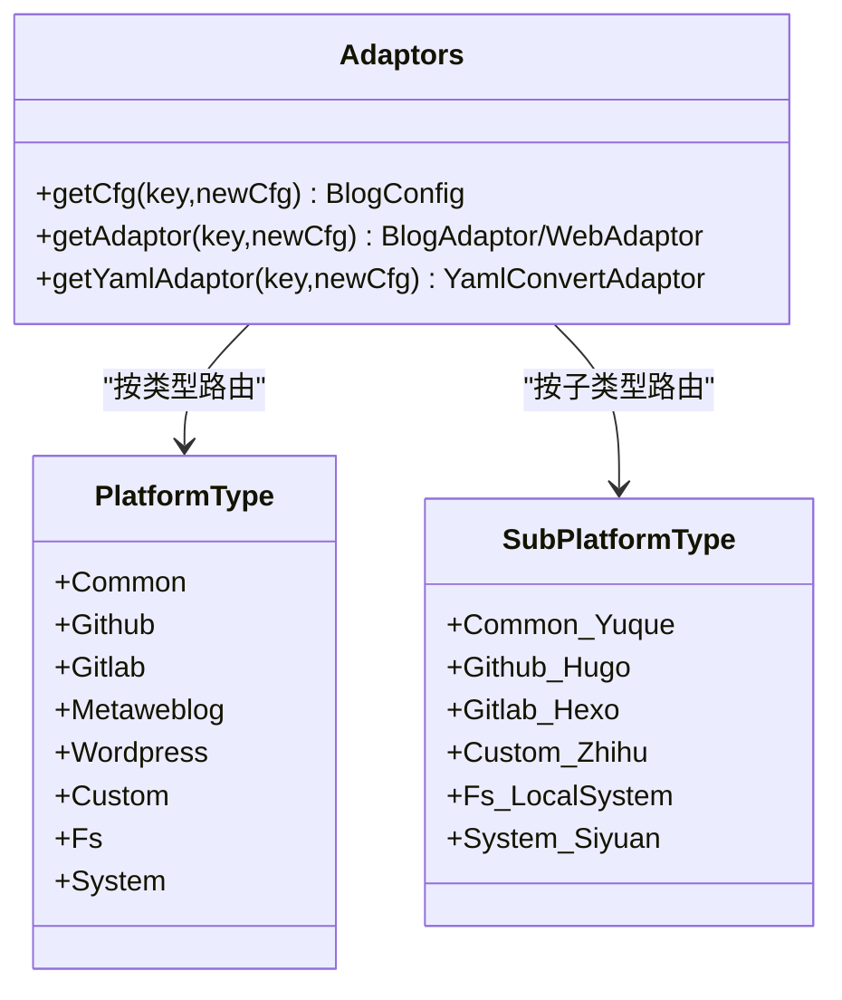
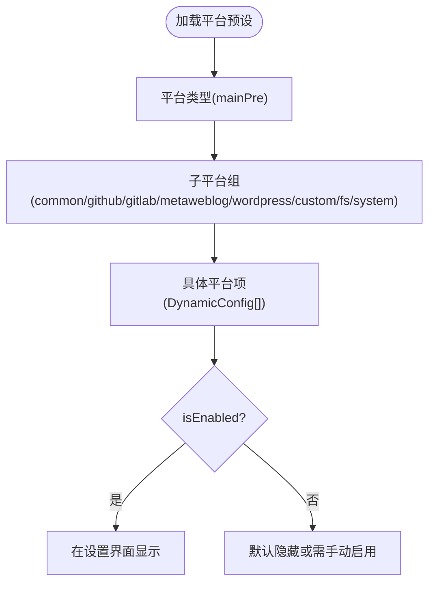
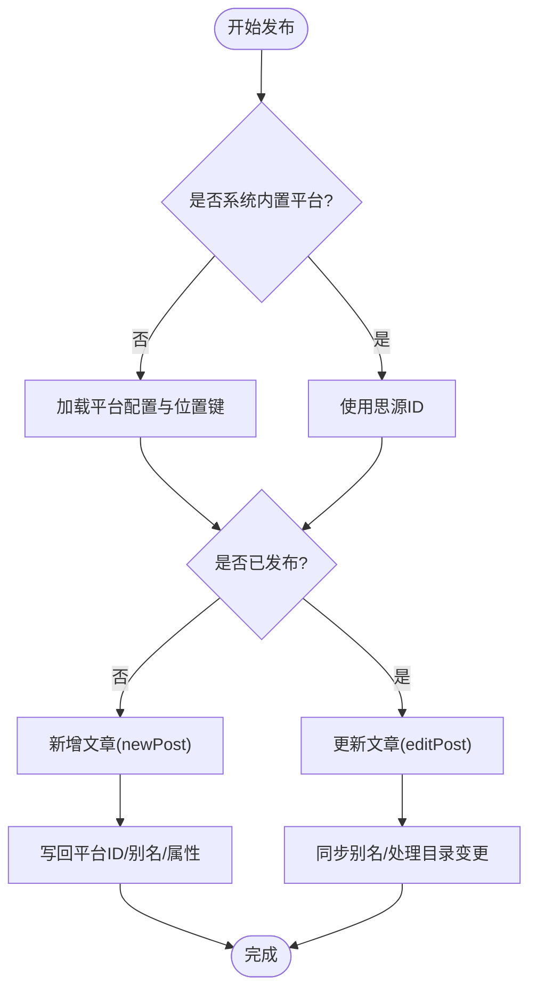
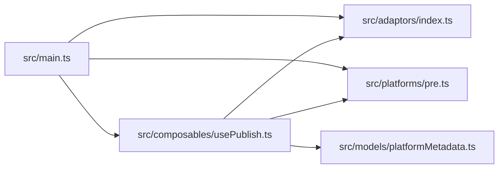

# 项目概述

<cite>
**本文引用的文件**
- [README_zh_CN.md](file://README_zh_CN.md)
- [README.md](file://README.md)
- [plugin.json](file://plugin.json)
- [package.json](file://package.json)
- [src/main.ts](file://src/main.ts)
- [src/adaptors/index.ts](file://src/adaptors/index.ts)
- [src/platforms/pre.ts](file://src/platforms/pre.ts)
- [src/models/platformMetadata.ts](file://src/models/platformMetadata.ts)
- [src/composables/usePlatformDefine.ts](file://src/composables/usePlatformDefine.ts)
- [src/composables/usePublish.ts](file://src/composables/usePublish.ts)
- [src/pages/SinglePublish.vue](file://src/pages/SinglePublish.vue)
- [src/pages/BatchPublish.vue](file://src/pages/BatchPublish.vue)
- [docs/常规发布.md](file://docs/常规发布.md)
- [docs/批量分发.md](file://docs/批量分发.md)
</cite>

## 目录
1. [引言](#引言)
2. [项目结构](#项目结构)
3. [核心组件](#核心组件)
4. [架构总览](#架构总览)
5. [详细组件分析](#详细组件分析)
6. [依赖关系分析](#依赖关系分析)
7. [性能考量](#性能考量)
8. [故障排查指南](#故障排查指南)
9. [结论](#结论)
10. [附录](#附录)

## 引言
“发布工具”是专为思源笔记设计的一站式内容发布插件，支持将笔记内容发布到20+个平台，覆盖博客系统、静态站点生成平台、知识库平台、社交平台及文件系统等。项目遵循开源免费原则，致力于降低内容多渠道发布的门槛，提升创作者在不同平台间的分发效率。在思源笔记生态中，该插件扮演“内容出口”的角色，连接笔记内核与外部平台生态，提供统一的发布体验与配置管理。

- 开源免费：项目采用自由版权，面向社区开放。
- 一站式发布：通过统一适配层对接多种平台，减少重复配置与学习成本。
- 生态定位：作为思源笔记的官方插件之一，提供跨平台发布能力，增强内容资产的可达性与复用性。

**章节来源**
- [README_zh_CN.md:1-100](file://README_zh_CN.md#L1-L100)
- [README.md:1-102](file://README.md#L1-L102)
- [plugin.json:1-43](file://plugin.json#L1-L43)

## 项目结构
项目采用前端单页应用架构，结合 Vue 3 + Vite + TypeScript 技术栈，核心模块围绕“平台适配器”“动态配置”“发布流程编排”展开。主要目录职责如下：
- src：核心源码，包含适配器、平台定义、发布流程、页面与组件、工具集等
- docs：帮助文档与使用说明
- public/scripts：构建与开发脚本
- siyuan：与思源内核交互的桥接层
- common：通用工具与测试
- openspec：开放规范与提案

**图表来源**
- [src/main.ts:10-21](file://src/main.ts#L10-L21)
- [src/adaptors/index.ts:56-573](file://src/adaptors/index.ts#L56-L573)
- [src/platforms/pre.ts:50-463](file://src/platforms/pre.ts#L50-L463)
- [src/composables/usePublish.ts:44-560](file://src/composables/usePublish.ts#L44-L560)
- [src/pages/SinglePublish.vue:10-21](file://src/pages/SinglePublish.vue#L10-L21)
- [src/pages/BatchPublish.vue:10-21](file://src/pages/BatchPublish.vue#L10-L21)

**章节来源**
- [src/main.ts:10-21](file://src/main.ts#L10-L21)
- [src/adaptors/index.ts:56-573](file://src/adaptors/index.ts#L56-L573)
- [src/platforms/pre.ts:50-463](file://src/platforms/pre.ts#L50-L463)
- [src/composables/usePublish.ts:44-560](file://src/composables/usePublish.ts#L44-L560)
- [src/pages/SinglePublish.vue:10-21](file://src/pages/SinglePublish.vue#L10-L21)
- [src/pages/BatchPublish.vue:10-21](file://src/pages/BatchPublish.vue#L10-L21)

## 核心组件
- 适配器统一入口：根据平台键值动态选择对应适配器与配置，屏蔽平台差异，提供统一的发布接口。
- 平台预设与类型：集中定义平台类型、子平台类型、认证方式与启用状态，便于统一管理与扩展。
- 发布流程编排：封装“新增/更新/删除/强制删除”等发布动作，负责预处理、属性合并、YAML转换、预览链接生成与元数据同步。
- 页面与组件：提供单篇发布与批量发布入口，承载表单与交互逻辑。

**章节来源**
- [src/adaptors/index.ts:56-573](file://src/adaptors/index.ts#L56-L573)
- [src/platforms/pre.ts:50-463](file://src/platforms/pre.ts#L50-L463)
- [src/composables/usePublish.ts:44-560](file://src/composables/usePublish.ts#L44-L560)
- [src/pages/SinglePublish.vue:10-21](file://src/pages/SinglePublish.vue#L10-L21)
- [src/pages/BatchPublish.vue:10-21](file://src/pages/BatchPublish.vue#L10-L21)

## 架构总览
下图展示了从用户触发发布到平台适配器执行请求的整体流程，以及与平台配置、YAML转换、元数据存储的关系。

**图表来源**
- [src/composables/usePublish.ts:70-212](file://src/composables/usePublish.ts#L70-L212)
- [src/adaptors/index.ts:65-467](file://src/adaptors/index.ts#L65-L467)
- [src/platforms/pre.ts:450-462](file://src/platforms/pre.ts#L450-L462)

**章节来源**
- [src/composables/usePublish.ts:44-560](file://src/composables/usePublish.ts#L44-L560)
- [src/adaptors/index.ts:56-573](file://src/adaptors/index.ts#L56-L573)
- [src/platforms/pre.ts:50-463](file://src/platforms/pre.ts#L50-L463)

## 详细组件分析

### 平台适配器与统一入口
- 适配器入口根据平台键映射到具体平台的API/适配器实现，支持博客类、静态站点类、自定义网站类、文件系统类与系统内嵌类。
- 对于存在YAML转换需求的平台，提供YAML适配器以实现前后端元数据的双向转换。
- 通过统一的配置加载机制，确保不同平台的认证方式、位置键、预览URL等差异被抽象化。

**图表来源**
- [src/adaptors/index.ts:56-573](file://src/adaptors/index.ts#L56-L573)
- [src/platforms/pre.ts:101-463](file://src/platforms/pre.ts#L101-L463)

**章节来源**
- [src/adaptors/index.ts:56-573](file://src/adaptors/index.ts#L56-L573)
- [src/platforms/pre.ts:101-463](file://src/platforms/pre.ts#L101-L463)

### 平台预设与类型定义
- 平台类型与子平台类型集中定义，包含图标、认证模式、启用状态、域名与登录地址等元信息。
- 通过组合预设列表，形成完整的平台清单，便于在设置界面与发布流程中统一呈现与筛选。

**图表来源**
- [src/platforms/pre.ts:50-463](file://src/platforms/pre.ts#L50-L463)
- [src/composables/usePlatformDefine.ts:18-82](file://src/composables/usePlatformDefine.ts#L18-L82)

**章节来源**
- [src/platforms/pre.ts:50-463](file://src/platforms/pre.ts#L50-L463)
- [src/composables/usePlatformDefine.ts:18-82](file://src/composables/usePlatformDefine.ts#L18-L82)

### 发布流程编排
- 新增/更新：根据是否已有平台ID决定走新增或更新分支；新增后写回平台ID与别名，更新时保持别名不变并处理目录变更导致的ID变化。
- 删除：支持安全删除与强制删除两种模式，前者依赖平台API，后者仅清理本地记录与属性。
- 预处理：调用适配器的预处理钩子，完成标题、摘要、标签、分类、YAML等字段的标准化与平台化。
- 元数据与属性：将平台YAML与标签/分类等元数据写入思源内核属性，便于后续读取与跨平台一致性维护。

**图表来源**
- [src/composables/usePublish.ts:70-212](file://src/composables/usePublish.ts#L70-L212)
- [src/platforms/pre.ts:450-462](file://src/platforms/pre.ts#L450-L462)

**章节来源**
- [src/composables/usePublish.ts:44-560](file://src/composables/usePublish.ts#L44-L560)
- [src/platforms/pre.ts:450-462](file://src/platforms/pre.ts#L450-L462)

### 页面与入口
- 单篇发布页：接收文档ID，引导用户选择平台并执行发布。
- 批量发布页：支持批量分发与合并策略，提升规模化发布效率。

**章节来源**
- [src/pages/SinglePublish.vue:10-21](file://src/pages/SinglePublish.vue#L10-L21)
- [src/pages/BatchPublish.vue:10-21](file://src/pages/BatchPublish.vue#L10-L21)
- [docs/常规发布.md:1-3](file://docs/常规发布.md#L1-L3)
- [docs/批量分发.md:1-3](file://docs/批量分发.md#L1-L3)

## 依赖关系分析
- 应用入口：创建并挂载Vue应用，引入UI样式。
- 适配器与平台：通过统一入口按键值解析，避免上层直接耦合具体平台实现。
- 发布流程：依赖适配器、平台配置、内核API与设置存储，形成闭环。
- 平台元数据：通过模型与存储管理标签、分类、模板等元数据，支撑跨平台一致性。

**图表来源**
- [src/main.ts:10-21](file://src/main.ts#L10-L21)
- [src/adaptors/index.ts:56-573](file://src/adaptors/index.ts#L56-L573)
- [src/platforms/pre.ts:50-463](file://src/platforms/pre.ts#L50-L463)
- [src/composables/usePublish.ts:44-560](file://src/composables/usePublish.ts#L44-L560)
- [src/models/platformMetadata.ts:16-49](file://src/models/platformMetadata.ts#L16-L49)

**章节来源**
- [src/main.ts:10-21](file://src/main.ts#L10-L21)
- [src/adaptors/index.ts:56-573](file://src/adaptors/index.ts#L56-L573)
- [src/platforms/pre.ts:50-463](file://src/platforms/pre.ts#L50-L463)
- [src/composables/usePublish.ts:44-560](file://src/composables/usePublish.ts#L44-L560)
- [src/models/platformMetadata.ts:16-49](file://src/models/platformMetadata.ts#L16-L49)

## 性能考量
- 适配器按需加载：通过统一入口按键值动态解析，避免一次性加载所有平台实现，降低启动开销。
- 数据深拷贝与不可变更新：在发布前对文档对象进行深拷贝，减少副作用；仅在必要时更新属性与元数据，避免频繁写入。
- YAML转换策略：优先使用平台提供的YAML适配器，减少手工维护成本；未提供适配器时采用默认策略，兼顾兼容性。
- 预览链接生成：基于平台返回的相对/绝对链接自动拼接，减少额外网络请求。

[本节为通用性能建议，无需特定文件引用]

## 故障排查指南
- 配置缺失：若提示“位置键为空”，请检查平台配置中的位置键设置，确保与平台返回的ID字段一致。
- 已发布但无法更新：确认本地记录中是否存在平台ID；若无，需先执行“强制删除”清理本地记录后再重新发布。
- 目录变更导致ID变化：更新流程会检测并同步新的平台ID，同时提示用户更新已完成。
- 预览链接异常：检查平台返回的链接是否为绝对路径，若是相对路径则会自动拼接站点首页地址。
- 平台认证问题：对于自定义网站类平台，确认登录地址与域名配置正确；部分平台可能需要UA或Cookie白名单支持。

**章节来源**
- [src/composables/usePublish.ts:195-212](file://src/composables/usePublish.ts#L195-L212)
- [src/composables/usePublish.ts:221-280](file://src/composables/usePublish.ts#L221-L280)
- [src/composables/usePublish.ts:333-343](file://src/composables/usePublish.ts#L333-L343)
- [src/platforms/pre.ts:20-45](file://src/platforms/pre.ts#L20-L45)

## 结论
“发布工具”通过统一的适配器与配置体系，将思源笔记与20+平台连接起来，形成一套可扩展、易维护、跨平台的一站式发布方案。其开源免费的特性降低了内容分发的成本，适合个人创作者与团队在多渠道发布场景中高效使用。随着平台生态的持续扩展与优化，该插件将持续提升发布体验与稳定性。

[本节为总结性内容，无需特定文件引用]

## 附录

### 安装与快速开始
- 在思源笔记插件市场搜索“发布工具”，安装并启用插件。
- 在思源笔记窗口左上角工具栏点击“飞机”按钮，进入发布界面。
- 可选：启用文档菜单后也可使用发布功能。

**章节来源**
- [README_zh_CN.md:15-21](file://README_zh_CN.md#L15-L21)
- [README.md:16-21](file://README.md#L16-L21)

### 常见使用场景
- 常规发布：在“常规发布”入口选择目标平台，填写标题、摘要、标签与分类，一键发布。
- 批量分发：在“批量分发”入口选择多个文档，统一发布到多个平台，支持合并策略。
- 文件系统发布：支持将内容导出为本地文件，便于离线归档或二次加工。

**章节来源**
- [docs/常规发布.md:1-3](file://docs/常规发布.md#L1-L3)
- [docs/批量分发.md:1-3](file://docs/批量分发.md#L1-L3)

### 技术背景与版本信息
- 版本：当前版本为 v1.41.1，近期新增 Astro 平台支持与文件系统发布能力。
- 依赖：项目基于 Vue 3、Vite、TypeScript 与 Element Plus 等生态构建，适配器层依赖 zhi-* 系列中间件与API库。
- 平台生态：涵盖 WordPress、Cnblogs、语雀、Notion、Halo、Telegraph、Confluence、各类静态站点生成器（Hugo、Hexo、Jekyll、VitePress、VuePress、Quartz、Astro）以及多个国内技术社区平台与社交平台。

**章节来源**
- [package.json:1-99](file://package.json#L1-L99)
- [plugin.json:1-43](file://plugin.json#L1-L43)
- [README_zh_CN.md:23-33](file://README_zh_CN.md#L23-L33)
- [README.md:23-33](file://README.md#L23-L33)