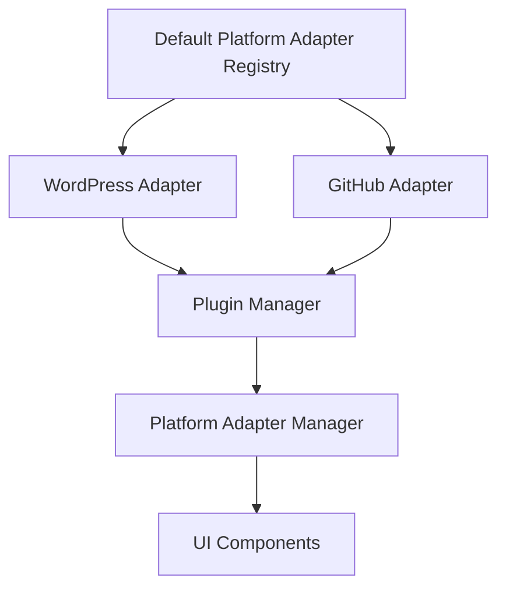
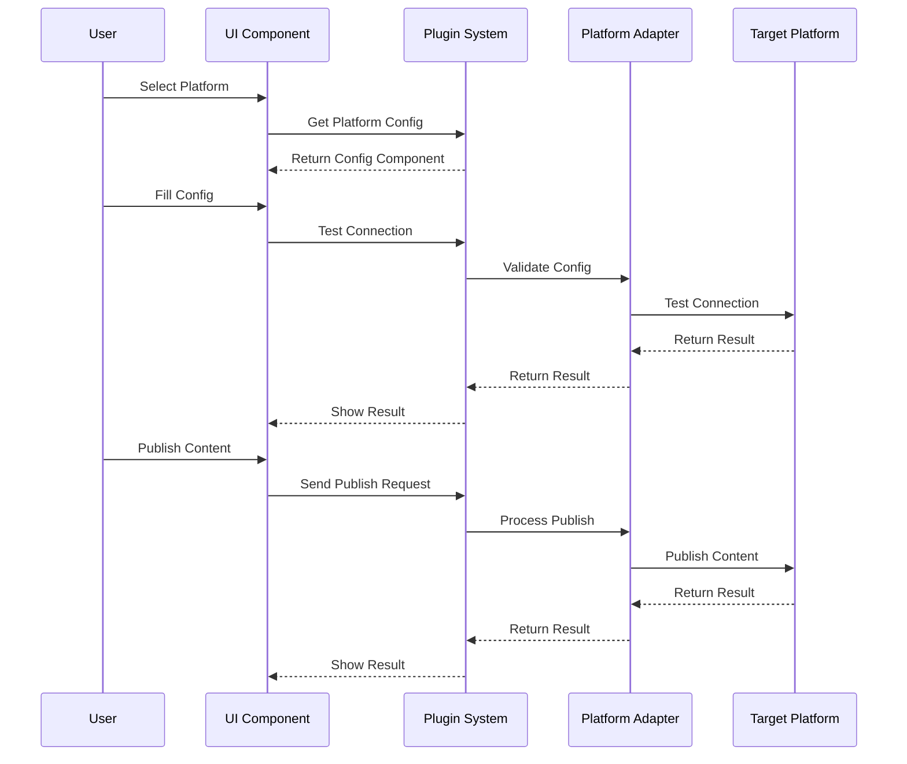
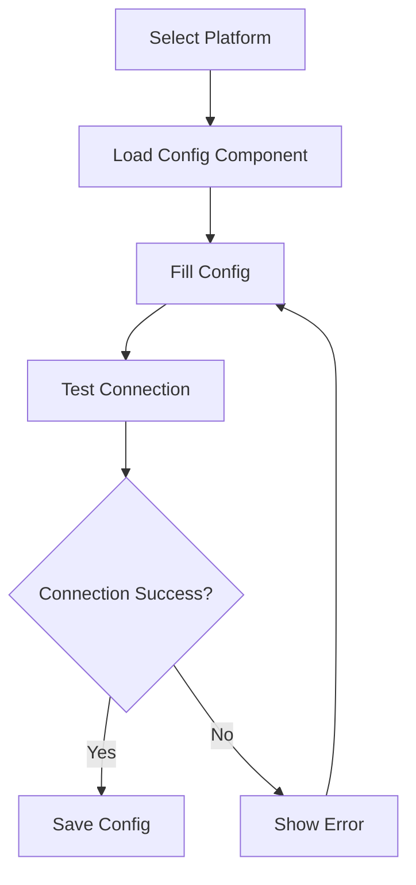
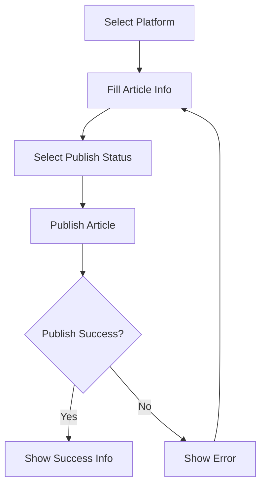
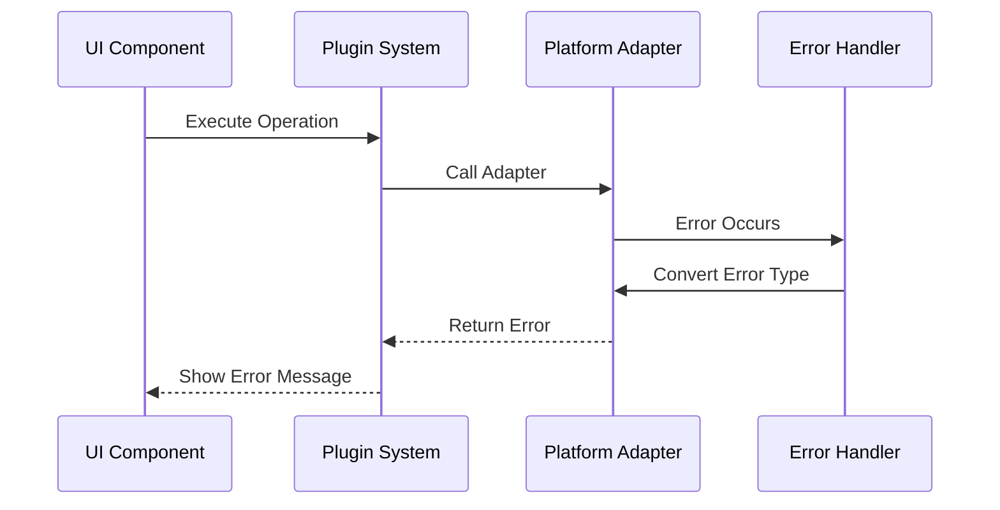
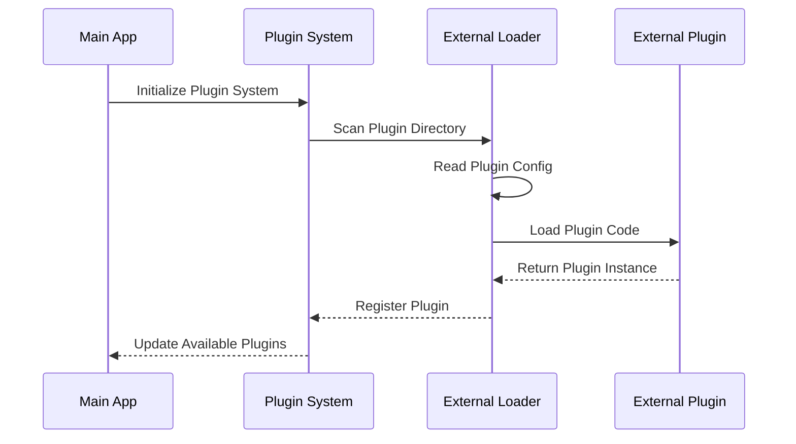

# SiYuan Publisher Development Guide

## Architecture Overview

SiYuan Publisher adopts a modular architecture and centralizes all shared type definitions in a dedicated `common` package. This design effectively avoids circular dependencies and improves maintainability.

### Directory Structure

```
packages/
  common/                # Shared type definitions (type/interface/enum only)
  core/                  # Core business logic
  plugin-system/         # Plugin management and loading
  platform-adapters/     # Third-party platform adapters
  main-app/              # Main application
  ui/                    # Frontend UI components
```

## Core Components and Call Chain

### 1. Plugin System Initialization Flow

```mermaid
sequenceDiagram
    participant App
    participant PS
    participant PAR
    participant PM
    participant PAM

    App->>PS: Initialize Plugin System
    PS->>PAR: Get Built-in Adapters
    PAR->>PAR: Register Built-in Adapters
    PAR-->>PS: Return Adapter List
    PS->>PM: Register Plugins
    PS->>PAM: Update Adapter List
    PAM-->>App: Return Available Platforms
```

### 2. Platform Adapter Registration Mechanism



### 3. Publishing Process



## Detailed Component Description

### 1. Plugin System

The plugin system is the core of the application, responsible for managing all platform adapters and plugins.

#### Main Components:

- **Plugin Manager**: Manages plugin lifecycle
  ```typescript
  class PluginManager {
    registerPlugin(plugin: Plugin): Promise<void>
    unloadPlugin(id: string): Promise<void>
    getPlugin(id: string): Plugin | undefined
    getAllPlugins(): Plugin[]
  }
  ```

- **Platform Adapter Manager**: Manages platform adapters
  ```typescript
  class PlatformAdapterManager {
    getAdapter(id: string): PlatformAdapter | undefined
    getAllAdapters(): PlatformAdapter[]
    connectAdapter(id: string, config: any): Promise<void>
    disconnectAdapter(id: string): Promise<void>
  }
  ```

### 2. Platform Adapters

Platform adapters implement integration with specific platforms.

#### Built-in Adapters:

- **WordPress Adapter**
  ```typescript
  class WordPressAdapter implements PlatformAdapter {
    id = "wordpress"
    type = "wordpress"
    async connect(config: WordPressConfig): Promise<void>
    async publish(post: Post, options: PublishOptions): Promise<PublishResult>
  }
  ```

- **GitHub Adapter**
  ```typescript
  class GitHubAdapter implements PlatformAdapter {
    id = "github"
    type = "github"
    async connect(config: GitHubConfig): Promise<void>
    async publish(post: Post, options: PublishOptions): Promise<PublishResult>
  }
  ```

#### External Adapters:

External platform adapters can be dynamically loaded through the plugin system, supporting installation from NPM or local loading. For detailed development guidelines and loading mechanisms, please refer to the [External Plugin Development](#external-plugin-development) section.

Key Features:
- Support dynamic loading and unloading
- Can be developed and published independently
- Uses the same interface as built-in adapters
- Can extend support for new platforms

### 3. Main App

The main application is built with Vue 3 and provides the user interface and interaction logic.

#### Main Components:

- **Publish.vue**: Publishing page
  ```vue
  <template>
    <div class="publish">
      <!-- Platform Selection -->
      <select v-model="selectedPlatform">
        <option v-for="platform in availablePlatforms" :key="platform.id" :value="platform.id">
          {{ platform.name }}
        </option>
      </select>

      <!-- Platform Configuration -->
      <component 
        :is="platformConfigComponent" 
        v-model:config="platformConfig" 
        @test="testConnection"
      />
    </div>
  </template>
  ```

## Configuration Process

### 1. Platform Configuration



### 2. Publishing Configuration



## Error Handling

### Error Types

```typescript
enum ErrorType {
  PLATFORM_CONNECTION_FAILED = "PLATFORM_CONNECTION_FAILED",
  PLATFORM_CONFIG_INVALID = "PLATFORM_CONFIG_INVALID",
  AUTHENTICATION_FAILED = "AUTHENTICATION_FAILED",
  INVALID_CONFIG = "INVALID_CONFIG",
  PUBLISH_FAILED = "PUBLISH_FAILED",
  UNKNOWN_ERROR = "UNKNOWN_ERROR"
}
```

### Error Handling Process



## Development Guidelines

### 1. Adding New Platform Adapters

1. Create new adapter in `platform-adapters` package
2. Implement `PlatformAdapter` interface
3. Register adapter in `DefaultPlatformAdapterRegistry`
4. Create corresponding configuration component

### 2. Modifying Existing Adapters

1. Find target adapter in `platform-adapters` package
2. Modify adapter implementation
3. Update configuration component
4. Test adapter functionality

### 3. Debugging Tips

1. Use Vue DevTools to debug UI components
2. Use browser console to check network requests
3. Check plugin system logs
4. Verify platform adapter configuration

## Best Practices

1. **Type Safety**
   - Always use TypeScript types
   - Avoid using `any` type
   - Use interfaces to define data structures

2. **Error Handling**
   - Use unified error types
   - Provide detailed error messages
   - Implement appropriate error recovery mechanisms

3. **Configuration Management**
   - Validate all configuration inputs
   - Provide default values
   - Save user configurations

4. **Testing**
   - Write unit tests
   - Test error scenarios
   - Verify platform integration

## Common Issues

1. **Platform Adapter Not Showing**
   - Check adapter registration
   - Verify configuration component
   - Check console errors

2. **Configuration Save Failed**
   - Check configuration validation
   - Verify storage mechanism
   - Check error logs

3. **Publishing Failed**
   - Check platform connection
   - Verify publish parameters
   - Check platform error messages

## Plugin System Architecture

### Plugin Types

1. **Built-in Platform Adapters**
   - Pre-installed with the application
   - Implemented in `packages/platform-adapters`
   - Automatically registered on startup
   - Examples: WordPress, GitHub adapters

2. **External Plugins**
   - Dynamically loaded at runtime
   - Can be installed from NPM or local files
   - Must implement required interfaces
   - Can extend functionality or add new platforms

### Plugin Loading Process

1. **Built-in Adapters**
   ```
   Application Start
   ├── Plugin System Initialization
   │   └── Register Built-in Adapters
   │       ├── WordPress Adapter
   │       └── GitHub Adapter
   └── Initialize Adapters
       └── Update UI State
   ```

2. **External Plugins**
   ```
   Plugin Loading Request
   ├── Validate Plugin Type
   ├── Load Plugin Configuration
   ├── Initialize Plugin
   │   ├── Check Dependencies
   │   └── Register with System
   └── Update UI State
   ```

### External Plugin Development

1. **Plugin Structure**
   ```
   my-platform-plugin/
   ├── package.json        # Plugin configuration
   ├── src/
   │   ├── index.ts       # Entry file
   │   ├── adapter.ts     # Platform adapter implementation
   │   └── config.vue     # Configuration component
   └── dist/              # Build output
   ```

2. **Plugin Configuration**
   ```json
   {
     "name": "my-platform-plugin",
     "version": "1.0.0",
     "main": "dist/index.js",
     "siyuan-publisher": {
       "type": "platform-adapter",
       "platform": "my-platform",
       "entry": "./dist/index.js"
     }
   }
   ```

3. **Plugin Interface**
   ```typescript
   interface ExternalPlugin {
     id: string;
     name: string;
     version: string;
     type: "platform-adapter";
     platform: string;
     adapter: PlatformAdapter;
     configComponent?: Component;
   }
   ```

4. **Plugin Loader**
   ```typescript
   class ExternalPluginLoader {
     async loadPlugin(path: string): Promise<ExternalPlugin> {
       // 1. Load plugin configuration
       const manifest = await this.loadManifest(path);
       
       // 2. Validate plugin type
       if (manifest.type !== "platform-adapter") {
         throw new Error("Unsupported plugin type");
       }
       
       // 3. Load plugin code
       const plugin = await import(manifest.entry);
       
       // 4. Initialize plugin
       await plugin.initialize();
       
       return plugin;
     }
   }
   ```

### Plugin Packaging and Publishing

1. **Build Configuration**
   ```typescript
   // vite.config.ts
   export default defineConfig({
     build: {
       lib: {
         entry: "src/index.ts",
         formats: ["es"],
         fileName: "index"
       },
       rollupOptions: {
         external: ["@siyuan-publisher/common"]
       }
     }
   });
   ```

2. **Publishing to NPM**
   ```bash
   # 1. Build plugin
   npm run build
   
   # 2. Publish to NPM
   npm publish
   ```

3. **Local Installation**
   ```bash
   # 1. Build plugin
   npm run build
   
   # 2. Copy to plugins directory
   cp -r dist/ /path/to/plugins/my-platform-plugin/
   ```

### Plugin Loading Mechanism

