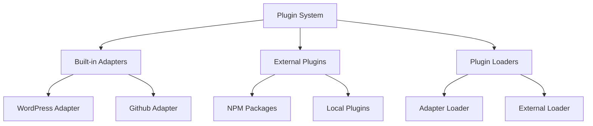
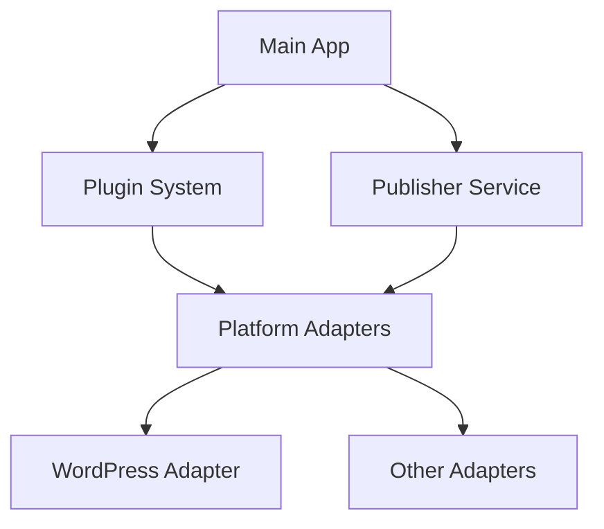

# SiYuan Publisher Development Guide

## Architecture Overview

The SiYuan Publisher is built with a modular architecture that separates concerns and promotes maintainability. Here's a detailed breakdown of the system:

### Core Components

1. **Main App (`packages/main-app`)**
   - Entry point of the application
   - Handles UI rendering and user interactions
   - Manages platform selection and configuration
   - Coordinates between different modules

2. **Core Module (`packages/core`)**
   - Provides fundamental services and types
   - Manages the publishing workflow
   - Defines core interfaces and types
   - Handles platform adapter registration

3. **Plugin System (`packages/plugin-system`)**
   - Manages plugin lifecycle
   - Handles dynamic loading of platform adapters
   - Provides plugin dependency resolution
   - Maintains plugin registry
   - Supports both built-in adapters and external plugins

4. **Platform Adapters (`packages/platform-adapters`)**
   - Implements platform-specific logic
   - Loaded dynamically as plugins
   - Provides unified interface for different platforms
   - Handles platform-specific configurations

### Plugin System Architecture



### Plugin Types

1. **Built-in Platform Adapters**
   - Pre-installed with the application
   - Implemented in `packages/platform-adapters`
   - Automatically registered on startup
   - Examples: WordPress, GitHub adapters

2. **External Plugins**
   - Dynamically loaded at runtime
   - Can be installed from NPM or local files
   - Must implement required interfaces
   - Can extend functionality or add new platforms

### Plugin Loading Process

1. **Built-in Adapters**
   ```
   Application Start
   ├── Plugin System Initialization
   │   └── Register Built-in Adapters
   │       ├── WordPress Adapter
   │       └── GitHub Adapter
   └── Initialize Adapters
       └── Update UI State
   ```

2. **External Plugins**
   ```
   Plugin Loading Request
   ├── Validate Plugin Type
   ├── Load Plugin Configuration
   ├── Initialize Plugin
   │   ├── Check Dependencies
   │   └── Register with System
   └── Update UI State
   ```

### Plugin Development Guidelines

1. **Creating Built-in Adapters**
   - Implement `PlatformAdapter` interface
   - Add to `packages/platform-adapters`
   - Register in plugin system
   - Include comprehensive tests

2. **Developing External Plugins**
   - Follow plugin interface requirements
   - Implement required lifecycle methods
   - Handle configuration properly
   - Include error handling
   - Provide documentation

3. **Plugin Configuration**
   - Use type-safe configuration
   - Validate configuration on load
   - Provide default values
   - Document all options

4. **Error Handling**
   - Use `PublisherError` for errors
   - Provide detailed error messages
   - Implement proper cleanup
   - Handle initialization failures

### Testing Strategy

1. **Unit Tests**
   - Test individual components
   - Mock dependencies
   - Verify interface compliance

2. **Integration Tests**
   - Test module interactions
   - Verify plugin loading
   - Check platform adapters

3. **End-to-End Tests**
   - Test complete publishing flow
   - Verify platform integration
   - Check error handling

### Error Handling

1. **UI Layer**
   - Display user-friendly messages
   - Provide retry options
   - Log errors for debugging

2. **Service Layer**
   - Handle platform-specific errors
   - Provide detailed error information
   - Implement retry mechanisms

3. **Plugin System**
   - Handle loading failures
   - Manage dependency conflicts
   - Provide fallback options

### Best Practices

1. **Plugin Development**
   - Keep plugins focused and modular
   - Follow single responsibility principle
   - Implement proper error handling
   - Provide clear documentation

2. **Configuration Management**
   - Use type-safe configuration
   - Validate all inputs
   - Provide sensible defaults
   - Document configuration options

3. **Error Handling**
   - Use appropriate error types
   - Provide meaningful error messages
   - Implement proper cleanup
   - Log errors for debugging

4. **Testing**
   - Write comprehensive tests
   - Test error scenarios
   - Verify plugin lifecycle
   - Check integration points

### Call Chain



### Detailed Flow

1. **Initialization**
   ```
   Main App
   ├── Loads Plugin System
   │   └── Discovers available platform adapters
   └── Initializes Publisher Service
       └── Registers platform adapters
   ```

2. **Platform Selection**
   ```
   Main App
   ├── User selects platform
   ├── Loads platform configuration component
   └── Displays platform-specific settings
   ```

3. **Connection Testing**
   ```
   Main App
   ├── User configures platform settings
   ├── Triggers connection test
   ├── Publisher Service
   │   └── Gets platform adapter
   └── Platform Adapter
       └── Tests connection with platform
   ```

4. **Publishing Process**
   ```
   Main App
   ├── User prepares post content
   ├── Triggers publish action
   ├── Publisher Service
   │   ├── Validates post data
   │   └── Gets platform adapter
   └── Platform Adapter
       ├── Transforms post data
       └── Publishes to platform
   ```

### Key Interfaces

1. **Publisher Interface**
   ```typescript
   interface Publisher {
     publish(post: Post): Promise<PublishResult>;
   }
   ```

2. **Platform Adapter Interface**
   ```typescript
   interface PlatformAdapter {
     testConnection(config: PlatformConfig): Promise<boolean>;
     publish(post: Post): Promise<PublishResult>;
   }
   ```

3. **Plugin Interface**
   ```typescript
   interface Plugin {
     id: string;
     name: string;
     version: string;
     initialize(): Promise<void>;
   }
   ```

### Development Guidelines

1. **Adding New Platforms**
   - Create new adapter in `platform-adapters`
   - Implement required interfaces
   - Register adapter in plugin system
   - Create platform configuration component

2. **Modifying Core Logic**
   - Update interfaces in `core` module
   - Maintain backward compatibility
   - Update affected adapters
   - Test all platform integrations

3. **Extending UI**
   - Follow existing component patterns
   - Use provided composables
   - Maintain consistent styling
   - Add appropriate error handling

### Testing Strategy

1. **Unit Tests**
   - Test individual components
   - Mock dependencies
   - Verify interface compliance

2. **Integration Tests**
   - Test module interactions
   - Verify plugin loading
   - Check platform adapters

3. **End-to-End Tests**
   - Test complete publishing flow
   - Verify platform integration
   - Check error handling

### Error Handling

1. **UI Layer**
   - Display user-friendly messages
   - Provide retry options
   - Log errors for debugging

2. **Service Layer**
   - Handle platform-specific errors
   - Provide detailed error information
   - Implement retry mechanisms

3. **Plugin System**
   - Handle loading failures
   - Manage dependency conflicts
   - Provide fallback options 