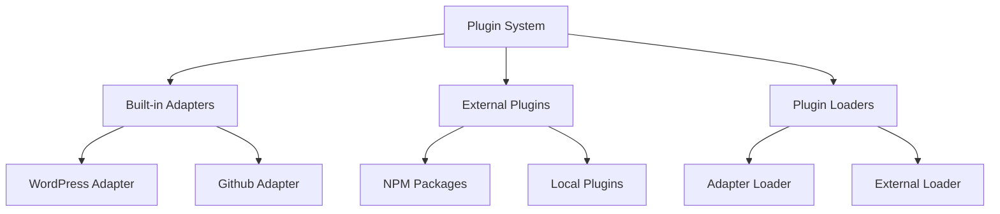
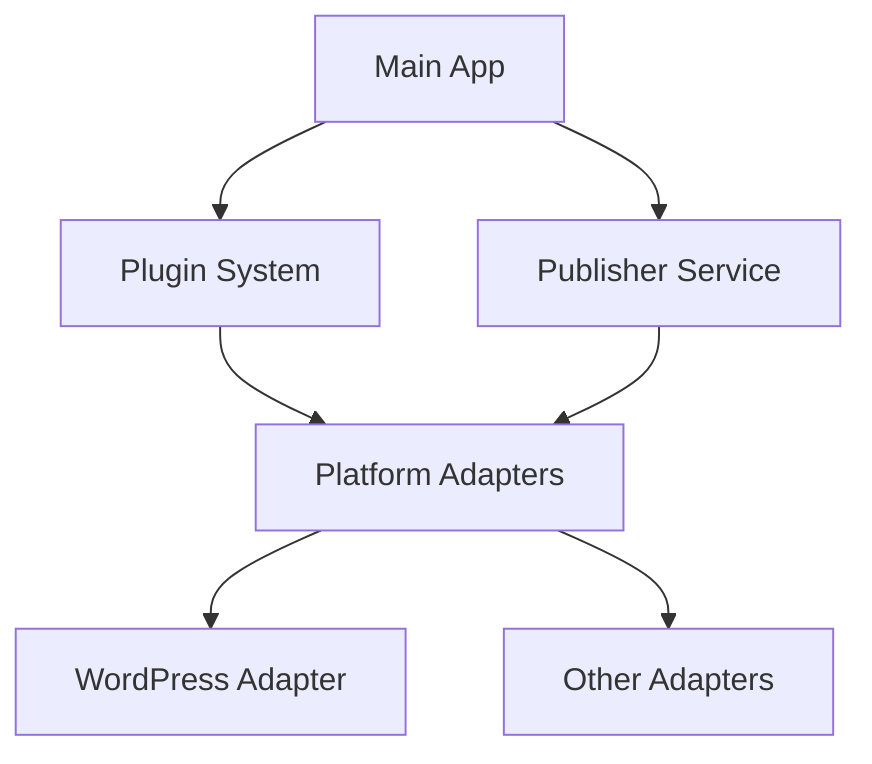
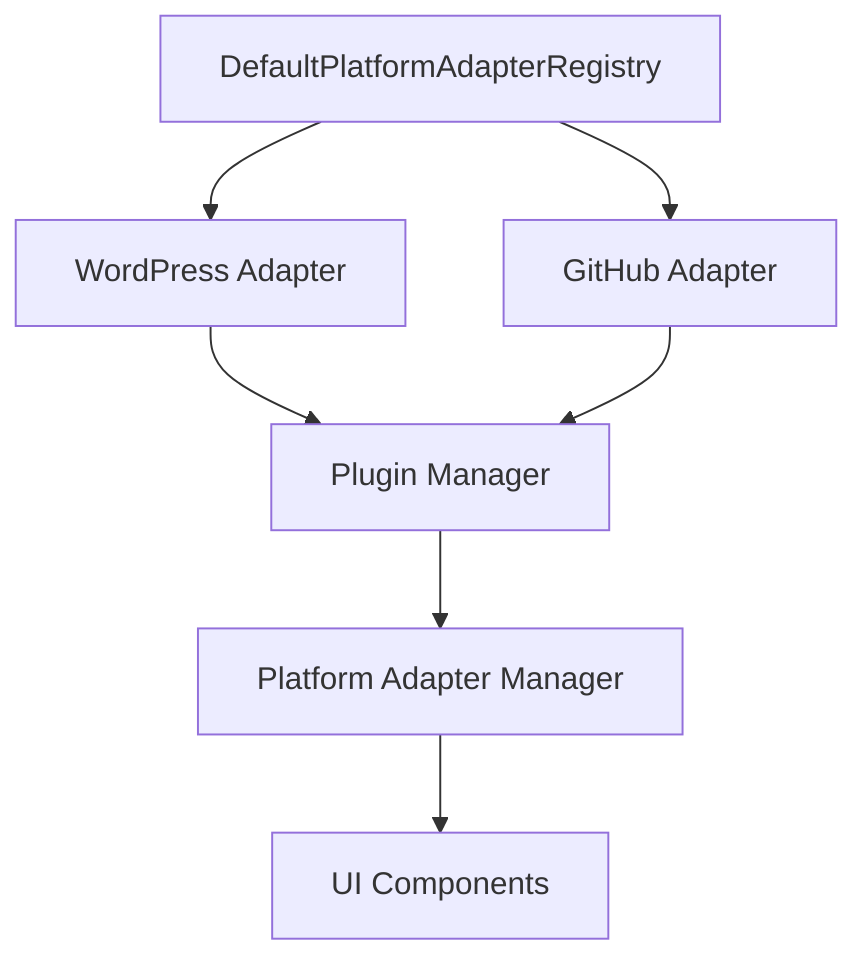
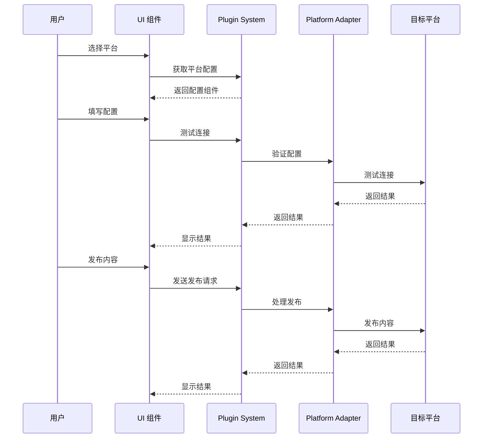
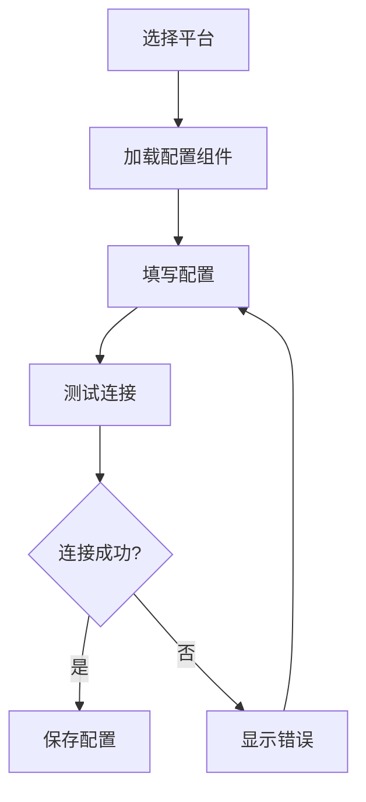
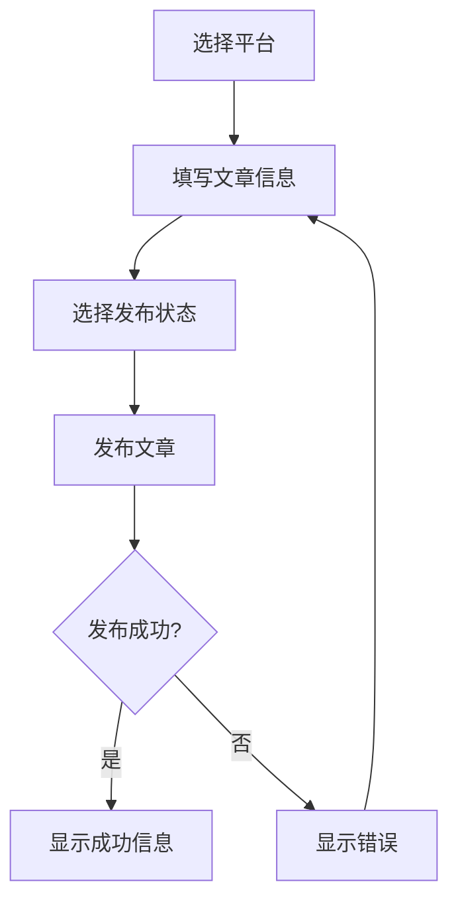
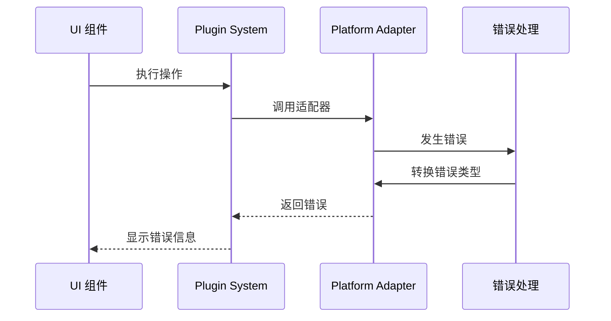

# SiYuan Publisher Development Guide

## Architecture Overview

SiYuan Publisher adopts a modular architecture and centralizes all shared type definitions in a dedicated `common` package. This design effectively avoids circular dependencies and improves maintainability.

### Directory Structure

```
packages/
  common/                # Shared type definitions (type/interface/enum only)
  core/                  # Core business logic
  plugin-system/         # Plugin management and loading
  platform-adapters/     # Third-party platform adapters
  main-app/              # Main application
  ui/                    # Frontend UI components
```

### Type Dependency & Call Chain

- **common**
  - Only defines types, does not depend on any business package.
  - All other packages depend on common for types.

- **core/plugin-system/platform-adapters/main-app/ui**
  - Only import types from `@siyuan-publisher/common`.
  - No cross-package type imports.
  - Business logic dependencies are flexible, but type dependencies always point to common.

#### Dependency Tree

```
common
  ↑   ↑   ↑   ↑   ↑
  |   |   |   |   |
core plugin-system platform-adapters main-app ui
```

- All shared types must be imported from common.
- No direct type imports between business packages.

### Coding Guidelines

- Define and maintain all shared types in the `common` package.
- Business packages only implement their own logic and import types from `@siyuan-publisher/common`.
- Do not import types directly between business packages to prevent circular dependencies and type redundancy.

### Example Call Chain

- `main-app` loads plugins via `plugin-system`, all types (e.g., Plugin, PlatformAdapter) are imported from `common`.
- `platform-adapters` implement adapters, all interfaces and config types are imported from `common`.
- `ui` components import types (e.g., Post, PublishResult) only from `common`.

### Summary

- The unified type center (`common`) makes the architecture clearer and easier to maintain.
- The dependency tree and call chain are easier to track and manage, greatly reducing the cost of future refactoring and extension.

### Core Components

1. **Main App (`packages/main-app`)**
   - Entry point of the application
   - Handles UI rendering and user interactions
   - Manages platform selection and configuration
   - Coordinates between different modules

2. **Core Module (`packages/core`)**
   - Provides fundamental services and types
   - Manages the publishing workflow
   - Defines core interfaces and types
   - Handles platform adapter registration

3. **Plugin System (`packages/plugin-system`)**
   - Manages plugin lifecycle
   - Handles dynamic loading of platform adapters
   - Provides plugin dependency resolution
   - Maintains plugin registry
   - Supports both built-in adapters and external plugins

4. **Platform Adapters (`packages/platform-adapters`)**
   - Implements platform-specific logic
   - Loaded dynamically as plugins
   - Provides unified interface for different platforms
   - Handles platform-specific configurations

### Plugin System Architecture



### Plugin Types

1. **Built-in Platform Adapters**
   - Pre-installed with the application
   - Implemented in `packages/platform-adapters`
   - Automatically registered on startup
   - Examples: WordPress, GitHub adapters

2. **External Plugins**
   - Dynamically loaded at runtime
   - Can be installed from NPM or local files
   - Must implement required interfaces
   - Can extend functionality or add new platforms

### Plugin Loading Process

1. **Built-in Adapters**
   ```
   Application Start
   ├── Plugin System Initialization
   │   └── Register Built-in Adapters
   │       ├── WordPress Adapter
   │       └── GitHub Adapter
   └── Initialize Adapters
       └── Update UI State
   ```

2. **External Plugins**
   ```
   Plugin Loading Request
   ├── Validate Plugin Type
   ├── Load Plugin Configuration
   ├── Initialize Plugin
   │   ├── Check Dependencies
   │   └── Register with System
   └── Update UI State
   ```

### Plugin Development Guidelines

1. **Creating Built-in Adapters**
   - Implement `PlatformAdapter` interface
   - Add to `packages/platform-adapters`
   - Register in plugin system
   - Include comprehensive tests

2. **Developing External Plugins**
   - Follow plugin interface requirements
   - Implement required lifecycle methods
   - Handle configuration properly
   - Include error handling
   - Provide documentation

3. **Plugin Configuration**
   - Use type-safe configuration
   - Validate configuration on load
   - Provide default values
   - Document all options

4. **Error Handling**
   - Use `PublisherError` for errors
   - Provide detailed error messages
   - Implement proper cleanup
   - Handle initialization failures

### Testing Strategy

1. **Unit Tests**
   - Test individual components
   - Mock dependencies
   - Verify interface compliance

2. **Integration Tests**
   - Test module interactions
   - Verify plugin loading
   - Check platform adapters

3. **End-to-End Tests**
   - Test complete publishing flow
   - Verify platform integration
   - Check error handling

### Error Handling

1. **UI Layer**
   - Display user-friendly messages
   - Provide retry options
   - Log errors for debugging

2. **Service Layer**
   - Handle platform-specific errors
   - Provide detailed error information
   - Implement retry mechanisms

3. **Plugin System**
   - Handle loading failures
   - Manage dependency conflicts
   - Provide fallback options

### Best Practices

1. **Plugin Development**
   - Keep plugins focused and modular
   - Follow single responsibility principle
   - Implement proper error handling
   - Provide clear documentation

2. **Configuration Management**
   - Use type-safe configuration
   - Validate all inputs
   - Provide sensible defaults
   - Document configuration options

3. **Error Handling**
   - Use appropriate error types
   - Provide meaningful error messages
   - Implement proper cleanup
   - Log errors for debugging

4. **Testing**
   - Write comprehensive tests
   - Test error scenarios
   - Verify plugin lifecycle
   - Check integration points

### Call Chain



### Detailed Flow

1. **Initialization**
   ```
   Main App
   ├── Loads Plugin System
   │   └── Discovers available platform adapters
   └── Initializes Publisher Service
       └── Registers platform adapters
   ```

2. **Platform Selection**
   ```
   Main App
   ├── User selects platform
   └── Loads corresponding adapter
   ```

3. **Publishing Process**
   ```
   Main App
   ├── Prepares content
   ├── Calls adapter's publish method
   └── Handles result
   ```

### Key Interfaces

1. **Publisher Interface**
   ```typescript
   interface Publisher {
     publish(post: Post): Promise<PublishResult>;
   }
   ```

2. **Platform Adapter Interface**
   ```typescript
   interface PlatformAdapter {
     testConnection(config: PlatformConfig): Promise<boolean>;
     publish(post: Post): Promise<PublishResult>;
   }
   ```

3. **Plugin Interface**
   ```typescript
   interface Plugin {
     id: string;
     name: string;
     version: string;
     initialize(): Promise<void>;
   }
   ```

### Development Guidelines

1. **Adding New Platforms**
   - Create new adapter in `platform-adapters`
   - Implement required interfaces
   - Register adapter in plugin system
   - Create platform configuration component

2. **Modifying Core Logic**
   - Update interfaces in `core` module
   - Maintain backward compatibility
   - Update affected adapters
   - Test all platform integrations

3. **Extending UI**
   - Follow existing component patterns
   - Use provided composables
   - Maintain consistent styling
   - Add appropriate error handling

### Testing Strategy

1. **Unit Tests**
   - Test individual components
   - Mock dependencies
   - Verify interface compliance

2. **Integration Tests**
   - Test module interactions
   - Verify plugin loading
   - Check platform adapters

3. **End-to-End Tests**
   - Test complete publishing flow
   - Verify platform integration
   - Check error handling

### Error Handling

1. **UI Layer**
   - Display user-friendly messages
   - Provide retry options
   - Log errors for debugging

2. **Service Layer**
   - Handle platform-specific errors
   - Provide detailed error information
   - Implement retry mechanisms

3. **Plugin System**
   - Handle loading failures
   - Manage dependency conflicts
   - Provide fallback options

## 核心组件和调用链

### 1. 插件系统初始化流程

```mermaid
sequenceDiagram
    participant App as Main App
    participant PS as Plugin System
    participant PAR as Platform Adapter Registry
    participant PM as Plugin Manager
    participant PAM as Platform Adapter Manager

    App->>PS: 初始化插件系统
    PS->>PAR: 获取内置适配器
    PAR->>PAR: 注册内置适配器
    PAR-->>PS: 返回适配器列表
    PS->>PM: 注册插件
    PS->>PAM: 更新适配器列表
    PAM-->>App: 返回可用平台列表
```

### 2. 平台适配器注册机制



### 3. 发布流程



## 详细组件说明

### 1. 插件系统 (Plugin System)

插件系统是整个应用的核心，负责管理所有平台适配器和插件。

#### 主要组件：

- **PluginManager**: 管理插件的生命周期
  ```typescript
  class PluginManager {
    registerPlugin(plugin: Plugin): Promise<void>
    unloadPlugin(id: string): Promise<void>
    getPlugin(id: string): Plugin | undefined
    getAllPlugins(): Plugin[]
  }
  ```

- **PlatformAdapterManager**: 管理平台适配器
  ```typescript
  class PlatformAdapterManager {
    getAdapter(id: string): PlatformAdapter | undefined
    getAllAdapters(): PlatformAdapter[]
    connectAdapter(id: string, config: any): Promise<void>
    disconnectAdapter(id: string): Promise<void>
  }
  ```

### 2. 平台适配器 (Platform Adapters)

平台适配器实现了与特定平台的集成。

#### 内置适配器：

- **WordPress Adapter**
  ```typescript
  class WordPressAdapter implements PlatformAdapter {
    id = "wordpress"
    type = "wordpress"
    async connect(config: WordPressConfig): Promise<void>
    async publish(post: Post, options: PublishOptions): Promise<PublishResult>
  }
  ```

- **GitHub Adapter**
  ```typescript
  class GitHubAdapter implements PlatformAdapter {
    id = "github"
    type = "github"
    async connect(config: GitHubConfig): Promise<void>
    async publish(post: Post, options: PublishOptions): Promise<PublishResult>
  }
  ```

### 3. 主应用 (Main App)

主应用使用 Vue 3 构建，提供了用户界面和交互逻辑。

#### 主要组件：

- **Publish.vue**: 发布页面
  ```vue
  <template>
    <div class="publish">
      <!-- 平台选择 -->
      <select v-model="selectedPlatform">
        <option v-for="platform in availablePlatforms" :key="platform.id" :value="platform.id">
          {{ platform.name }}
        </option>
      </select>

      <!-- 平台配置 -->
      <component 
        :is="platformConfigComponent" 
        v-model:config="platformConfig" 
        @test="testConnection"
      />
    </div>
  </template>
  ```

## 配置流程

### 1. 平台配置



### 2. 发布配置



## 错误处理

### 错误类型

```typescript
enum ErrorType {
  PLATFORM_CONNECTION_FAILED = "PLATFORM_CONNECTION_FAILED",
  PLATFORM_CONFIG_INVALID = "PLATFORM_CONFIG_INVALID",
  AUTHENTICATION_FAILED = "AUTHENTICATION_FAILED",
  INVALID_CONFIG = "INVALID_CONFIG",
  PUBLISH_FAILED = "PUBLISH_FAILED",
  UNKNOWN_ERROR = "UNKNOWN_ERROR"
}
```

### 错误处理流程



## 开发指南

### 1. 添加新平台适配器

1. 在 `platform-adapters` 包中创建新的适配器类
2. 实现 `PlatformAdapter` 接口
3. 在 `DefaultPlatformAdapterRegistry` 中注册适配器
4. 创建对应的配置组件

### 2. 修改现有适配器

1. 在 `platform-adapters` 包中找到目标适配器
2. 修改适配器实现
3. 更新配置组件
4. 测试适配器功能

### 3. 调试技巧

1. 使用 Vue DevTools 调试 UI 组件
2. 使用浏览器控制台查看网络请求
3. 检查插件系统日志
4. 验证平台适配器配置

## 最佳实践

1. **类型安全**
   - 始终使用 TypeScript 类型
   - 避免使用 `any` 类型
   - 使用接口定义数据结构

2. **错误处理**
   - 使用统一的错误类型
   - 提供详细的错误信息
   - 实现适当的错误恢复机制

3. **配置管理**
   - 验证所有配置输入
   - 提供默认值
   - 保存用户配置

4. **测试**
   - 编写单元测试
   - 测试错误场景
   - 验证平台集成

## 常见问题

1. **平台适配器未显示**
   - 检查适配器注册
   - 验证配置组件
   - 查看控制台错误

2. **配置保存失败**
   - 检查配置验证
   - 验证存储机制
   - 查看错误日志

3. **发布失败**
   - 检查平台连接
   - 验证发布参数
   - 查看平台错误信息 