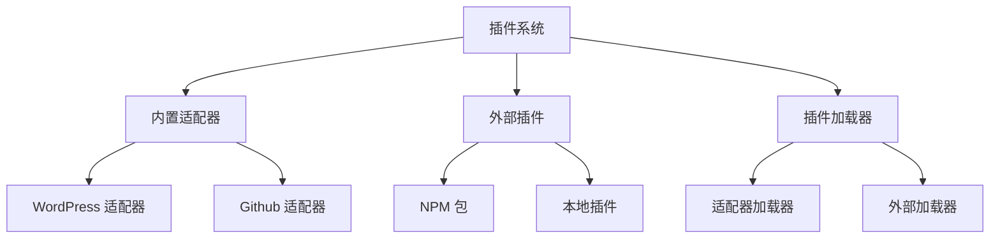

# SiYuan Publisher 开发指南

## 架构概述

SiYuan Publisher 采用模块化架构设计，实现了关注点分离并提高了可维护性。以下是系统的详细说明：

### 核心组件

1. **主应用 (`packages/main-app`)**
   - 应用程序入口点
   - 处理 UI 渲染和用户交互
   - 管理平台选择和配置
   - 协调不同模块之间的交互

2. **核心模块 (`packages/core`)**
   - 提供基础服务和类型定义
   - 管理发布工作流程
   - 定义核心接口和类型
   - 处理平台适配器注册

3. **插件系统 (`packages/plugin-system`)**
   - 管理插件生命周期
   - 处理平台适配器的动态加载
   - 提供插件依赖解析
   - 维护插件注册表
   - 同时支持内置适配器和外部插件

4. **平台适配器 (`packages/platform-adapters`)**
   - 实现平台特定的逻辑
   - 作为插件动态加载
   - 为不同平台提供统一接口
   - 处理平台特定的配置

### 插件系统架构



### 插件类型

1. **内置平台适配器**
   - 随应用程序预装
   - 在 `packages/platform-adapters` 中实现
   - 启动时自动注册
   - 示例：WordPress、GitHub 适配器

2. **外部插件**
   - 运行时动态加载
   - 可以从 NPM 或本地文件安装
   - 必须实现所需接口
   - 可以扩展功能或添加新平台

### 插件加载流程

1. **内置适配器**
   ```
   应用启动
   ├── 插件系统初始化
   │   └── 注册内置适配器
   │       ├── WordPress 适配器
   │       └── GitHub 适配器
   └── 初始化适配器
       └── 更新 UI 状态
   ```

2. **外部插件**
   ```
   插件加载请求
   ├── 验证插件类型
   ├── 加载插件配置
   ├── 初始化插件
   │   ├── 检查依赖
   │   └── 注册到系统
   └── 更新 UI 状态
   ```

### 插件开发指南

1. **创建内置适配器**
   - 实现 `PlatformAdapter` 接口
   - 添加到 `packages/platform-adapters`
   - 在插件系统中注册
   - 包含完整的测试

2. **开发外部插件**
   - 遵循插件接口要求
   - 实现必要的生命周期方法
   - 正确处理配置
   - 包含错误处理
   - 提供文档

3. **插件配置**
   - 使用类型安全的配置
   - 加载时验证配置
   - 提供默认值
   - 记录所有选项

4. **错误处理**
   - 使用 `PublisherError` 处理错误
   - 提供详细的错误信息
   - 实现适当的清理
   - 处理初始化失败

### 测试策略

1. **单元测试**
   - 测试独立组件
   - 模拟依赖
   - 验证接口合规性

2. **集成测试**
   - 测试模块交互
   - 验证插件加载
   - 检查平台适配器

3. **端到端测试**
   - 测试完整发布流程
   - 验证平台集成
   - 检查错误处理

### 错误处理

1. **UI 层**
   - 显示用户友好的消息
   - 提供重试选项
   - 记录错误以便调试

2. **服务层**
   - 处理平台特定错误
   - 提供详细的错误信息
   - 实现重试机制

3. **插件系统**
   - 处理加载失败
   - 管理依赖冲突
   - 提供回退选项

### 最佳实践

1. **插件开发**
   - 保持插件专注和模块化
   - 遵循单一职责原则
   - 实现适当的错误处理
   - 提供清晰的文档

2. **配置管理**
   - 使用类型安全的配置
   - 验证所有输入
   - 提供合理的默认值
   - 记录配置选项

3. **错误处理**
   - 使用适当的错误类型
   - 提供有意义的错误消息
   - 实现适当的清理
   - 记录错误以便调试

4. **测试**
   - 编写全面的测试
   - 测试错误场景
   - 验证插件生命周期
   - 检查集成点 