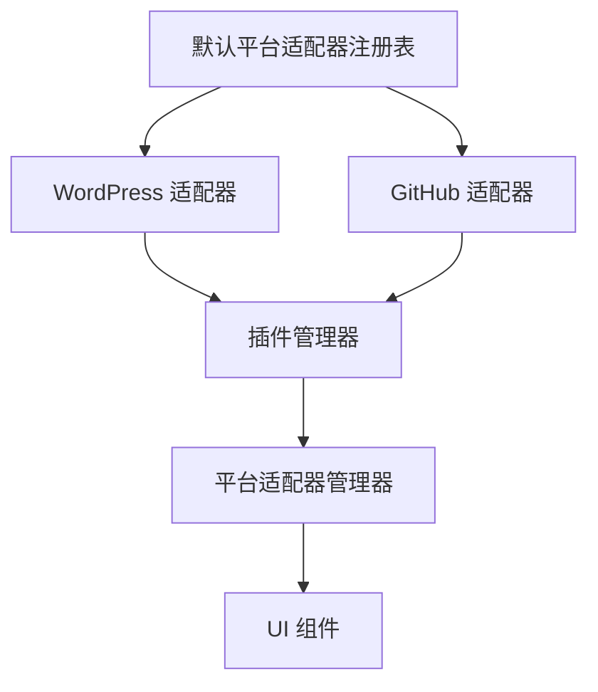
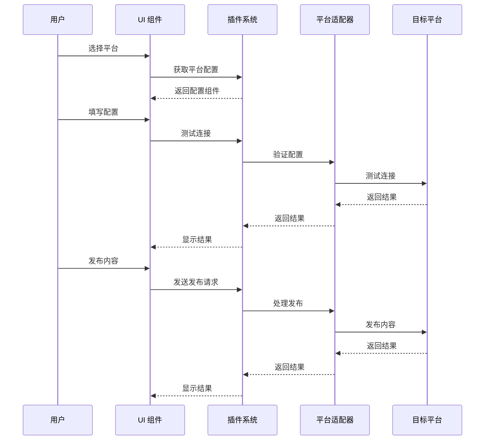
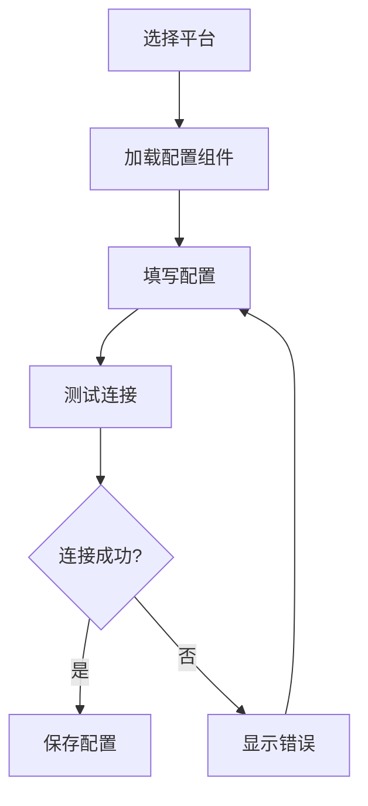
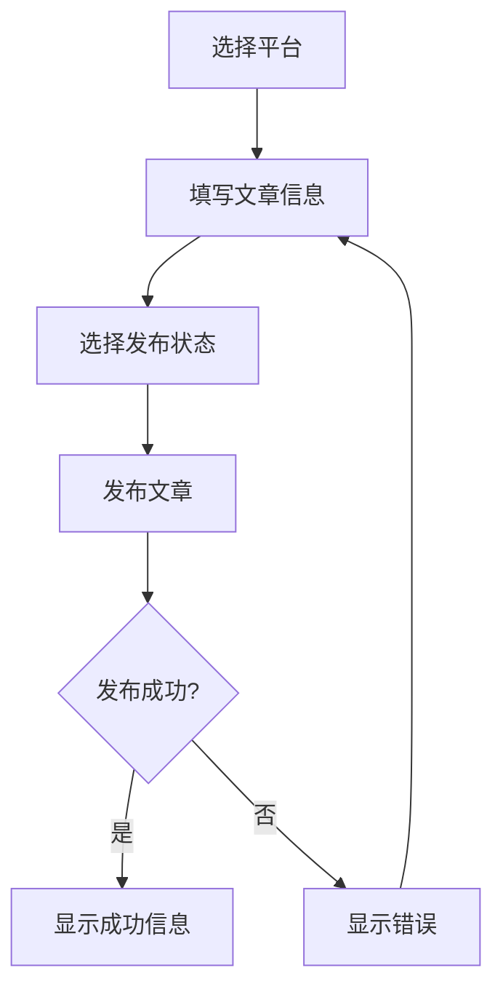
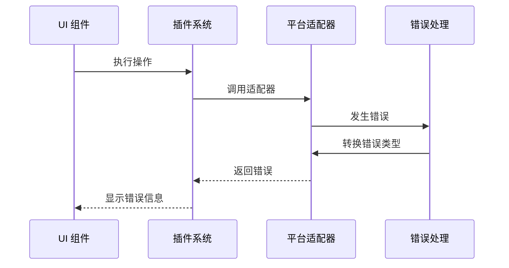

# 思源笔记发布工具开发指南

## 架构概述

思源笔记发布工具采用模块化架构，所有共享类型定义都集中在 `common` 包中。这种设计有效避免了循环依赖，提高了可维护性。

### 目录结构

```
packages/
  common/                # 共享类型定义（仅类型/接口/枚举）
  core/                  # 核心业务逻辑
  plugin-system/         # 插件管理和加载
  platform-adapters/     # 第三方平台适配器
  main-app/              # 主应用
  ui/                    # 前端 UI 组件
```

## 核心组件和调用链

### 1. 插件系统初始化流程

```mermaid
sequenceDiagram
    participant App as 主应用
    participant PS as 插件系统
    participant PAR as 平台适配器注册表
    participant PM as 插件管理器
    participant PAM as 平台适配器管理器

    App->>PS: 初始化插件系统
    PS->>PAR: 获取内置适配器
    PAR->>PAR: 注册内置适配器
    PAR-->>PS: 返回适配器列表
    PS->>PM: 注册插件
    PS->>PAM: 更新适配器列表
    PAM-->>App: 返回可用平台列表
```

### 2. 平台适配器注册机制



### 3. 发布流程



## 详细组件说明

### 1. 插件系统 (Plugin System)

插件系统是整个应用的核心，负责管理所有平台适配器和插件。

#### 主要组件：

- **插件管理器**: 管理插件的生命周期
  ```typescript
  class PluginManager {
    registerPlugin(plugin: Plugin): Promise<void>
    unloadPlugin(id: string): Promise<void>
    getPlugin(id: string): Plugin | undefined
    getAllPlugins(): Plugin[]
  }
  ```

- **平台适配器管理器**: 管理平台适配器
  ```typescript
  class PlatformAdapterManager {
    getAdapter(id: string): PlatformAdapter | undefined
    getAllAdapters(): PlatformAdapter[]
    connectAdapter(id: string, config: any): Promise<void>
    disconnectAdapter(id: string): Promise<void>
  }
  ```

### 2. 平台适配器 (Platform Adapters)

平台适配器实现了与特定平台的集成。

#### 内置适配器：

- **WordPress 适配器**
  ```typescript
  class WordPressAdapter implements PlatformAdapter {
    id = "wordpress"
    type = "wordpress"
    async connect(config: WordPressConfig): Promise<void>
    async publish(post: Post, options: PublishOptions): Promise<PublishResult>
  }
  ```

- **GitHub 适配器**
  ```typescript
  class GitHubAdapter implements PlatformAdapter {
    id = "github"
    type = "github"
    async connect(config: GitHubConfig): Promise<void>
    async publish(post: Post, options: PublishOptions): Promise<PublishResult>
  }
  ```

### 3. 主应用 (Main App)

主应用使用 Vue 3 构建，提供了用户界面和交互逻辑。

#### 主要组件：

- **Publish.vue**: 发布页面
  ```vue
  <template>
    <div class="publish">
      <!-- 平台选择 -->
      <select v-model="selectedPlatform">
        <option v-for="platform in availablePlatforms" :key="platform.id" :value="platform.id">
          {{ platform.name }}
        </option>
      </select>

      <!-- 平台配置 -->
      <component 
        :is="platformConfigComponent" 
        v-model:config="platformConfig" 
        @test="testConnection"
      />
    </div>
  </template>
  ```

## 配置流程

### 1. 平台配置



### 2. 发布配置



## 错误处理

### 错误类型

```typescript
enum ErrorType {
  PLATFORM_CONNECTION_FAILED = "PLATFORM_CONNECTION_FAILED",
  PLATFORM_CONFIG_INVALID = "PLATFORM_CONFIG_INVALID",
  AUTHENTICATION_FAILED = "AUTHENTICATION_FAILED",
  INVALID_CONFIG = "INVALID_CONFIG",
  PUBLISH_FAILED = "PUBLISH_FAILED",
  UNKNOWN_ERROR = "UNKNOWN_ERROR"
}
```

### 错误处理流程



## 开发指南

### 1. 添加新平台适配器

1. 在 `platform-adapters` 包中创建新的适配器类
2. 实现 `PlatformAdapter` 接口
3. 在 `DefaultPlatformAdapterRegistry` 中注册适配器
4. 创建对应的配置组件

### 2. 修改现有适配器

1. 在 `platform-adapters` 包中找到目标适配器
2. 修改适配器实现
3. 更新配置组件
4. 测试适配器功能

### 3. 调试技巧

1. 使用 Vue DevTools 调试 UI 组件
2. 使用浏览器控制台查看网络请求
3. 检查插件系统日志
4. 验证平台适配器配置

## 最佳实践

1. **类型安全**
   - 始终使用 TypeScript 类型
   - 避免使用 `any` 类型
   - 使用接口定义数据结构

2. **错误处理**
   - 使用统一的错误类型
   - 提供详细的错误信息
   - 实现适当的错误恢复机制

3. **配置管理**
   - 验证所有配置输入
   - 提供默认值
   - 保存用户配置

4. **测试**
   - 编写单元测试
   - 测试错误场景
   - 验证平台集成

## 常见问题

1. **平台适配器未显示**
   - 检查适配器注册
   - 验证配置组件
   - 查看控制台错误

2. **配置保存失败**
   - 检查配置验证
   - 验证存储机制
   - 查看错误日志

3. **发布失败**
   - 检查平台连接
   - 验证发布参数
   - 查看平台错误信息 