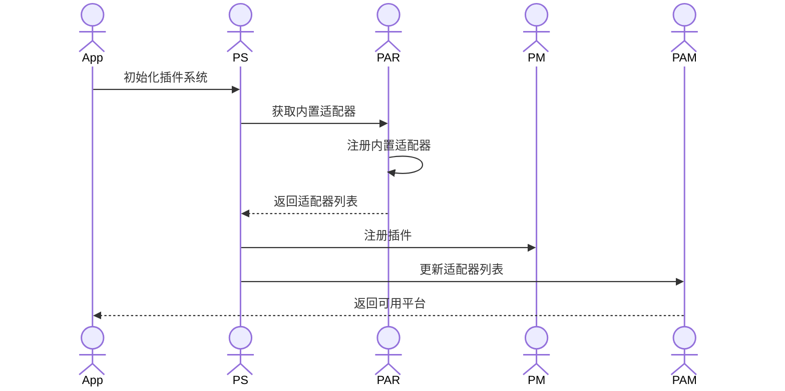
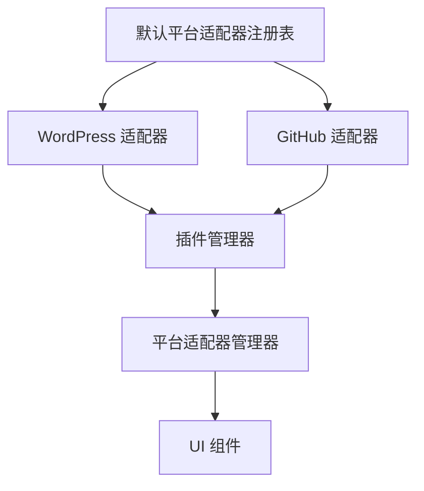
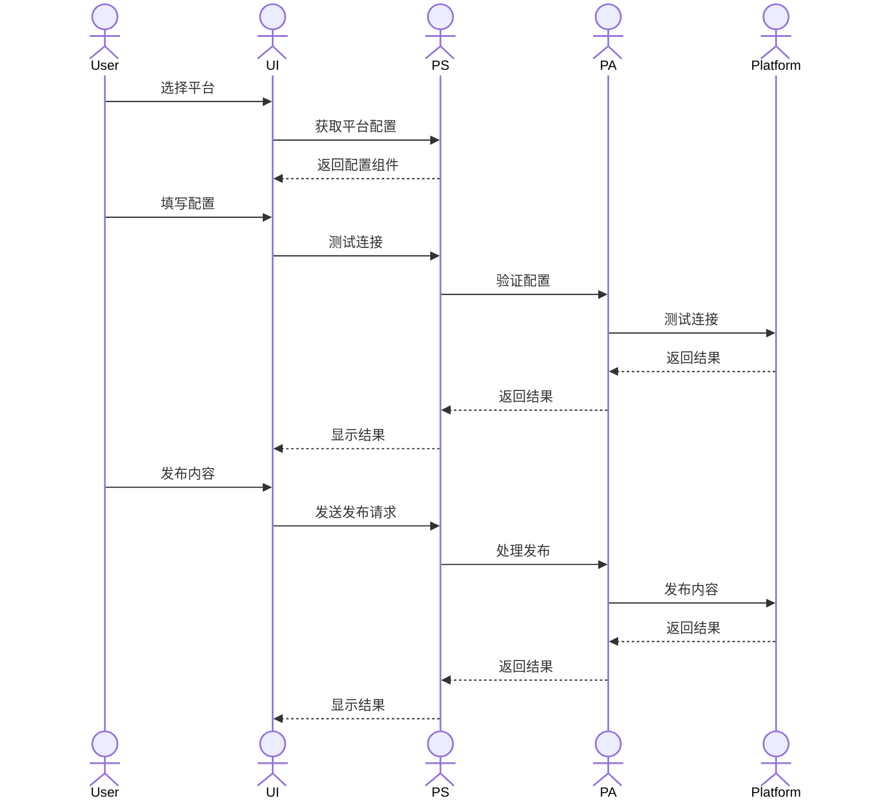
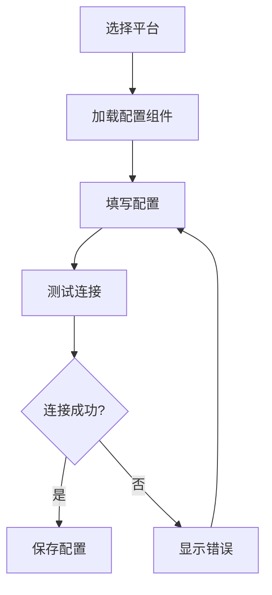
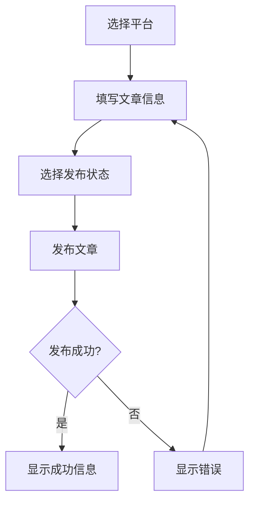
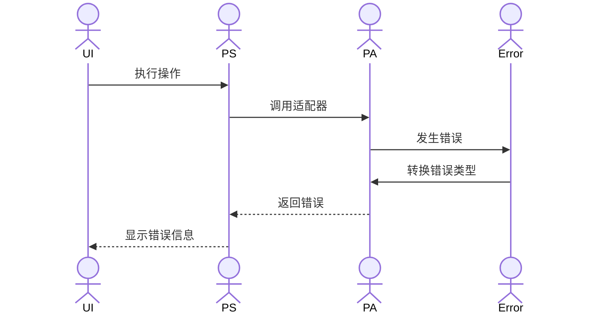

# SiYuan Publisher 开发指南

## 架构概述

SiYuan Publisher 采用模块化架构，并将所有共享类型定义集中在专门的 `common` 包中。这种设计有效避免了循环依赖，提高了可维护性。

### 目录结构

```
packages/
  common/                # 共享类型定义（仅类型/接口/枚举）
  core/                  # 核心业务逻辑
  plugin-system/         # 插件管理和加载
  platform-adapters/     # 第三方平台适配器
  main-app/              # 主应用
  ui/                    # 前端 UI 组件
```

## 核心组件和调用链

### 1. 插件系统初始化流程



### 2. 平台适配器注册机制



### 3. 发布流程



## 详细组件说明

### 1. 插件系统

插件系统是应用的核心，负责管理所有平台适配器和插件。

#### 主要组件：

- **插件管理器**：管理插件生命周期
  ```typescript
  class PluginManager {
    registerPlugin(plugin: Plugin): Promise<void>
    unloadPlugin(id: string): Promise<void>
    getPlugin(id: string): Plugin | undefined
    getAllPlugins(): Plugin[]
  }
  ```

- **平台适配器管理器**：管理平台适配器
  ```typescript
  class PlatformAdapterManager {
    getAdapter(id: string): PlatformAdapter | undefined
    getAllAdapters(): PlatformAdapter[]
    connectAdapter(id: string, config: any): Promise<void>
    disconnectAdapter(id: string): Promise<void>
  }
  ```

### 2. 平台适配器

平台适配器实现与特定平台的集成。

#### 内置适配器：

- **WordPress 适配器**
  ```typescript
  class WordPressAdapter implements PlatformAdapter {
    id = "wordpress"
    type = "wordpress"
    async connect(config: WordPressConfig): Promise<void>
    async publish(post: Post, options: PublishOptions): Promise<PublishResult>
  }
  ```

- **GitHub 适配器**
  ```typescript
  class GitHubAdapter implements PlatformAdapter {
    id = "github"
    type = "github"
    async connect(config: GitHubConfig): Promise<void>
    async publish(post: Post, options: PublishOptions): Promise<PublishResult>
  }
  ```

#### 外部适配器：

外部平台适配器可以通过插件系统动态加载，支持从 NPM 安装或本地加载。详细的开发指南和加载机制请参考[外部插件开发](#外部插件开发)部分。

主要特点：
- 支持动态加载和卸载
- 可以独立开发和发布
- 使用与内置适配器相同的接口
- 可以扩展支持新平台

### 3. 主应用

主应用使用 Vue 3 构建，提供用户界面和交互逻辑。

#### 主要组件：

- **Publish.vue**：发布页面
  ```vue
  <template>
    <div class="publish">
      <!-- 平台选择 -->
      <select v-model="selectedPlatform">
        <option v-for="platform in availablePlatforms" :key="platform.id" :value="platform.id">
          {{ platform.name }}
        </option>
      </select>

      <!-- 平台配置 -->
      <component 
        :is="platformConfigComponent" 
        v-model:config="platformConfig" 
        @test="testConnection"
      />
    </div>
  </template>
  ```

## 配置流程

### 1. 平台配置



### 2. 发布配置



## 错误处理

### 错误类型

```typescript
enum ErrorType {
  PLATFORM_CONNECTION_FAILED = "PLATFORM_CONNECTION_FAILED",
  PLATFORM_CONFIG_INVALID = "PLATFORM_CONFIG_INVALID",
  AUTHENTICATION_FAILED = "AUTHENTICATION_FAILED",
  INVALID_CONFIG = "INVALID_CONFIG",
  PUBLISH_FAILED = "PUBLISH_FAILED",
  UNKNOWN_ERROR = "UNKNOWN_ERROR"
}
```

### 错误处理流程



## 开发指南

### 1. 添加新平台适配器

1. 在 `platform-adapters` 包中创建新适配器
2. 实现 `PlatformAdapter` 接口
3. 在 `DefaultPlatformAdapterRegistry` 中注册适配器
4. 创建对应的配置组件

### 2. 修改现有适配器

1. 在 `platform-adapters` 包中找到目标适配器
2. 修改适配器实现
3. 更新配置组件
4. 测试适配器功能

### 3. 外部插件加载

1. **插件目录结构**
   ```
   plugins/
   ├── my-platform-plugin/
   │   ├── package.json
   │   ├── src/
   │   │   ├── index.ts
   │   │   ├── adapter.ts
   │   │   └── config.vue
   │   └── dist/
   └── other-plugin/
   ```

2. **插件加载流程**
   ```typescript
   class ExternalPluginLoader {
     async loadPlugin(path: string): Promise<ExternalPlugin> {
       // 1. 加载插件配置
       const manifest = await this.loadManifest(path);
       
       // 2. 验证插件类型
       if (manifest.type !== "platform-adapter") {
         throw new Error("不支持的插件类型");
       }
       
       // 3. 加载插件代码
       const plugin = await import(manifest.entry);
       
       // 4. 初始化插件
       await plugin.initialize();
       
       return plugin;
     }
   }
   ```

3. **插件配置示例**
   ```json
   {
     "name": "my-platform-plugin",
     "version": "1.0.0",
     "main": "dist/index.js",
     "siyuan-publisher": {
       "type": "platform-adapter",
       "platform": "my-platform",
       "entry": "./dist/index.js",
       "dependencies": {
         "@siyuan-publisher/common": "^1.0.0"
       }
     }
   }
   ```

4. **插件接口定义**
   ```typescript
   interface ExternalPlugin {
     id: string;
     name: string;
     version: string;
     type: "platform-adapter";
     platform: string;
     adapter: PlatformAdapter;
     configComponent?: Component;
     initialize(): Promise<void>;
     unload(): Promise<void>;
   }
   ```

5. **插件加载机制**
   - 应用启动时扫描插件目录
   - 验证插件配置和依赖
   - 动态加载插件代码
   - 初始化插件并注册到系统
   - 更新 UI 显示可用插件

6. **插件开发注意事项**
   - 确保正确的插件配置
   - 实现必需的接口方法
   - 处理依赖关系
   - 提供错误处理
   - 支持动态加载和卸载

7. **调试技巧**
   - 使用 Vue DevTools 调试 UI 组件
   - 使用浏览器控制台检查网络请求
   - 检查插件系统日志
   - 验证平台适配器配置

## 最佳实践

1. **类型安全**
   - 始终使用 TypeScript 类型
   - 避免使用 `any` 类型
   - 使用接口定义数据结构

2. **错误处理**
   - 使用统一的错误类型
   - 提供详细的错误信息
   - 实现适当的错误恢复机制

3. **配置管理**
   - 验证所有配置输入
   - 提供默认值
   - 保存用户配置

4. **测试**
   - 编写单元测试
   - 测试错误场景
   - 验证平台集成

## UI 开发规范

### 1. 样式系统

#### 目录结构
```
src/
├── styles/
│   ├── base/              # 基础样式
│   │   ├── variables.styl # 变量定义
│   │   ├── mixins.styl    # 混入函数
│   │   └── reset.styl     # 样式重置
│   ├── components/        # 组件样式
│   │   ├── button.styl
│   │   └── ...
│   └── global.styl        # 全局样式
```

#### 样式规则
1. **顶层容器**
   - 所有组件必须使用 `#publisherApp` 作为顶层容器
   - 禁止直接使用 CSS 选择器

2. **命名规范**
   - 组件类名使用 `pt-` 前缀
   - 遵循 BEM 命名规范
   - 示例：`pt-btn`、`pt-btn--primary`、`pt-btn__icon`

3. **样式实现**
   - 使用 Stylus 简易语法
   - 禁止使用其他 CSS 预处理器
   - 禁止使用内联样式
   - 禁止使用第三方 UI 组件库

4. **变量使用**
   - 所有颜色、尺寸、间距等必须使用变量
   - 变量定义在 `variables.styl` 中
   - 禁止使用硬编码值

5. **组件开发**
   - 严格遵循 Ant Design 设计规范
   - 组件样式必须模块化
   - 组件样式必须可配置
   - 组件样式必须支持主题定制

### 2. 组件开发

#### 基本规则
1. **组件结构**
   ```vue
   <template>
     <div id="publisherApp">
       <div class="pt-component">
         <!-- 组件内容 -->
       </div>
     </div>
   </template>
   ```

2. **样式导入**
   ```vue
   <style lang="stylus">
   @import '../styles/components/component.styl'
   </style>
   ```

3. **类型定义**
   ```typescript
   interface ComponentProps {
     // 组件属性定义
   }
   ```

#### 组件类型
1. **基础组件**
   - Button（按钮）
   - Input（输入框）
   - Select（选择器）
   - Switch（开关）
   - Checkbox（复选框）
   - Radio（单选框）

2. **布局组件**
   - Grid（栅格）
   - Layout（布局）
   - Space（间距）
   - Divider（分割线）

3. **数据展示**
   - Table（表格）
   - List（列表）
   - Card（卡片）
   - Tree（树形控件）

4. **反馈组件**
   - Modal（对话框）
   - Drawer（抽屉）
   - Message（消息提示）
   - Notification（通知提醒）

### 3. 主题系统

#### 主题变量
```stylus
// 主题色
$primary-color = #1677ff
$success-color = #52c41a
$warning-color = #faad14
$error-color = #ff4d4f

// 文字颜色
$heading-color = rgba(0, 0, 0, 0.88)
$text-color = rgba(0, 0, 0, 0.65)
$text-color-secondary = rgba(0, 0, 0, 0.45)
$disabled-color = rgba(0, 0, 0, 0.25)

// 边框和圆角
$border-radius-base = 4px
$border-color-base = #d9d9d9
$border-color-split = #f0f0f0

// 阴影
$box-shadow-base = 0 2px 8px rgba(0, 0, 0, 0.15)
```

#### 主题定制
1. **变量覆盖**
   - 通过覆盖 `variables.styl` 中的变量实现主题定制
   - 支持动态主题切换

2. **暗色主题**
   - 支持暗色主题
   - 使用 CSS 变量实现主题切换

### 4. 最佳实践

1. **性能优化**
   - 使用 CSS 变量实现动态样式
   - 避免过度嵌套选择器
   - 合理使用 CSS 选择器

2. **可维护性**
   - 保持样式文件结构清晰
   - 使用有意义的变量名
   - 添加必要的注释

3. **可扩展性**
   - 组件样式必须可配置
   - 支持主题定制
   - 支持样式覆盖

4. **兼容性**
   - 支持主流浏览器
   - 使用 CSS 前缀
   - 提供降级方案

## 常见问题

1. **平台适配器未显示**
   - 检查适配器注册
   - 验证配置组件
   - 检查控制台错误

2. **配置保存失败**
   - 检查配置验证
   - 验证存储机制
   - 检查错误日志

3. **发布失败**
   - 检查平台连接
   - 验证发布参数
   - 检查平台错误信息 