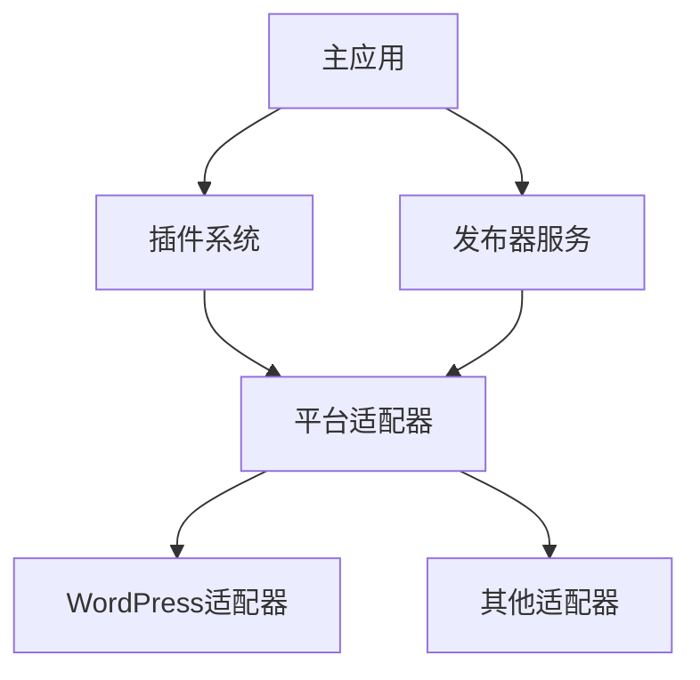

# 思源发布器开发指南

## 架构概述

思源发布器采用模块化架构设计，实现了关注点分离，提高了可维护性。以下是系统的详细说明：

### 核心组件

1. **主应用 (`packages/main-app`)**
   - 应用程序入口点
   - 处理 UI 渲染和用户交互
   - 管理平台选择和配置
   - 协调不同模块之间的交互

2. **核心模块 (`packages/core`)**
   - 提供基础服务和类型定义
   - 管理发布工作流程
   - 定义核心接口和类型
   - 处理平台适配器注册

3. **插件系统 (`packages/plugin-system`)**
   - 管理插件生命周期
   - 处理平台适配器的动态加载
   - 提供插件依赖解析
   - 维护插件注册表

4. **平台适配器 (`packages/platform-adapters`)**
   - 实现平台特定的逻辑
   - 作为插件动态加载
   - 为不同平台提供统一接口
   - 处理平台特定的配置

### 调用链



### 详细流程

1. **初始化**
   ```
   主应用
   ├── 加载插件系统
   │   └── 发现可用的平台适配器
   └── 初始化发布器服务
       └── 注册平台适配器
   ```

2. **平台选择**
   ```
   主应用
   ├── 用户选择平台
   ├── 加载平台配置组件
   └── 显示平台特定设置
   ```

3. **连接测试**
   ```
   主应用
   ├── 用户配置平台设置
   ├── 触发连接测试
   ├── 发布器服务
   │   └── 获取平台适配器
   └── 平台适配器
       └── 测试与平台的连接
   ```

4. **发布流程**
   ```
   主应用
   ├── 用户准备文章内容
   ├── 触发发布操作
   ├── 发布器服务
   │   ├── 验证文章数据
   │   └── 获取平台适配器
   └── 平台适配器
       ├── 转换文章数据
       └── 发布到平台
   ```

### 关键接口

1. **发布器接口**
   ```typescript
   interface Publisher {
     publish(post: Post): Promise<PublishResult>;
   }
   ```

2. **平台适配器接口**
   ```typescript
   interface PlatformAdapter {
     testConnection(config: PlatformConfig): Promise<boolean>;
     publish(post: Post): Promise<PublishResult>;
   }
   ```

3. **插件接口**
   ```typescript
   interface Plugin {
     id: string;
     name: string;
     version: string;
     initialize(): Promise<void>;
   }
   ```

### 开发指南

1. **添加新平台**
   - 在 `platform-adapters` 中创建新适配器
   - 实现所需接口
   - 在插件系统中注册适配器
   - 创建平台配置组件

2. **修改核心逻辑**
   - 更新 `core` 模块中的接口
   - 保持向后兼容性
   - 更新受影响的适配器
   - 测试所有平台集成

3. **扩展 UI**
   - 遵循现有组件模式
   - 使用提供的组合式函数
   - 保持一致的样式
   - 添加适当的错误处理

### 测试策略

1. **单元测试**
   - 测试独立组件
   - 模拟依赖
   - 验证接口合规性

2. **集成测试**
   - 测试模块交互
   - 验证插件加载
   - 检查平台适配器

3. **端到端测试**
   - 测试完整发布流程
   - 验证平台集成
   - 检查错误处理

### 错误处理

1. **UI 层**
   - 显示用户友好的消息
   - 提供重试选项
   - 记录错误以便调试

2. **服务层**
   - 处理平台特定错误
   - 提供详细的错误信息
   - 实现重试机制

3. **插件系统**
   - 处理加载失败
   - 管理依赖冲突
   - 提供回退选项 