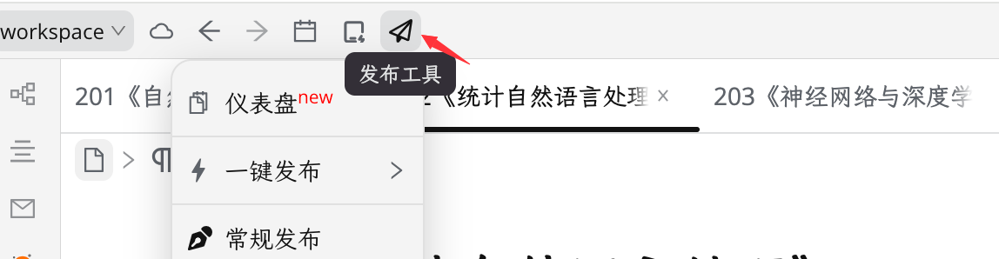

[中文](README_zh_CN.md)

# Publisher

Publish articles from siyuan-note to platforms like WordPress、Cnblogs、Yuque etc. `Free` and `open source`.

> Please [click here to see the latest docs](https://siyuan.wiki/s/20240330142711-bc3gjg0), it updates in real
> time.

**Encountered other issues or have suggestions? Group 1 is full, please join QQ Group 2 for discussion.**

## Quick Start

1. Click on the plugin marketplace, search for `Publisher`, and install the plugin.
2. Enable the plugin, then click on the airplane button in the top-left toolbar of the siyuan-note window to start using it.  
   
3. Document menu (optional): Refer to [docs](https://siyuan.wiki/s/20230810132040-nn4q7vs) FAQ 12 to enable the document menu and start using it.

## Update History

Please check the https://github.com/terwer/siyuan-plugin-publisher/blob/main/CHANGELOG.md directly.

## Easter Egg

[Other siyuan-note plugins developed by the author](https://github.com/terwer/zhi/blob/main/README.md#plugins)

## Donate

If you approve of this project, invite me to have a cup of coffee, which will encourage me to keep updating and create
more useful tools~

### Wechat

### Alipay

### Afdian

https://afdian.com/a/terwer

# Thanks

- Thanks to the third-party framework for supporting the bottom layer of this project

  Names not listed in order

  |    Name     | version |vendor|
    |:-----------:|:-------:| :---------: |
  |    turbo    |  1.9+   |Vercel|
  |     Vue     | 3.3.4+  |Evan You|
  |    Vite     |  4.2+   |Evan You|
  | TypeScript  |  5.0+   |Microsoft|
  | siyuan-note | 2.9.0+  |D,V|

- Thanks to [leolee9086](https://github.com/leolee9086) and [ciwoyipang]() for the icon resource

* Thanks to the enthusiastic support of the following users, I will continue to update and maintain the project!

    - 2024-03-31 *Ren Donated to [Publish Tool]
    - 2024-03-22 *Ming Donated to [Publish Tool]
    - 2024-03-05 *ruler Donated to [Publish Tool]

    - 2024-03-12 *? Donated to [Publish Tool]
    - 2024-03-04 *azar Donated to [Publish Tool]
    - 2024-02-28 *Zhao Donated to [Publish Tool]
    - 2024-01-15 Zi* Donated to [Publish Tool]
    - 2024-01-09 Zi* Donated to [Publish Tool]
    - 2023-11-12 S* Donated to [Publish Tool]
    - 2023-10-15 *Xian Donated to [Publish Tool]
    - 2023-09-04 *Xia Donated to [Publish Tool]

    - 2023-08-31 *Cheng Donate to [Publishing Tool] Thanks for providing the note posting tool, reminder change
    - 2023-08-31 *? Donated to [Publish Tool] Thanks for providing the siyuan-note Publish Tool.
    - 2023-08-14 *? Donated to [Publish Tool]
    - 2023-08-10 *f Donated to [Publish Tool] for liking the release plugin.
    - 2023-08-10 *2 Donated to [Publish Tool] to support the development of Source Release Plugin.
    - 2023-07-13 *Liang Donated to [Document Alias] Is it possible to expand the functionality to H1?
    - 2023-07-09 *z Donated to [Online Sharing] The online sharing plugin is great, thanks!
    - 2023-06-14 *Jun Donated to [Document Roaming] Thanks for the Document Roaming feature.
    - 2023-01-16 *Zhan Donated to [Import Tool] Finally, we can import epub files.

      If you do not want to display donation information, you can send an email directly to youweics@163.com.
