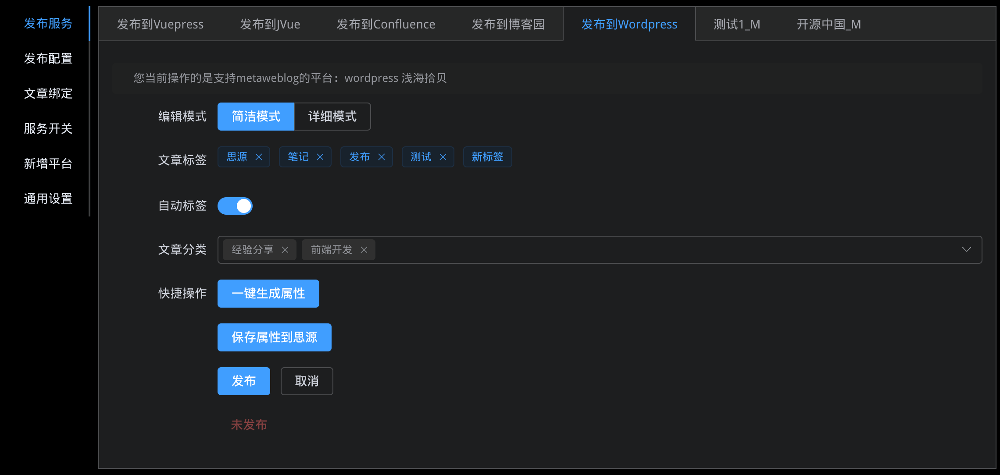

# sy-post-publisher

将思源笔记的文章发布到支持的开放平台的**思源笔记挂件**

目前支持 `Vuepress` 以及 2 种博客平台标准、`metaweblog api` 和基于 `Wordpress` 的 `xmlrpc` 远程调用 api

同时提供了一个 [统一通用的API适配器](https://github.com/terwer/src-sy-post-publisher/blob/main/src/lib/api.ts)，让适配任何平台成为可能。




[点击查看帮助文档](https://mp.terwer.space/post/readme-1j4ltp.html)

[点击查看配置视频教程](https://mp.terwer.space/post/configure-entry-video-brpm9.html)

## 最近更新

[点击这里查看开发进度](https://github.com/users/terwer/projects/1/views/1)

* 0.0.3 关键特性

  2022-09-28 发布

  * feat: #62 [标题支持数字编号](https://github.com/terwer/src-sy-post-publisher/pull/62)

    例如在思源笔记的标题为 `023.利用pm2后台运行nodejs程序`，发布的时候会自动去掉编号变成 `利用pm2后台运行nodejs程序`。这样做的目的是保持文章在思源笔记的结构化，然后又不影响其他平台的展示。
  * feat: #72 [Wordpress默认发布为Markdown](https://github.com/terwer/src-sy-post-publisher/pull/72)

    这里还做了进一步的优化，现在发布方式支持配置了，可以自定发布为 markdown 还是 HTML，满足不同平台诉求。
  * feat: #76 [动态类型支持选择发布格式](https://github.com/terwer/src-sy-post-publisher/pull/76)

    支持 HTML 和 Markdown 两种发布格式。
  * fix: #73 [发布到语雀偶发的获取默认知识库失败问题](https://github.com/terwer/src-sy-post-publisher/pull/73)
  * feat: #103 [支持可设置分类的平台选择分类-语雀支持选择分类](https://github.com/terwer/src-sy-post-publisher/pull/103)
  * feat: #77 [支持Metaweblog选择分类（博客园、Wordpress等）](https://github.com/terwer/src-sy-post-publisher/pull/77)
  * feat: #81 [支持取消所有平台](https://github.com/terwer/src-sy-post-publisher/pull/81)

    所有平台均支持关闭，不再强制内置任何平台，默认所有平台关闭，用户自行启用。
  * feat: #88 [适配暗色模式](https://github.com/terwer/src-sy-post-publisher/pull/88)​

    现在所有页面都支持暗色模式和浅色模式切换
  * feat: #89 [整合node-siyuan到挂件【非挂件模式】](https://github.com/terwer/src-sy-post-publisher/pull/89)​

    非挂件模式提供文章列表页面，整合我的另外一个 node-siyuan 项目。
  * feat: #99 [Google插件扩展](https://github.com/terwer/src-sy-post-publisher/pull/99)​

    现在可以直接在 Google Chrome 插件扩展中使用了。
  * feat: #102 [代码优化以及空状态处理](https://github.com/terwer/src-sy-post-publisher/pull/102)​

    现在支持加载过程中展示骨架，提供更好的体验。
  * feat: #104 [动态类型支持自定义预览地址](https://github.com/terwer/src-sy-post-publisher/pull/104)​

* 0.0.4 版本预告

  预计 2022-12-31 发布

  * [ ] 支持发布到印象笔记
  * [ ] 支持详情页导出Anki记忆卡【非挂件模式】
  * [ ] 支持微信消息、微信公众号、CSDN、简书、知乎（预研，目前没有公开API，可能需要借助cookie模拟登陆）
  * [ ] 支持Github pages、HUGO、Jekyll、Next.js content、Nuxt.js content
  * [ ] 集成PicGO，可直接粘贴图片自动上传。旧文档的非图床图片，在发布时候使用PicGO上传然后再发布
  * [ ] 详情页支持下载所有图片到本地，并打包成带assets文件夹和md文件的zip包，这个主要是某些分享场景网络不畅通可能有用
  * [ ] 支持发布时候选择一键剔除外链图片，主要是个别平台不允许外链图片

[历史更新日志](Changelog.md)

## 支持平台

* [X] Vuepress
* [X] 博客园
* [X] 链滴社区
* [X] 语雀
* [X] Wordpress
* [X] Metaweblog API

## Vue 3 + TypeScript + Vite

项目使用 Vue 3 框架，TypeScript 开发语言，Vite 作为构建工具。

项目使用了 Vue 3 的 `<script setup>`
，可以查看文档 [script setup docs](https://v3.vuejs.org/api/sfc-script-setup.html#sfc-script-setup) 了解更多。

## 推荐开发工具

* [VS Code](https://code.visualstudio.com/) + [Volar](https://marketplace.visualstudio.com/items?itemName=Vue.volar)
* IntelliJ IDEA 或者 WebStorm

## 依赖版本

|工具|版本|
| ------| --------|
|node|v16.16.0|
|yarn|1.22.19|
|vercel|28.0.1|
|pm2|5.2.0|

## 环境变量

**设置环境变量**

复制 `.env.local.example` 文件到 `.env.local` (会被 git 忽略):

```bash
cp .env.local.example .env.local
```

打开 `.env.local` 并且设置 SIYUAN_API_URL。例如：
http://127.0.0.1:6806。

你的 `.env.local` 文件大概像下面这样：

```properties
# log level
VITE_LOG_INFO_ENABLED=false
# siyuan api
VITE_SIYUAN_API_URL=http://127.0.0.1:6806
VITE_SIYUAN_CONFIG_TOKEN=
# middlware to support cors, optional
# VITE_MIDDLEWARE_URL=
```

你也可以设置 `.env.development.local`, `.env.production.local`, `.env.test.local` 用于不同环境，开发、测试、构建等。

参考 [Vite .env 设置文档](https://cn.vitejs.dev/guide/env-and-mode.html#env-files)

## 开发

准备

```bash
npm i -g yarn
npm i -g vercel
```

开发阶段运行

```bash
# yarn create vite
yarn
yarn vdev
```

**特别提醒：**

如果你觉得 vervel 不利于热加载，也可以用下面的方式开发启动，但是环境变量 `VITE_MIDDLEWARE_URL` 需要设置跨域代理，我这里提供一个

```properties
VITE_MIDDLEWARE_URL=https://publish.terwer.space/api/middleware
```

然后用下面命令启动，可以支持热加载。

```bash
yarn dev
```

浏览器默认入口连接是

http://localhost:3000/blog/index.html

## 部署

从 0.0.3 版本开始，思源笔记发布辅助工具提供 3 种部署方式。

### 方式 1、部署到思源笔记挂件

```bash
yarn w
```

压缩 `dist` 文件夹为 `.zip`, 上架思源笔记挂件集市。

### 方式 2、部署到 Google Chrome 浏览器插件

```bash
yarn e
```

压缩 `extension` 文件夹为 `.crx`, 上架 Google Chrome 应用商店。

### 方式 3、部署到服务器后台服务

准备

```bash
npm i -g yarn
npm i -g vercel
npm i -g pm2
```

启动

```bash
yarn pm2
```

停止

```bash
yarn pm2s
```

查看

```bash
pm2 ls
```