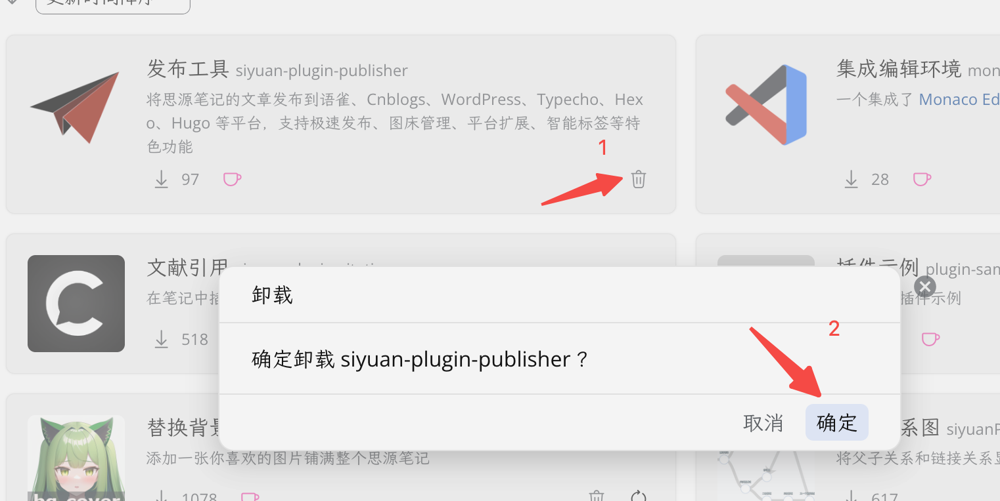
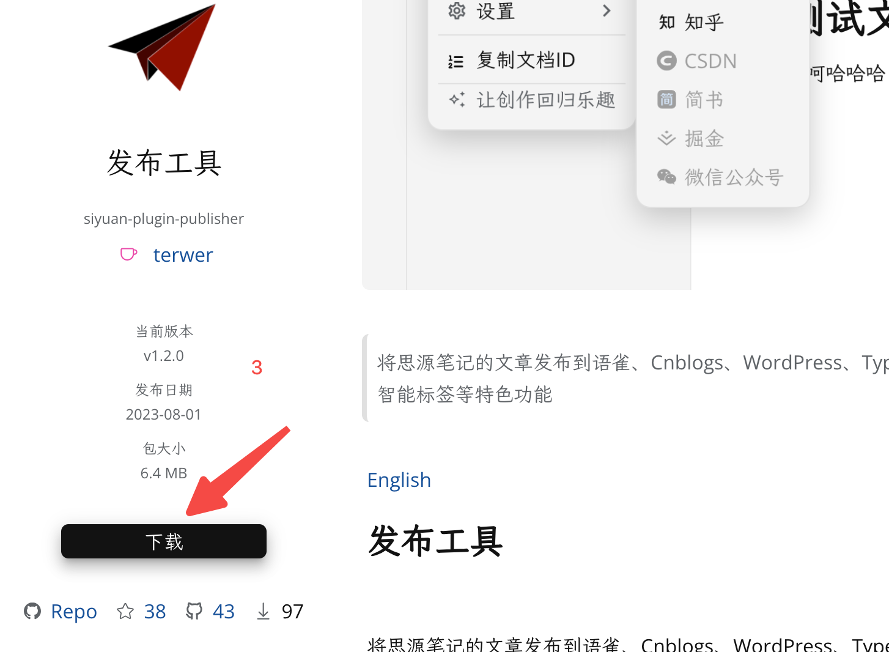

[English](README.md)

# 发布工具

将思源笔记的文章发布到语雀、Notion、Cnblogs、WordPress、Typecho、Hexo、知乎 等平台，支持极速发布、图床管理、平台扩展、智能标签等特色功能。

> **注意：本插件当前处于快速迭代和前期beta测试阶段，功能尚不稳定，仅作为前期尝鲜测试，不建议正式使用。如果您遇到了无法使用的问题，可尝试以下步骤修复：**

（1）卸载插件

（2）重新下载安装

（3）重新启用

（4）如果某个平台配置不完整，可以禁用平台配置、然后删除这个平台并重新添加。

若此步骤之后还是无法使用，或者您有任何建议和需求，欢迎 [新建issue](https://github.com/terwer/siyuan-plugin-publisher/issues/new) 。

**本提示会在稳定版发布后移除。**

## 最近的关键更新与 Bug 修复

- 支持文章绑定
- hexo 支持 yaml
- 支持自动生成文章别名
- 统一整合各平台配置
- 完成 hexo 适配
- 修复常规发布返回异常问题
- 修复typecho更新不生效问题
- 修复批量分发报错问题
- Notion、语雀平台使用思源笔记正向代理，提升性能
- 常规发布支持文章比对
- 新增 notion 支持
- 语雀支持更改默认知识库
- 新增支持细粒度配置的常规发布
- 支持 语雀、博客园、metaweblog、typecho、wordpress

## 思源笔记兼容情况

本插件支持思源笔记几乎所有设备和平台，具体兼容情况如下：

- [X] 思源笔记客户端（零配置）强烈推荐
- [X] 伺服环境（需要设置跨域请求代理）
  - [X] 思源笔记浏览器伺服
  - [X] 思源笔记客户端伺服
  - [X] 思源笔记客移动端伺服
- [X] 思源笔记docker版（需要设置跨域请求代理）

**注意：如果是局域网伺服，需要在局域网自行部署跨域代理。**

**设置方法，clone https://github.com/terwer/node-metaweblog-api-adaptor 然后 `pnpm install && pnpm dev`，启动之后代理地址为：https://<局域网IP>:3000/api/middleware 。** 

**如果是外网需要部署在外网，外网的跨域请求代理也可以直接使用：https://api.terwer.space/api/middleware**

**后续可能会迁移到官方的正向代理实现零配置，但是目前还是必须要自己设置，可在这里关注进展。**

- 进度1：语雀、Notion平台已使用内置正向代理，无需配置。

## 平台列表

排名不分先后

- [X] 语雀
- [X] 博客园
- [X] Metaweblog
- [X] Typecho
- [X] WordPress
- [X] Github
  - [X] Hexo
- [X] Notion
- [ ] 知乎

## 核心特色

- [X] **极速发布**：一次配置，一键发布
- [ ] **图床管理**：集成 PicGO 图床，支持 s3、minio、水印插件
- [X] **支持扩展**：基于统一的博客 API 规范，内置 metaweblogAPI 、 WordPress 、Wechatsync 和 Github 支持，并提供了统一的适配器，理论上可支持扩展到任何平台
- [X] **平台开关**：所有平台均支持启用禁用，默认开启博客园，可随时禁用
- [X] **动态新增**：支持自定义添加平台
- [ ] **智能分类**：支持智能标签、智能 slug 别名、智能摘要，并持续完善中
- [ ] **文章绑定**：支持关联已有的平台文章到思源笔记，方便后续管理，支持思源-> 平台单向同步
- [X] **适应主题**：自动适配暗黑模式与浅色模式
- [X] **语言支持**：多语言支持，支持中文版和英文版
- [ ] **发布视图**：支持多种发布视图，简单模式、详细模式和源码模式
- [X] **多种部署**：支持思源笔记插件强烈推荐、Chrome 浏览器扩展、自部署

本插件承诺，基础功能永久免费，智能AI相关的后续可能会收费，内测阶段完全免费。如果您想支持开发者，请在这里 [随意打赏](https://github.com/terwer/siyuan-plugin-publisher/blob/main/README_zh_CN.md#捐赠)。

> 🌹 温馨提示：这个插件是原 `思源笔记发布工具` 挂件的插件升级版，功能包含原有挂件提供的所有功能，同时提供了方便的菜单操作入口，并进行了一系列问题修复和体验优化。
>
> 除 [扩展功能] 外，**其他功能无需任何依赖** ，也无需下载之前的挂件，挂件在插件中已经内置。

## 平台适配计划

如果你有想使用的平台，但是此工具目前还没实现，可在这里提交 [思源笔记发布工具插件平台适配跟踪表](https://terwergreen.feishu.cn/share/base/form/shrcnGRdThUiqnhBg15xgclMM0c)
，开发者会考虑列入开发计划中。

平台适配情况请查看请参考 [最新适配情况](https://terwergreen.feishu.cn/share/base/view/shrcnWT2IGIz1r94z9qvqUghDzd)

## 更新历史

请直接查看 [CHANGELOG](./CHANGELOG.md)

## FAQ

* Q1：发布工具插件怎么安装？安装之后在哪里找到他的入口？

  A1：找到 **`集市->插件->发布工具`** 下载启用即可。

  安装过程无需其他任何操作。这个跟其他插件的下载安装无任何区别。

  安装完成后，在顶部右侧工具栏找到 ✈️ 图标，点击菜单，按照对应说明操作使用即可。

* Q2：装了发布工具插件之后，还需要安装挂件吗？

  A2：**不需要。**

  插件版包含挂件版的所有功能。

* Q3：我不习惯新版操作，想继续使用以前的挂件，可以吗？

  A3：**可以但是不推荐。**

  **我们强烈推荐您直接使用插件版，因为插件版将是以后长久维护的主要版本，挂架版本已废弃，仅作为修复问题以及兼容历史用户。**

* Q4：我以前是通过 `自定义JS片段 ` 或者 直接添加 `挂件` 来使用的，现在还需要下载该插件吗？

  A4：**可选。** 但是我们强烈推荐您删除 JS 片段和挂件，下载插件版使用。

  如果您不想使用插件版，那么您无需下载，使用原有 `自定义 JS 片段` 或者 添加 `挂件` 继续使用即可。

  如果您想使用插件版，那么我们强烈建议您删除之前添加的 `自定义JS片段` 和 `挂件`，直接下载插件版，启用即可。无需其他额外操作。

* Q5：我的历史配置数据项迁移到插件，可以吗？
* A5：**可以。** 注意：数据迁移将在后续版本提供。

  请在 `发布设置->检测并迁移历史配置。` 操作。

  注意：挂件版配置数据导入仅支持 `sy-p-cfg-v0.8.1.json` 。

* Q6：我需要发布的平台，发布工具没有提供怎么办？
* A6：参考：[平台适配计划](https://github.com/terwer/siyuan-plugin-publisher/blob/main/README_zh_CN.md#平台适配计划 "平台适配计划")

## 捐赠

如果您认可这个项目，请我喝一杯咖啡吧，这将鼓励我持续更新，并创作出更多好用的工具~

### 微信

### 支付宝

# 感谢

* 感谢第三方框架对本项目底层的支持

  排名不分先后

  |Name|version|vendor|
  | :---------: | :-----: | :---------: |
  |turbo|1.9+|Vercel|
  |vite|4.2+|Evan You|
  |Svelte|3.57+|Rich Harris|
  |TypeScript|5.0+|Microsoft|
  |siyuan-note|2.9.0+|D,V|

* 感谢 [leolee9086](https://github.com/leolee9086) 提供的图标资源