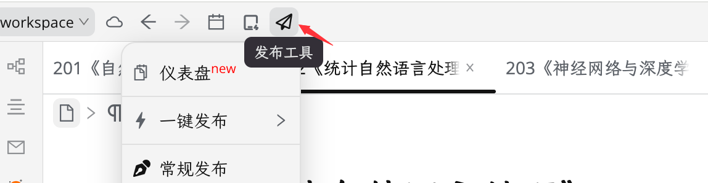

[English](README.md)

# 发布工具

> 把思源笔记里的文章发布到博客、知识库和静态站。

发布工具是一款面向在思源写作、同时需要维护博客、知识库或静态站用户的思源笔记插件。配置一次平台账号后，打开文档即可发布；之后文章改了，也可以继续更新到已经发布过的平台。

## 核心能力

- **快速发布**：打开思源文档，选择平台即可发布。
- **持续更新**：文章发布后，后续修改可以继续更新到同一平台。
- **图片处理**：发布时按平台能力处理文章中的图片。
- **一次配置**：平台账号验证并保存后，后续发布可直接复用。
- **多平台发布**：支持博客、知识库、静态站仓库、网页登录平台和本地目录等场景。
- **统一界面**：平台配置、快速发布、发布状态和错误详情集中在一个界面。

## 特色功能

### 发布工作台

**工作台是发布工具的新入口，围绕当前文档组织发布操作。**

1. 在 **发布设置** 中添加并验证平台账号。
2. 打开要发布的思源文档。
3. 在 **快速发布** 中选择平台，发布或更新文章。

发布成功后，可以在同一处查看发布状态、打开已发布文章，或删除不再需要的发布记录。配置或发布失败时，会尽量展示可读的错误详情。

## 快速开始

1. 在思源插件市场安装并启用 **发布工具**。
2. 打开插件偏好，开启 **使用新版 UI**。
3. 从思源工具栏打开发布工具。
4. 在 **发布设置** 中添加平台账号，完成验证并保存。
5. 打开要发布的文档，进入 **快速发布**，选择平台后发布。

## 支持的平台

- **内容平台 / 知识库**：语雀、Notion、Halo、Confluence 等。
- **博客平台**：博客园、WordPress、Typecho、Jvue 等。
- **静态站点仓库**：GitHub / GitLab，适合 Hexo、Hugo、Jekyll、Quartz、VuePress、VitePress、Astro 等站点。
- **网页登录平台**：适合通过网页登录态发布的部分平台。
- **本地目录**：在桌面端输出到本地文件夹，方便继续配合其他工具处理。

具体平台能力会随版本持续完善，可在插件内的平台列表和使用文档中查看。

## 使用文档

[查看发布工具文档](https://siyuan.wiki/s/20230810132040-nn4q7vs)

## 更新记录

[CHANGELOG](CHANGELOG.md)

## 社区与历史

[QQ 群 722632752](https://qm.qq.com/cgi-bin/qm/qr?k=fYrA79XDvtr4JuEgez-dmj1h3tOef8pg&jump_from=webapi&authKey=DC+XcjkoTH762jxvkSgpt7V97QFETnaLVTZIWhd8PdZoX+MNSr+LsprWFYYELXu8) · [作者的其他思源插件](https://github.com/terwer/zhi/blob/main/README_zh_CN.md#%E6%8F%92%E4%BB%B6) · [历史 README 归档](docs/archive/README.md)

感谢思源笔记、Vue、Vite、TypeScript 等开源项目，以及所有反馈、测试和支持发布工具的用户。

## 许可

[GPL-3.0](LICENSE)
